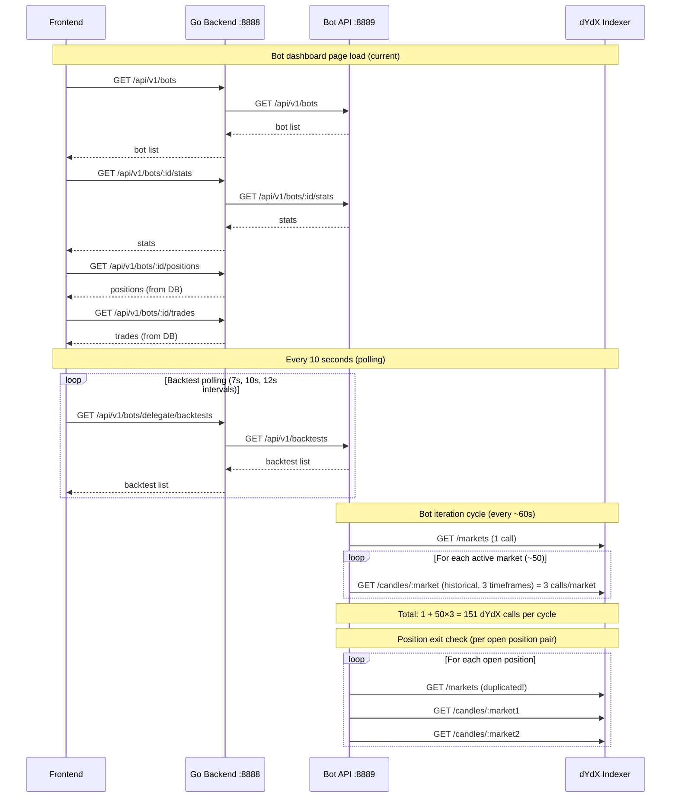
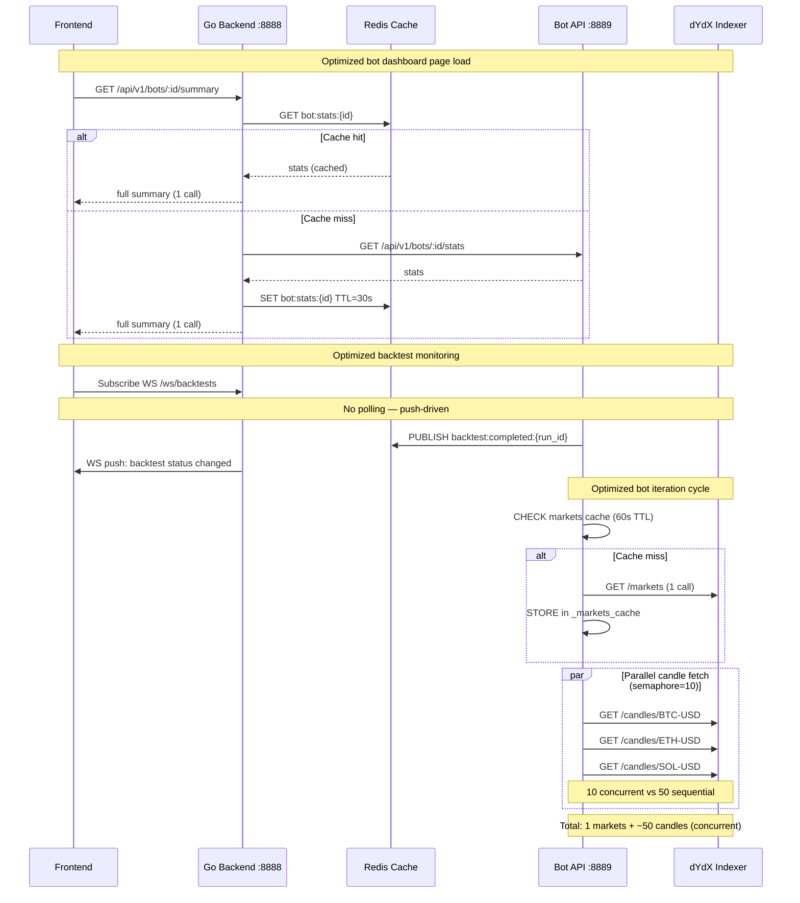
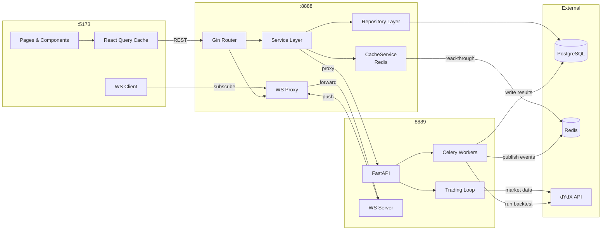

# Project Improvement Plan

## Executive Summary

This plan documents a systematic analysis of the dYdX Trading Bot monorepo across three service layers (Python bot, Go backend, React frontend) with the goal of achieving the same business outcomes using fewer API calls, lower latency, and cleaner architecture. The highest-impact opportunities are:

1. Eliminating O(n) sequential dYdX API calls in the bot's market-data loop (currently 50+ calls per cycle)
2. Introducing a Redis-backed market-data and bot-stats cache in the Go backend (the infrastructure already exists but is unused for these paths)
3. Replacing frontend polling loops with server-sent events or WebSocket push for real-time data
4. Consolidating redundant per-resource HTTP fetches into aggregate endpoints
5. Completing partially-implemented stubs (CandleCacheService, WarmCache, PrefetchCandlesForRun)

No production code is changed by this plan. All items reference actual files and line numbers.

---

## Current Architecture Overview

```
┌───────────────────────────────────────────────────────────────────┐
│  Frontend (React / Vite)  :5173                                    │
│  frontend/src/api.ts        (axios + cookie auth)                  │
│  frontend/src/api/enhancedClient.ts  (fetch + token refresh)       │
│  frontend/src/api/hooks.ts           (React Query hooks)           │
│  frontend/src/api/queryClient.ts     (staleTime / gcTime config)   │
│  frontend/src/pages/Backtests.tsx    (4 polling intervals)         │
│  frontend/src/pages/Dashboard.tsx    (setInterval + useQuery)      │
│  frontend/src/components/StrategyManager.tsx  (manual state)       │
└───────────────┬───────────────────────────────────────────────────┘
                │  HTTP REST  (every 7–30 s polling)
                ▼
┌───────────────────────────────────────────────────────────────────┐
│  Go Backend (Gin)  :8888                                           │
│  backend/internal/routes/*_routes.go                               │
│  backend/internal/services/bot_api_client.go  (HTTP proxy)         │
│  backend/internal/services/cache_service.go   (Redis – partial)    │
│  backend/internal/services/candle_cache_service.go  (stub)         │
│  backend/internal/repository/*.go             (raw SQL)            │
└───────────────┬───────────────────────────────────────────────────┘
                │  HTTP REST passthrough (no caching on hot paths)
                ▼
┌───────────────────────────────────────────────────────────────────┐
│  Python Bot API (FastAPI / uvicorn)  :8889                         │
│  bot/src/api/server.py          (FastAPI app + WebSocket server)   │
│  bot/src/api/websocket_server.py                                   │
│  bot/src/trading/market_data.py  (sequential dYdX calls)           │
│  bot/src/trading/position_manager.py  (repeated get_markets())     │
│  bot/src/trading/account_manager.py                                │
│  bot/src/trading/bot_agent.py   (atomic pair execution)            │
│  bot/src/infrastructure/workers/backtest_tasks.py  (Celery)        │
│  bot/src/infrastructure/workers/celery_app.py                      │
└───────────────┬───────────────────────────────────────────────────┘
                │  HTTPS  (100–200 ms + 0.2 s throttle per call)
                ▼
┌────────────────────────┐    ┌────────────────────────┐
│  dYdX Indexer REST API │    │  dYdX Node gRPC        │
│  (market data, candles)│    │  (order execution)     │
└────────────────────────┘    └────────────────────────┘
```

### Infrastructure

- **Database**: PostgreSQL (55 migrations, see `backend/migrations/postgres/`)
- **Cache**: Redis (connected in `backend/internal/services/cache_service.go`; also used by Celery broker/backend via `bot/src/infrastructure/workers/celery_app.py`)
- **Task Queue**: Celery with Redis broker (`CELERY_BROKER_URL` / `REDIS_URL`)
- **WebSocket**: Bot-side (`bot/src/api/websocket_server.py`) + frontend client (`frontend/src/api/websocket.ts`)

---

## Current API Call Flow Diagram



---

## Main Bottlenecks and Duplicated Calls

### 1. N+1 dYdX candle fetches in `construct_market_prices`

**File**: `bot/src/trading/market_data.py`, lines 164–210  
**Problem**: `construct_market_prices` calls `get_candles_historical(client, market)` for each market in a sequential `for` loop. For 50 active markets with 3 historical timeframes each, this generates **150+ HTTP calls**. Each call has a hard-coded `asyncio.sleep(0.2)` throttle, meaning 50 markets × 3 windows × 0.2s = **30 seconds of pure sleep** before any computation begins.

```python
# bot/src/trading/market_data.py lines 183-210
for i, market in enumerate(tradeable_markets[0:]):
    close_prices_add = await get_candles_historical(   # sequential, no batching
        client, market, resolution=resolution
    )
```

### 2. Repeated `get_markets()` calls within a single iteration cycle

**File**: `bot/src/trading/position_manager.py`, lines 216, 315, 719  
**Problem**: `get_markets(client)` is called three separate times across `open_positions` and `manage_trade_exits` in the same iteration cycle. The dYdX markets list changes rarely (minutes to hours). There is no per-instance cache for this response.

### 3. Bot stats go through two HTTP hops with no caching

**Flow**: Frontend → Go backend (`/api/v1/bots/:id/stats`) → Python bot API → (sometimes dYdX)  
**File**: `backend/internal/services/bot_api_client_extended.go`, line 66 (`GetBotStats`)  
**Problem**: The Go backend's `CacheService` (Redis) exists and is working but is **not used** for any bot-stats or backtest-status delegation paths. Every request triggers a full round-trip to the Python service.

### 4. Frontend has four independent polling loops on Backtests page

**File**: `frontend/src/pages/Backtests.tsx`, lines 322, 339, 432, 454  
**Problem**: Four `useQuery` hooks with different intervals (7 s, 10 s, 12 s, dynamic) independently poll backend endpoints. When active backtests are running, this produces 4–6 backend requests every 7 seconds from a single open browser tab.

### 5. Dashboard uses both `setInterval` and `useQuery` polling simultaneously

**File**: `frontend/src/pages/Dashboard.tsx`, lines 431 and 505  
**Problem**: `pollRef.current = setInterval(() => void computeStats(), 10000)` (line 431) and a separate `useQuery` with `refetchInterval: 30_000` (line 505) both fire independently. This creates duplicate backend calls for overlapping data.

### 6. `CandleCacheService` stubs are not implemented

**File**: `backend/internal/services/candle_cache_service.go`  
**Problem**: `WarmCache()` (line ~160) and `PrefetchCandlesForRun()` (line ~145) are empty — they log a message but do not fetch or store anything. The infrastructure is wired but does nothing.

### 7. Two `IndexerClient` instances pointing to the same endpoint

**File**: `bot/src/trading/dydx_client.py`, lines ~80–100  
**Problem**: `indexer` and `indexer_account` are both `IndexerClient(host=market_data_endpoint)`. Separate connection pools are opened to the same host for what is essentially one service.

### 8. `get_candles_recent` called per-pair during position exit evaluation

**File**: `bot/src/trading/position_manager.py`, lines 343–344 and 713–715  
**Problem**: For each open position pair, two sequential `get_candles_recent` calls are made. With 10 open pairs, that is 20 dYdX API calls that could be batched or served from a short-lived in-memory cache.

### 9. Inline route handler logic instead of handler layer

**File**: `backend/internal/routes/bot_instance_routes.go`, lines 56–165  
**Problem**: Position and trade detail handlers are written inline as anonymous functions inside the route registration function. This bypasses the handler layer pattern used elsewhere and makes testing and reuse difficult.

### 10. Strategy runtime status requires full page polling

**File**: `frontend/src/components/StrategyManager.tsx`  
**Problem**: StrategyManager uses `api.ts` (axios) directly with manual `useState`/`useEffect` state management instead of React Query. This means no deduplication, no stale-while-revalidate, and no shared cache across components.

---

## API Call Reduction Opportunities

| Opportunity | Calls Before | Calls After | Reduction |
|---|---|---|---|
| Parallelize candle fetches in `construct_market_prices` | 150+ sequential | ~50 concurrent (3 timeframes merged) | ~67% reduction in wall-clock time |
| Cache `get_markets()` result (60s TTL) | 3 calls/cycle | 1 call/cycle | 66% |
| Redis cache for bot stats in Go backend (30s TTL) | 1 call/frontend-poll | ~0 (cache hit) | ~95% during polling |
| Merge 4 Backtests polling intervals into 1 + WebSocket | 4 polls/7s = ~34/min | 1 poll/30s + WS push | ~90% |
| Fix Dashboard dual polling | 2 timers | 1 React Query | 50% |
| Cache backtest list in Go backend (15s TTL) | pass-through per poll | cache hit | ~90% during active runs |
| Per-pair candle cache (in-memory, 30s TTL) | 2 calls/pair/cycle | 0 on cache hit | up to 100% within window |
| Single aggregate `/api/v1/bots/:id/summary` endpoint | 4 frontend calls on load | 1 call | 75% reduction on bot page load |

---

## Backend Improvement Plan

### B1 – Apply Redis caching to bot stats and backtest status delegation

**Files**: `backend/internal/routes/bot_api_delegate_routes.go`, `backend/internal/services/cache_service.go`  
The `CacheService` client is initialized in `backend/internal/services/` and connects to Redis. The delegation route that proxies `/api/v1/bots/:id/stats` does not check the cache before forwarding. Add a 30-second TTL read-through cache:
- Cache key: `bot:stats:{instance_id}`
- Invalidate on `/start`, `/stop`, `/restart` mutations
- Same pattern for `backtest:status:{run_id}` with 10s TTL

### B2 – Complete `CandleCacheService` stubs

**File**: `backend/internal/services/candle_cache_service.go`  
`WarmCache()` and `PrefetchCandlesForRun()` are empty. Implement them to prefetch candle data from the `backtest_candles` PostgreSQL table and store in Redis with a 24-hour TTL. This will eliminate repeated DB reads for completed backtest visualizations.

### B3 – Add aggregate bot summary endpoint

**File**: New handler in `backend/internal/handlers/bot_instance_handler.go`  
Add `GET /api/v1/bots/:id/summary` that returns stats + recent trades + open positions in a single response. This replaces the 4 separate calls the frontend makes on the bot dashboard page load.

### B4 – Move inline position/trade handlers to handler layer

**File**: `backend/internal/routes/bot_instance_routes.go` (lines 56–165)  
The anonymous functions registered as route handlers for `GET /:instance_id/positions` and `GET /:instance_id/trades/:trade_id` should be moved to `backend/internal/handlers/bot_instance_handler.go` following the pattern already used for other bot routes.

### B5 – Add missing database indexes for frequent query patterns

The following queries appear frequently but lack compound covering indexes in the Postgres migrations:
- `backtest_runs` filtered by `user_id + status + created_at DESC` (backtest list pagination)
- `bot_trades` filtered by `bot_instance_id + status` with ORDER BY `created_at DESC`
- `strategy_execution_states` filtered by `strategy_id + status`

Migration 000047 (`backtest_list_perf_index`) already exists — verify it covers the above patterns.

### B6 – Inject `CacheService` via dependency injection

**Files**: `backend/internal/routes/*.go`  
Currently `BotAPIClient`, `BotInstanceService`, and repositories are all instantiated fresh inside each `Register*Routes()` function. This means multiple instances of the same service exist in memory simultaneously and share no state (including the cache). Pass a single application-level `CacheService` instance through the dependency graph.

### B7 – Add response compression middleware

**File**: `backend/cmd/server/`  
The Gin router does not have a `gzip` middleware registered. Enabling `gin-gonic/gin`'s `gzip` middleware would reduce payload sizes for large backtest result responses by 60–80%.

---

## Bot Improvement Plan

### P1 – Parallelize `construct_market_prices` candle fetches

**File**: `bot/src/trading/market_data.py`, lines 183–210  
Replace the sequential `for` loop with `asyncio.gather()` using a semaphore to stay within rate limits. Three timeframes per market can also be merged into a single wider request where the dYdX API allows.

```python
# Before (sequential, 150+ calls × 0.2s sleep):
for i, market in enumerate(tradeable_markets):
    close_prices_add = await get_candles_historical(client, market)

# After (concurrent, bounded by semaphore):
sem = asyncio.Semaphore(10)  # max 10 in-flight at once
async def fetch(market):
    async with sem:
        return market, await get_candles_historical(client, market)
results = await asyncio.gather(*[fetch(m) for m in tradeable_markets])
```

### P2 – Cache `get_markets()` result per client instance

**File**: `bot/src/trading/market_data.py`  
Add a module-level (or instance-level for multi-instance mode) TTL cache for `get_markets()` responses. Markets list changes infrequently. A 60-second TTL eliminates the 2 extra calls per cycle.

```python
_markets_cache: dict = {"data": None, "expires": 0.0}
MARKETS_CACHE_TTL = 60.0

async def get_markets(client):
    now = asyncio.get_event_loop().time()
    if _markets_cache["data"] and now < _markets_cache["expires"]:
        return _markets_cache["data"]
    result = await asyncio.wait_for(
        client.indexer.markets.get_perpetual_markets(), timeout=15.0
    )
    _markets_cache.update({"data": result, "expires": now + MARKETS_CACHE_TTL})
    return result
```

### P3 – Cache `get_candles_recent` per market with short TTL

**File**: `bot/src/trading/position_manager.py`, lines 343–344 and 713–715  
A 30-second in-memory LRU cache on `get_candles_recent` avoids re-fetching the same market's recent candles multiple times within a single iteration cycle when multiple open positions reference the same market.

### P4 – Merge duplicate `IndexerClient` instances

**File**: `bot/src/trading/dydx_client.py`  
`indexer` and `indexer_account` are both `IndexerClient(host=market_data_endpoint)`. Since they point to the same host, consolidate into one client instance and route market vs account queries through it. This halves the connection pool overhead.

### P5 – Use circuit breaker around dYdX API calls

**File**: `bot/src/trading/market_data.py`, `bot/src/trading/account_manager.py`  
Currently only `asyncio.wait_for` with 15s timeout is used. A circuit breaker (open after 3 consecutive failures, half-open after 30s) would prevent cascading failures during dYdX outages and avoid burning API quota during known downtime.

### P6 – Replace `asyncio.sleep(0.2)` throttle with token bucket

**File**: `bot/src/trading/market_data.py`, lines 72 and 114; `bot/src/trading/account_manager.py`, lines 142 and 499  
The fixed 0.2s sleep throttle adds artificial latency even when the rate limit has not been reached. Replace with an async token bucket (e.g., `aiolimiter`) that only blocks when the rate limit window is actually full.

### P7 – Persist market data snapshots after each successful fetch cycle

**File**: `bot/src/trading/realtime_data_service.py`  
`_update_market_data()` (line ~100) broadcasts existing DB data without refreshing it from dYdX. After each successful `construct_market_prices` run, persist a snapshot of the latest prices to the `market_data` table. This allows the realtime service to serve stale-but-accurate data during dYdX API degradation, instead of sending empty/stale data.

---

## Frontend Improvement Plan

### F1 – Consolidate Backtests page polling into a single interval

**File**: `frontend/src/pages/Backtests.tsx`, lines 322, 339, 432, 454  
Four `useQuery` hooks with different intervals (7 s, 10 s, 12 s, conditional) independently poll overlapping data. Consolidate to:
- One poll at 10s when active runs exist (driven by `activeRunCountForPolling`)
- One poll at 60s when no active runs exist
- Push via existing WebSocket for real-time status updates when a run transitions

### F2 – Eliminate dual polling in Dashboard

**File**: `frontend/src/pages/Dashboard.tsx`, lines 431 and 505  
`pollRef.current = setInterval(() => void computeStats(), 10000)` runs alongside `useQuery({ refetchInterval: 30_000 })`. Remove the manual `setInterval` and rely entirely on React Query's built-in refetch interval. React Query handles deduplication and background refresh correctly.

### F3 – Migrate StrategyManager to React Query

**File**: `frontend/src/components/StrategyManager.tsx`  
The component manages strategy list state manually with `useState` + `useEffect` + direct `api.ts` calls. Migrating to `useQuery` / `useMutation` from `frontend/src/api/hooks.ts` would give it stale-while-revalidate, shared cache (avoiding duplicate fetches when the same strategy data is needed elsewhere), and automatic deduplication.

### F4 – Add debounce to strategy start-readiness check

**File**: `frontend/src/components/StrategyManager.tsx`  
The start-readiness endpoint (`GET /api/v1/strategies/:id/start-readiness`) appears to be called each time the strategy modal opens. Add a 500ms debounce and a 30-second `staleTime` in the React Query config. Readiness data (collateral, key existence) does not change second-to-second.

### F5 – Enable WebSocket-driven backtest status updates

**File**: `frontend/src/api/websocket.ts`, `frontend/src/pages/Backtests.tsx`  
The bot WebSocket server (`bot/src/api/websocket_server.py`) already broadcasts `broadcast_strategy_status` updates. The frontend has a WebSocket client (`frontend/src/api/websocket.ts`). Wire backtest status pushes from bot → Go backend (via WebSocket proxy or SSE) → frontend to replace the 7s polling interval during active runs.

### F6 – Add `staleTime` to static reference data queries

**File**: `frontend/src/api/queryClient.ts`  
The `queryConfigs.static` preset (30 min `staleTime`) exists but is not applied to strategy list or settings queries. Apply it to prevent repeated fetches of rarely-changing data like strategy configurations, Telegram settings, and user profile on every tab focus.

### F7 – Prevent duplicate fetches on bot page load

**File**: `frontend/src/components/BotManager.tsx`, `frontend/src/api/hooks.ts`  
On the bots page, the frontend makes 4 separate API calls: list bots, bot stats, bot positions, bot trades. With the proposed `GET /api/v1/bots/:id/summary` aggregate endpoint (B3), this becomes a single request. Use `queryClient.prefetchQuery` for the bot summary during navigation to reduce perceived load time.

---

## Database / Query Optimization Plan

### D1 – Verify and extend backtest list query index coverage

**File**: `backend/migrations/postgres/000047_backtest_list_perf_index.up.sql`  
The list-backtests query filters on `user_id`, sorts by `created_at DESC`, and optionally filters by `status`. The covering index should be `(user_id, status, created_at DESC)`. If migration 47 only indexes `(user_id, created_at)`, add a composite including `status`.

### D2 – Add missing index on `bot_instances(user_id, status)`

**File**: New migration  
`ListBotInstances` queries by `user_id` and optionally `status`. Migration 000022 creates the `bot_instances` table; verify it has a compound index `(user_id, status)` for the common list query.

### D3 – Add partial index for active backtests

**File**: New migration  
The most expensive query pattern is "find running/pending backtests for user X". A partial index `WHERE status IN ('running', 'pending', 'started')` on `backtest_runs(user_id, status, created_at)` would dramatically speed this up as most runs will be completed/failed.

### D4 – Paginate bot trade and position endpoints

**File**: `backend/internal/routes/bot_instance_routes.go` (inline handlers), `backend/internal/repository/bot_trade_repository.go`  
The positions handler uses hardcoded `limit=100, offset=0`. Add proper pagination with `cursor` or `page`/`page_size` params and ensure the DB query uses a keyset pagination pattern (WHERE `id > :last_id`) rather than OFFSET for large datasets.

### D5 – Batch backtest sync health checks

**File**: `backend/internal/repository/backtest_sync_repo.go`, lines 710–757  
The sync health check issues 6 separate COUNT and MAX queries for trades, positions, and candles (lines 733–757). These can be merged into 2 queries using conditional aggregation:

```sql
SELECT
    COUNT(*) FILTER (WHERE c.market_1 = 'UNKNOWN' OR c.market_2 = 'UNKNOWN') AS unknown_trades,
    MAX(c.entry_timestamp) AS last_trade_ts
FROM backtest_trades c
JOIN backtest_runs r ON c.run_id_fk = r.id
WHERE r.run_id = $1 AND r.user_id = $2;
```

---

## Caching Strategy

### Tier 1 – In-process Python (bot worker)

| Data | TTL | Location | Notes |
|---|---|---|---|
| `get_markets()` response | 60 s | Module-level dict | Cleared on bot restart |
| `get_candles_recent(market)` | 30 s | LRU dict (max 200 entries) | Bounded by market count |
| `check_order_status(order_id)` | 5 s | LRU dict | Only for non-terminal states |

### Tier 2 – Redis (Go backend)

| Data | Key Pattern | TTL | Invalidation |
|---|---|---|---|
| Bot stats | `bot:stats:{instance_id}` | 30 s | On start/stop/restart |
| Backtest status | `backtest:status:{run_id}` | 10 s | On completion |
| Backtest list (per user) | `backtest:list:{user_id}:{page}` | 15 s | On new run created |
| Candles for completed run | `backtest:candles:{run_id}:{market}` | 24 h | On run deleted |
| Markets list | `dydx:markets` | 5 min | On market status change event |

### Tier 3 – Frontend (React Query)

| Data | staleTime | gcTime | Notes |
|---|---|---|---|
| Strategy list | 5 min | 15 min | Already configured via `queryConfigs.user` |
| Bot list | 30 s | 5 min | |
| Backtest list (no active runs) | 60 s | 10 min | |
| Backtest list (active runs exist) | 0 s | 2 min | Force-refresh via WS push |
| Settings / Telegram config | 30 min | 1 h | Use `queryConfigs.static` |
| User profile | 5 min | 15 min | |

---

## Event-Driven / Background Job Opportunities

### E1 – Emit Celery task completion event to Redis pub/sub

**File**: `bot/src/infrastructure/workers/backtest_tasks.py`  
When a backtest completes or fails, publish a Redis message on channel `backtest:completed:{run_id}`. The Go backend subscribes and pushes a WebSocket message to connected frontend clients. This replaces the 7s polling interval entirely for run completion notifications.

### E2 – Market data background sync job

**File**: `bot/src/trading/realtime_data_service.py`  
Move the per-bot market data update (currently inside `_monitor_bot` every 5s) to a single shared Celery periodic task (beat schedule). One background job fetches and caches all active market prices rather than each bot instance fetching independently.

### E3 – Backtest candle pre-processing on completion

After a backtest completes, a Celery task could pre-aggregate candle data into chart-ready buckets (OHLCV per minute/hour) and cache the result in Redis. The frontend chart visualization would then load from cache instead of fetching thousands of raw candle rows from PostgreSQL.

### E4 – Strategy heartbeat health check via Celery Beat

**File**: `bot/src/trading/realtime_data_service.py`  
The 30-second heartbeat polling the frontend does for strategy runtime status (`StrategyManager.tsx`) could be replaced by a Celery Beat job that writes a heartbeat timestamp to Redis. The Go backend exposes it as a lightweight endpoint (`GET /api/v1/strategies/:id/heartbeat`) that reads from Redis in O(1) without touching the Python service.

---

## Security and Rate-Limit Considerations

### S1 – The existing sliding-window rate limiter is in-memory only

**File**: `bot/src/api/server.py`, class `_SlidingWindowRateLimiter`  
The backtest and instance-create rate limiters reset on Python process restart and do not share state across multiple uvicorn workers or replicas. If the bot API is ever run with `--workers > 1`, the limit is effectively multiplied by the worker count. For multi-worker deployments, move the rate limit state to Redis (same pattern as the existing `CacheService`).

### S2 – Bot API token exposure in Go backend logs

**File**: `backend/internal/services/bot_api_client.go`  
Audit log statements around HTTP request construction to confirm the `BOT_API_TOKEN` value is never logged at DEBUG level. The `bot_api_client.go` logs request details; ensure the `Authorization` header is masked.

### S3 – CORS origin check uses string comparison only

**File**: `backend/internal/routes/bot_api_delegate_routes.go` (WebSocket upgrader), `backend/internal/middleware/`  
`CheckOrigin: func(r *http.Request) bool { return middleware.IsAllowedBrowserOrigin(...) }` — verify the `IsAllowedBrowserOrigin` implementation uses exact string matching (or regex with anchoring) rather than `strings.Contains`, which could be bypassed with a crafted origin header like `https://evil.comlegitdomain.com`.

### S4 – `asyncio.sleep(0.2)` rate throttle not configurable in production

**File**: `bot/src/trading/market_data.py`, lines 72 and 114  
The throttle is hardcoded. During high-frequency backtests where many candle ranges are fetched, this 0.2s delay compounds significantly. Moving it to a configurable env variable (`DYDX_API_THROTTLE_MS`, default 200) allows tuning without code changes.

---

## Observability / Logging Improvements

### O1 – Bot API stats endpoint exists but is not surfaced in the admin dashboard

**File**: `backend/internal/services/bot_api_client.go`, `BotAPIStats()` function  
The `botAPIStats` atomic collector tracks total requests, failures, latency, and timeouts. This data should be exposed at `GET /api/v1/admin/bot-api-stats` and displayed on the `AdminHub` page.

### O2 – No distributed trace correlation between Go backend and Python bot

**File**: `backend/internal/routes/bot_api_delegate_routes.go`, `bot/src/api/server.py`  
The Go backend generates a `trace_id` (via `middleware.GetTraceID`) and passes it in the delegated request headers. The Python bot API should log the received `trace_id` at the start of each request handling. Currently the trace propagation is one-directional.

### O3 – `cache_service.go` uses `log.Printf` not structured logging

**File**: `backend/internal/services/cache_service.go`  
All cache hit/miss events use `log.Printf`. These should use a structured logger (zerolog or zap, depending on what the rest of the backend uses) with fields: `key`, `ttl`, `hit:bool`, `latency_ms`. This enables cache hit-rate dashboards in Loki/Grafana.

### O4 – Add candle fetch latency histogram to bot metrics

**File**: `bot/src/trading/market_data.py`  
Track per-market candle fetch latency and emit to Loki with labels `market`, `resolution`, `timeframe`. This will surface which markets are slowest to respond and inform parallel fetch tuning.

---

## Prioritized Roadmap

### Quick Wins (1–3 days)

| # | Task | Files | Est. Effort | API Calls Reduced | Risk |
|---|---|---|---|---|---|
| QW1 | Cache `get_markets()` result (60s TTL) in-process | `bot/src/trading/market_data.py` | 0.5 d | ~66% of cycle's market calls | Low |
| QW2 | Cache `get_candles_recent` per market (30s TTL) in-process | `bot/src/trading/market_data.py`, `position_manager.py` | 0.5 d | Up to 100% within window | Low |
| QW3 | Remove `setInterval` dual-polling from Dashboard | `frontend/src/pages/Dashboard.tsx` lines 431 | 0.5 d | ~50% of dashboard polls | Low |
| QW4 | Apply `queryConfigs.static` staleTime to settings/profile queries | `frontend/src/api/hooks.ts` | 0.5 d | ~90% of settings refetches | Low |
| QW5 | Add Redis TTL cache to bot stats delegation in Go backend | `backend/internal/routes/bot_api_delegate_routes.go`, `cache_service.go` | 1 d | ~95% of bot-stat polls | Low-Medium |
| QW6 | Enable gzip middleware on Gin router | `backend/cmd/server/` | 0.25 d | Bandwidth -60–80% | Low |

### Medium Improvements (1–2 weeks)

| # | Task | Files | Est. Effort | API Calls Reduced | Risk |
|---|---|---|---|---|---|
| MW1 | Parallelize `construct_market_prices` with `asyncio.gather` + semaphore | `bot/src/trading/market_data.py` | 2 d | -67% wall-clock; same call count but concurrent | Medium |
| MW2 | Complete `CandleCacheService` stubs (WarmCache, PrefetchCandlesForRun) | `backend/internal/services/candle_cache_service.go` | 2 d | -100% DB reads for completed backtest charts | Medium |
| MW3 | Consolidate 4 Backtests polling intervals into 1 | `frontend/src/pages/Backtests.tsx` | 1 d | -75% backtest API polls | Low |
| MW4 | Migrate StrategyManager to React Query | `frontend/src/components/StrategyManager.tsx` | 2 d | Deduplication + shared cache | Medium |
| MW5 | Add aggregate `/api/v1/bots/:id/summary` endpoint | `backend/internal/handlers/`, `routes/bot_instance_routes.go` | 1 d | -75% on bot page load | Low |
| MW6 | Add compound DB indexes for bot trades and active backtest queries | `backend/migrations/postgres/` | 1 d | -50–80% query time | Low |
| MW7 | Move inline position/trade handlers to handler layer | `backend/internal/routes/bot_instance_routes.go` | 1 d | N/A (architecture) | Low |
| MW8 | Replace `asyncio.sleep(0.2)` with configurable env throttle | `bot/src/trading/market_data.py`, `account_manager.py` | 0.5 d | Reduces artificial latency | Low |

### Larger Refactoring (3–6 weeks)

| # | Task | Files | Est. Effort | API Calls Reduced | Risk |
|---|---|---|---|---|---|
| LR1 | Wire Celery task completion events to Redis pub/sub → WebSocket push to frontend | `bot/src/infrastructure/workers/backtest_tasks.py`, `backend/internal/`, `frontend/src/api/websocket.ts` | 2 w | Replace 7s polling entirely | High |
| LR2 | Shared market data background sync job (one Celery beat task for all bots) | `bot/src/trading/realtime_data_service.py`, Celery Beat schedule | 1 w | -90% of per-bot market data fetches | High |
| LR3 | Implement token-bucket rate limiter replacing fixed sleep throttles | `bot/src/trading/market_data.py` | 1 w | Reduces unnecessary wait time | Medium |
| LR4 | Redis-backed rate limiter for bot API (multi-worker safe) | `bot/src/api/server.py` | 1 w | N/A (resilience) | Medium |
| LR5 | Circuit breaker around dYdX API calls | `bot/src/trading/market_data.py`, `account_manager.py` | 1 w | N/A (fault tolerance) | Medium |
| LR6 | Pre-aggregate backtest candle data on completion via Celery task | `bot/src/infrastructure/workers/backtest_tasks.py`, new task | 2 w | -100% chart render DB load | Medium |

---

## Estimated Impact Summary

| Improvement | API Calls Reduced | Performance Gain | Risk | Complexity |
|---|---|---|---|---|
| Cache `get_markets()` | -2 calls/cycle | ~5s/cycle | Low | XS |
| Cache `get_candles_recent` | Up to -20 calls/cycle | ~4s/cycle | Low | S |
| Parallelize candle fetches | 0 (same count, concurrent) | -25–30s wall-clock | Medium | M |
| Redis cache for bot stats (BE) | -95% of polls | <1ms per hit | Low-Med | S |
| Remove Dashboard dual poll | -50% dashboard polls | Cleaner UX | Low | XS |
| Consolidate Backtests polling | -75% backtest polls | Cleaner UX | Low | S |
| Aggregate bot summary endpoint | -75% bot page load | -200ms page load | Low | S |
| DB indexes (D1–D3) | N/A | -50–80% query time | Low | S |
| WebSocket push (LR1) | Replace all status polling | Near-instant updates | High | L |
| Shared market data job (LR2) | -90% per-bot market fetches | Lower dYdX API quota | High | L |

---

## Optimized Flow Diagram



---

## Caching Flow Diagram

```mermaid
flowchart TD
    FE[Frontend] -->|GET /bots/:id/stats| BE[Go Backend]
    BE -->|GET bot:stats:{id}| R[(Redis)]
    R -->|HIT: return cached| BE
    R -->|MISS| BOT[Bot API]
    BOT -->|stats response| BE
    BE -->|SET with 30s TTL| R
    BE -->|response| FE

    BOTW[Bot Worker] -->|cycle complete| PUBSUB[Redis Pub/Sub]
    PUBSUB -->|backtest:completed| BE
    BE -->|WebSocket push| FE

    BOTW2[Bot Worker] -->|GET /markets| MC{markets cache}
    MC -->|HIT <60s| BOTW2
    MC -->|MISS| DYDX[dYdX API]
    DYDX -->|markets| MC
    MC -->|markets| BOTW2
```

---

## Bot / Backend / Frontend Interaction Flow


