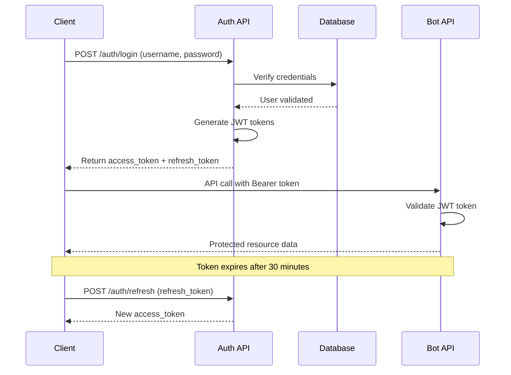

# dYdX Trading Bot - Complete Authentication Guide

**Version:** 1.0.0  
**Last Updated:** November 2025  
**Status:** Production Ready

---

## Table of Contents

1. [Overview](#overview)
2. [Quick Start](#quick-start)
3. [Authentication Flow](#authentication-flow)
4. [API Endpoints](#api-endpoints)
5. [Security Features](#security-features)
6. [Two-Factor Authentication](#two-factor-authentication)
7. [Email Integration](#email-integration)
8. [Code Examples](#code-examples)
9. [Production Setup](#production-setup)
10. [Troubleshooting](#troubleshooting)

---

## Overview

The dYdX Trading Bot API includes a comprehensive **JWT-based authentication system** with the following features:

### 🔐 Security Features

- **JWT Authentication**: Industry-standard JSON Web Tokens with configurable expiration
- **Bearer Token Authorization**: Secure API access using Bearer tokens
- **Two-Factor Authentication**: TOTP and email-based 2FA support
- **Password Security**: bcrypt hashing with salt for secure password storage
- **User Management**: Admin and user roles with appropriate permissions
- **Rate Limiting**: Built-in protection against brute force attacks
- **Email Verification**: Required for password resets and 2FA setup
- **Token Management**: Secure refresh tokens with blacklisting support

### 🎯 Authentication Scope

| Endpoint Type | Authentication Required | Description |
|---------------|------------------------|-------------|
| **Public** 🟢 | No | `/health`, `/auth/*` endpoints |
| **Protected** 🔒 | Yes | `/api/v1/bots/*`, `/api/v1/system/*` |

---

## Quick Start

### 1. Initialize Authentication System

```bash
# Navigate to bot directory
cd /home/chris/workspace/dydx-trading-bot/bot

# Activate virtual environment
source venv/bin/activate

# Initialize authentication database
python init_auth_db.py
```

**Expected Output:**

```
============================================================
dYdX Trading Bot - Authentication Database Setup
============================================================
INFO: 🚀 Starting database initialization...
INFO: ✅ Database tables created successfully
INFO: 👤 Creating default admin user...
INFO: ✅ Default admin user created:
INFO:    Username: admin
INFO:    Password: admin123
INFO:    Email: admin@localhost
INFO: ⚠️  IMPORTANT: Change the default password after first login!
============================================================
🎉 SETUP COMPLETE!
============================================================
```

### 2. Start API Server

```bash
# Start the API server
python start_api.py

# Server will run on http://localhost:8000
# Swagger UI available at http://localhost:8000/docs
```

### 3. Login and Get Token

```bash
# Login with default admin credentials
curl -X POST "http://localhost:8000/auth/login" \
  -H "Content-Type: application/json" \
  -d '{
    "username": "admin",
    "password": "admin123"
  }'
```

**Response:**

```json
{
  "success": true,
  "message": "Login successful",
  "data": {
    "access_token": "eyJ0eXAiOiJKV1QiLCJhbGciOiJIUzI1NiJ9...",
    "refresh_token": "eyJ0eXAiOiJKV1QiLCJhbGciOiJIUzI1NiJ9...",
    "token_type": "Bearer",
    "expires_in": 1800,
    "user": {
      "id": "4ba86029-1692-4221-94f0-091be8f9c638",
      "username": "admin",
      "email": "admin@localhost",
      "role": "admin",
      "is_active": true,
      "is_2fa_enabled": false,
      "email_verified": false,
      "created_at": "2025-11-02T10:00:00Z"
    }
  },
  "timestamp": "2025-11-02T10:30:45.123456"
}
```

### 4. Use Bearer Token

```bash
# Store token for subsequent requests
export TOKEN="your_access_token_here"

# Use in authenticated API calls
curl -H "Authorization: Bearer $TOKEN" \
  "http://localhost:8000/api/v1/bots"
```

### 5. Access Swagger UI

1. **Open Browser:** <http://localhost:8000/docs>
2. **Click "Authorize" Button** (🔒 icon)
3. **Enter Token:** `Bearer your_access_token_here`
4. **Click "Authorize"**
5. **All endpoints now accessible!** 🎉

---

## Authentication Flow

### Standard Login Flow



### Token Lifecycle

| Token Type | Purpose | Lifetime | Storage |
|------------|---------|----------|---------|
| **Access Token** | API authentication | 30 minutes | Client memory/session |
| **Refresh Token** | Token renewal | 7 days | Secure client storage |
| **Reset Token** | Password reset | 1 hour | Database + email |
| **Email Verification** | Email confirmation | 24 hours | Database |

---

## API Endpoints

### 🟢 Public Authentication Endpoints

#### Login

**`POST /auth/login`** - Authenticate user and receive tokens

**Request:**

```json
{
  "username": "admin",
  "password": "admin123"
}
```

**Response:**

```json
{
  "success": true,
  "data": {
    "access_token": "eyJ0eXAiOiJKV1QiLCJhbGciOiJIUzI1NiJ9...",
    "refresh_token": "eyJ0eXAiOiJKV1QiLCJhbGciOiJIUzI1NiJ9...",
    "token_type": "Bearer",
    "expires_in": 1800,
    "user": {
      "id": "uuid",
      "username": "admin",
      "email": "admin@localhost",
      "role": "admin",
      "is_2fa_enabled": false
    }
  }
}
```

#### Refresh Token

**`POST /auth/refresh`** - Get new access token using refresh token

**Request:**

```json
{
  "refresh_token": "eyJ0eXAiOiJKV1QiLCJhbGciOiJIUzI1NiJ9..."
}
```

**Response:**

```json
{
  "success": true,
  "data": {
    "access_token": "eyJ0eXAiOiJKV1QiLCJhbGciOiJIUzI1NiJ9...",
    "token_type": "Bearer",
    "expires_in": 1800
  }
}
```

#### Logout

**`POST /auth/logout`** - Invalidate tokens (🔒 Authenticated)

**Headers:** `Authorization: Bearer <token>`

**Response:**

```json
{
  "success": true,
  "message": "Successfully logged out"
}
```

### 👤 User Management Endpoints

#### Register User (Admin Only)

**`POST /auth/register`** - Create new user account (🔒 Admin only)

**Headers:** `Authorization: Bearer <admin_token>`

**Request:**

```json
{
  "username": "newuser",
  "email": "user@example.com",
  "password": "secure_password",
  "role": "user"
}
```

#### Get Profile

**`GET /auth/profile`** - Get current user information (🔒 Authenticated)

**Headers:** `Authorization: Bearer <token>`

**Response:**

```json
{
  "success": true,
  "data": {
    "id": "uuid",
    "username": "admin",
    "email": "admin@localhost",
    "role": "admin",
    "is_2fa_enabled": true,
    "email_verified": true,
    "created_at": "2025-11-02T10:00:00Z",
    "last_login": "2025-11-02T10:30:00Z"
  }
}
```

#### Update Profile

**`PUT /auth/profile`** - Update user profile (🔒 Authenticated)

**Headers:** `Authorization: Bearer <token>`

**Request:**

```json
{
  "email": "newemail@example.com",
  "current_password": "current_password"
}
```

### 🔐 Password Management

#### Change Password

**`POST /auth/change-password`** - Change user password (🔒 Authenticated)

**Headers:** `Authorization: Bearer <token>`

**Request:**

```json
{
  "current_password": "admin123",
  "new_password": "new_secure_password",
  "totp_code": "123456"
}
```

**Response:**

```json
{
  "success": true,
  "message": "Password changed successfully"
}
```

#### Forgot Password

**`POST /auth/forgot-password`** - Request password reset email

**Request:**

```json
{
  "email": "admin@localhost"
}
```

**Response:**

```json
{
  "success": true,
  "message": "Password reset email sent"
}
```

#### Reset Password

**`POST /auth/reset-password`** - Reset password using reset token

**Request:**

```json
{
  "token": "reset_token_from_email",
  "new_password": "new_secure_password"
}
```

### 🔒 Two-Factor Authentication

#### Setup TOTP 2FA

**`POST /auth/2fa/setup`** - Generate QR code for 2FA setup (🔒 Authenticated)

**Headers:** `Authorization: Bearer <token>`

**Response:**

```json
{
  "success": true,
  "data": {
    "qr_code_url": "data:image/png;base64,iVBOR...",
    "manual_entry_key": "JBSWY3DPEHPK3PXP",
    "backup_codes": [
      "12345678",
      "87654321"
    ]
  }
}
```

#### Verify TOTP Code

**`POST /auth/2fa/verify`** - Verify and enable 2FA (🔒 Authenticated)

**Headers:** `Authorization: Bearer <token>`

**Request:**

```json
{
  "totp_code": "123456"
}
```

#### Request Email Verification

**`POST /auth/2fa/request-email-verification`** - Send verification code via email

**Request:**

```json
{
  "email": "admin@localhost",
  "purpose": "password_reset"
}
```

#### Verify Email Code

**`POST /auth/2fa/verify-email`** - Verify email with received code

**Request:**

```json
{
  "email": "admin@localhost",
  "verification_code": "123456",
  "purpose": "password_reset"
}
```

### 📧 Email Testing (Admin Only)

#### Test Email Configuration

**`POST /auth/test-email`** - Test email service configuration (🔒 Admin only)

**Headers:** `Authorization: Bearer <admin_token>`

**Request:**

```json
{
  "recipient": "test@example.com"
}
```

---

## Security Features

### 🛡️ Password Security

- **bcrypt Hashing**: Industry-standard password hashing with salt
- **Strength Requirements**: Configurable minimum password strength
- **History Tracking**: Prevent password reuse (configurable)
- **Secure Reset**: Time-limited reset tokens with single-use validation

### 🚫 Rate Limiting & Protection

- **Login Attempts**: Configurable failed login limit (default: 5 attempts)
- **Account Lockout**: Temporary lockout after failed attempts (default: 15 minutes)
- **IP-based Limiting**: Track attempts by IP address
- **Token Refresh Limits**: Prevent refresh token abuse

### 🔐 Token Security

- **JWT Standards**: RFC 7519 compliant JSON Web Tokens
- **Secure Signing**: Configurable secret key for token signing
- **Token Blacklisting**: Immediate token invalidation on logout
- **Expiration Management**: Configurable token lifetimes
- **Refresh Rotation**: New refresh tokens on each use (optional)

### 📋 Audit Logging

- **Login Tracking**: All login attempts with IP, timestamp, result
- **Password Changes**: Audit trail for password modifications
- **2FA Events**: Setup, verification, and usage logging
- **Token Operations**: Token creation, refresh, and invalidation

---

## Two-Factor Authentication

### 🔑 TOTP (Time-based One-Time Password)

The bot supports **TOTP 2FA** compatible with popular authenticator apps:

- **Google Authenticator** (Android/iOS)
- **Authy** (Cross-platform)
- **Microsoft Authenticator** (Android/iOS/Windows)
- **1Password** (Cross-platform)

#### Setup Process

1. **Enable 2FA:**

   ```bash
   curl -X POST "http://localhost:8000/auth/2fa/setup" \
     -H "Authorization: Bearer $TOKEN"
   ```

2. **Scan QR Code** with authenticator app or **enter manual key**

3. **Verify Setup:**

   ```bash
   curl -X POST "http://localhost:8000/auth/2fa/verify" \
     -H "Authorization: Bearer $TOKEN" \
     -H "Content-Type: application/json" \
     -d '{"totp_code": "123456"}'
   ```

4. **Save Backup Codes** for emergency access

#### Using 2FA

Once enabled, certain operations require TOTP verification:

- **Password Changes**
- **Account Settings Updates**
- **Administrative Actions**

### 📧 Email-based 2FA

For password resets and critical operations:

1. **Request Email Verification:**

   ```bash
   curl -X POST "http://localhost:8000/auth/2fa/request-email-verification" \
     -H "Content-Type: application/json" \
     -d '{
       "email": "admin@localhost",
       "purpose": "password_reset"
     }'
   ```

2. **Check Email** for 6-digit verification code

3. **Verify Code:**

   ```bash
   curl -X POST "http://localhost:8000/auth/2fa/verify-email" \
     -H "Content-Type: application/json" \
     -d '{
       "email": "admin@localhost",
       "verification_code": "123456",
       "purpose": "password_reset"
     }'
   ```

---

## Email Integration

### 📮 Email Providers

The authentication system supports two email providers:

#### Mailgun (Recommended)

**Advantages:**

- High deliverability rates
- Professional email service
- Detailed analytics and logs
- Easy API integration

**Setup (.env):**

```bash
EMAIL_PROVIDER=mailgun
MAILGUN_API_KEY=key-your-mailgun-api-key
MAILGUN_DOMAIN=your-domain.com
MAILGUN_FROM_EMAIL=noreply@your-domain.com
```

#### SMTP (Alternative)

**Advantages:**

- Works with any SMTP provider
- Use existing email accounts
- Good for development/testing

**Setup (.env):**

```bash
EMAIL_PROVIDER=smtp
SMTP_HOST=smtp.gmail.com
SMTP_PORT=587
SMTP_USERNAME=your-email@gmail.com
SMTP_PASSWORD=your-app-password
SMTP_FROM_EMAIL=your-email@gmail.com
SMTP_USE_TLS=true
```

### 📧 Email Templates

Professional HTML templates for:

- **Welcome emails** for new users
- **Password reset** instructions
- **2FA verification codes**
- **Account security alerts**
- **Login notifications**

#### Sample Email Template

```html
<!DOCTYPE html>
<html>
<head>
    <meta charset="utf-8">
    <title>dYdX Trading Bot - Email Verification</title>
</head>
<body style="font-family: Arial, sans-serif; max-width: 600px; margin: 0 auto;">
    <div style="background: linear-gradient(135deg, #667eea 0%, #764ba2 100%); padding: 20px; text-align: center;">
        <h1 style="color: white; margin: 0;">🤖 dYdX Trading Bot</h1>
    </div>
    
    <div style="padding: 20px; background: #f8f9fa;">
        <h2 style="color: #333;">Email Verification Required</h2>
        <p>Your verification code is:</p>
        <div style="background: white; padding: 15px; text-align: center; border-radius: 5px; margin: 20px 0;">
            <span style="font-size: 24px; font-weight: bold; color: #667eea; letter-spacing: 3px;">123456</span>
        </div>
        <p><strong>This code expires in 10 minutes.</strong></p>
        <p>If you didn't request this verification, please ignore this email.</p>
    </div>
    
    <div style="padding: 15px; background: #e9ecef; text-align: center; font-size: 12px; color: #666;">
        © 2025 dYdX Trading Bot - Automated Trading System
    </div>
</body>
</html>
```

---

## Code Examples

### Python Authentication Client

```python
import requests
from typing import Optional, Dict, Any
import time

class TradingBotAuth:
    def __init__(self, base_url: str = "http://localhost:8000"):
        self.base_url = base_url
        self.access_token: Optional[str] = None
        self.refresh_token: Optional[str] = None
        self.token_expires_at: Optional[float] = None
        
    def login(self, username: str, password: str, totp_code: Optional[str] = None) -> Dict[str, Any]:
        """Login and store tokens"""
        payload = {
            "username": username,
            "password": password
        }
        
        if totp_code:
            payload["totp_code"] = totp_code
            
        response = requests.post(
            f"{self.base_url}/auth/login",
            json=payload
        )
        
        if response.status_code == 200:
            data = response.json()['data']
            self.access_token = data['access_token']
            self.refresh_token = data['refresh_token']
            self.token_expires_at = time.time() + data['expires_in']
            return data['user']
        else:
            raise Exception(f"Login failed: {response.text}")
    
    def logout(self) -> bool:
        """Logout and clear tokens"""
        if not self.access_token:
            return True
            
        try:
            response = requests.post(
                f"{self.base_url}/auth/logout",
                headers=self._get_auth_headers()
            )
            return response.status_code == 200
        finally:
            self.access_token = None
            self.refresh_token = None
            self.token_expires_at = None
    
    def refresh_access_token(self) -> bool:
        """Refresh access token if needed"""
        if not self.refresh_token:
            return False
            
        response = requests.post(
            f"{self.base_url}/auth/refresh",
            json={"refresh_token": self.refresh_token}
        )
        
        if response.status_code == 200:
            data = response.json()['data']
            self.access_token = data['access_token']
            self.token_expires_at = time.time() + data['expires_in']
            return True
        else:
            # Refresh failed, need to login again
            self.access_token = None
            self.refresh_token = None
            self.token_expires_at = None
            return False
    
    def _get_auth_headers(self) -> Dict[str, str]:
        """Get headers with authentication"""
        if not self.access_token:
            raise Exception("Not authenticated. Please login first.")
            
        return {
            "Authorization": f"Bearer {self.access_token}",
            "Content-Type": "application/json"
        }
    
    def _ensure_valid_token(self) -> bool:
        """Ensure we have a valid token, refresh if needed"""
        if not self.access_token:
            return False
            
        # Check if token expires in next 60 seconds
        if self.token_expires_at and (self.token_expires_at - time.time()) < 60:
            return self.refresh_access_token()
            
        return True
    
    def authenticated_request(self, method: str, endpoint: str, **kwargs) -> requests.Response:
        """Make authenticated API request with automatic token refresh"""
        if not self._ensure_valid_token():
            raise Exception("Authentication required. Please login.")
            
        response = requests.request(
            method=method,
            url=f"{self.base_url}{endpoint}",
            headers=self._get_auth_headers(),
            **kwargs
        )
        
        # If token expired, try to refresh and retry once
        if response.status_code == 401 and self.refresh_access_token():
            response = requests.request(
                method=method,
                url=f"{self.base_url}{endpoint}",
                headers=self._get_auth_headers(),
                **kwargs
            )
            
        return response
    
    # Convenience methods for common operations
    def get_profile(self) -> Dict[str, Any]:
        """Get current user profile"""
        response = self.authenticated_request("GET", "/auth/profile")
        return response.json()
    
    def change_password(self, current_password: str, new_password: str, totp_code: Optional[str] = None) -> bool:
        """Change user password"""
        payload = {
            "current_password": current_password,
            "new_password": new_password
        }
        
        if totp_code:
            payload["totp_code"] = totp_code
            
        response = self.authenticated_request("POST", "/auth/change-password", json=payload)
        return response.status_code == 200
    
    def setup_2fa(self) -> Dict[str, Any]:
        """Setup TOTP 2FA"""
        response = self.authenticated_request("POST", "/auth/2fa/setup")
        return response.json()['data']
    
    def verify_2fa(self, totp_code: str) -> bool:
        """Verify and enable 2FA"""
        response = self.authenticated_request("POST", "/auth/2fa/verify", json={"totp_code": totp_code})
        return response.status_code == 200
    
    # Bot management methods
    def get_bots(self) -> Dict[str, Any]:
        """Get all bot instances"""
        response = self.authenticated_request("GET", "/api/v1/bots")
        return response.json()
    
    def create_bot(self, config: Dict[str, Any]) -> Dict[str, Any]:
        """Create new bot instance"""
        response = self.authenticated_request("POST", "/api/v1/bots", json=config)
        return response.json()
    
    def start_bot(self, instance_id: str) -> Dict[str, Any]:
        """Start bot instance"""
        response = self.authenticated_request("POST", f"/api/v1/bots/{instance_id}/start")
        return response.json()

# Usage Example
def main():
    # Initialize authentication client
    auth = TradingBotAuth()
    
    try:
        # Login
        user = auth.login("admin", "admin123")
        print(f"Logged in as: {user['username']}")
        
        # Setup 2FA (first time)
        if not user.get('is_2fa_enabled'):
            print("Setting up 2FA...")
            qr_data = auth.setup_2fa()
            print(f"Scan QR code or enter key: {qr_data['manual_entry_key']}")
            
            # Wait for user to setup authenticator app
            totp_code = input("Enter TOTP code from authenticator: ")
            if auth.verify_2fa(totp_code):
                print("2FA enabled successfully!")
        
        # Change default password
        if input("Change default password? (y/n): ").lower() == 'y':
            new_password = input("Enter new password: ")
            totp_code = input("Enter TOTP code: ") if user.get('is_2fa_enabled') else None
            
            if auth.change_password("admin123", new_password, totp_code):
                print("Password changed successfully!")
        
        # Get bots
        bots = auth.get_bots()
        print(f"Found {len(bots['data']['instances'])} bots")
        
        # Create new bot
        bot_config = {
            "instance_id": "secure-bot-01",
            "instance_name": "Secure Trading Bot",
            "credentials": {
                "address": "dydx1...",
                "mnemonic": "word1 word2 ..."
            },
            "trading_params": {
                "is_testnet": True,
                "zscore_threshold": 1.5,
                "usd_per_trade": 50.0
            }
        }
        
        result = auth.create_bot(bot_config)
        if result['success']:
            print(f"Bot created: {result['data']['instance_id']}")
            
            # Start the bot
            start_result = auth.start_bot(result['data']['instance_id'])
            print(f"Bot start result: {start_result['message']}")
    
    except Exception as e:
        print(f"Error: {e}")
    
    finally:
        # Always logout
        auth.logout()
        print("Logged out")

if __name__ == "__main__":
    main()
```

### JavaScript/Node.js Authentication

```javascript
class TradingBotAuthClient {
    constructor(baseUrl = 'http://localhost:8000') {
        this.baseUrl = baseUrl;
        this.accessToken = null;
        this.refreshToken = null;
        this.tokenExpiresAt = null;
    }
    
    async login(username, password, totpCode = null) {
        const payload = { username, password };
        if (totpCode) payload.totp_code = totpCode;
        
        const response = await fetch(`${this.baseUrl}/auth/login`, {
            method: 'POST',
            headers: { 'Content-Type': 'application/json' },
            body: JSON.stringify(payload)
        });
        
        if (response.ok) {
            const data = await response.json();
            this.accessToken = data.data.access_token;
            this.refreshToken = data.data.refresh_token;
            this.tokenExpiresAt = Date.now() + (data.data.expires_in * 1000);
            return data.data.user;
        } else {
            throw new Error(`Login failed: ${response.statusText}`);
        }
    }
    
    async logout() {
        if (!this.accessToken) return true;
        
        try {
            await fetch(`${this.baseUrl}/auth/logout`, {
                method: 'POST',
                headers: this.getAuthHeaders()
            });
        } finally {
            this.accessToken = null;
            this.refreshToken = null;
            this.tokenExpiresAt = null;
        }
    }
    
    async refreshAccessToken() {
        if (!this.refreshToken) return false;
        
        const response = await fetch(`${this.baseUrl}/auth/refresh`, {
            method: 'POST',
            headers: { 'Content-Type': 'application/json' },
            body: JSON.stringify({ refresh_token: this.refreshToken })
        });
        
        if (response.ok) {
            const data = await response.json();
            this.accessToken = data.data.access_token;
            this.tokenExpiresAt = Date.now() + (data.data.expires_in * 1000);
            return true;
        } else {
            this.accessToken = null;
            this.refreshToken = null;
            this.tokenExpiresAt = null;
            return false;
        }
    }
    
    getAuthHeaders() {
        if (!this.accessToken) {
            throw new Error('Not authenticated. Please login first.');
        }
        
        return {
            'Authorization': `Bearer ${this.accessToken}`,
            'Content-Type': 'application/json'
        };
    }
    
    async ensureValidToken() {
        if (!this.accessToken) return false;
        
        // Refresh if token expires in next 60 seconds
        if (this.tokenExpiresAt && (this.tokenExpiresAt - Date.now()) < 60000) {
            return await this.refreshAccessToken();
        }
        
        return true;
    }
    
    async authenticatedRequest(method, endpoint, body = null) {
        if (!await this.ensureValidToken()) {
            throw new Error('Authentication required. Please login.');
        }
        
        const options = {
            method,
            headers: this.getAuthHeaders()
        };
        
        if (body) {
            options.body = JSON.stringify(body);
        }
        
        let response = await fetch(`${this.baseUrl}${endpoint}`, options);
        
        // Retry once if token expired
        if (response.status === 401 && await this.refreshAccessToken()) {
            options.headers = this.getAuthHeaders();
            response = await fetch(`${this.baseUrl}${endpoint}`, options);
        }
        
        return response;
    }
    
    // Convenience methods
    async getProfile() {
        const response = await this.authenticatedRequest('GET', '/auth/profile');
        return await response.json();
    }
    
    async getBots() {
        const response = await this.authenticatedRequest('GET', '/api/v1/bots');
        return await response.json();
    }
    
    async createBot(config) {
        const response = await this.authenticatedRequest('POST', '/api/v1/bots', config);
        return await response.json();
    }
}

// Usage
const auth = new TradingBotAuthClient();

async function main() {
    try {
        // Login
        const user = await auth.login('admin', 'admin123');
        console.log(`Logged in as: ${user.username}`);
        
        // Get bots
        const bots = await auth.getBots();
        console.log(`Found ${bots.data.instances.length} bots`);
        
        // Logout
        await auth.logout();
        console.log('Logged out');
        
    } catch (error) {
        console.error('Error:', error.message);
    }
}

main();
```

---

## Production Setup

### 🔒 Environment Configuration

Create a secure `.env` file for production:

```bash
# JWT Configuration
SECRET_KEY=your_super_secure_secret_key_here_32_chars_min
JWT_ALGORITHM=HS256
ACCESS_TOKEN_EXPIRE_MINUTES=30
REFRESH_TOKEN_EXPIRE_DAYS=7

# Password & Security
PASSWORD_RESET_TOKEN_EXPIRE_HOURS=1
MAX_LOGIN_ATTEMPTS=5
LOCKOUT_DURATION_MINUTES=15

# Email Configuration (Mailgun recommended)
EMAIL_PROVIDER=mailgun
MAILGUN_API_KEY=key-your-actual-mailgun-api-key
MAILGUN_DOMAIN=your-actual-domain.com
MAILGUN_FROM_EMAIL=noreply@your-domain.com

# Database (PostgreSQL for production)
DB_TYPE=postgresql
DB_HOST=your-db-host
DB_PORT=5432
DB_NAME=dydx_trading_bot
DB_USER=your_db_user
DB_PASSWORD=your_secure_db_password

# HTTPS Configuration (required for production)
USE_HTTPS=true
SSL_CERT_PATH=/path/to/ssl/cert.pem
SSL_KEY_PATH=/path/to/ssl/private.key

# Rate Limiting
ENABLE_RATE_LIMITING=true
RATE_LIMIT_PER_MINUTE=60
```

### 🛡️ Security Checklist

#### ✅ Before Going Live

- [ ] **Change default admin password**
- [ ] **Generate secure SECRET_KEY** (32+ characters)
- [ ] **Enable 2FA for all users**
- [ ] **Configure email provider** (Mailgun/SMTP)
- [ ] **Use HTTPS only** (SSL/TLS certificates)
- [ ] **Setup PostgreSQL** (not SQLite)
- [ ] **Enable rate limiting**
- [ ] **Configure firewall** (restrict API access)
- [ ] **Setup log monitoring** (check for suspicious activity)
- [ ] **Regular backups** (database and configuration)

#### 📝 Security Best Practices

1. **Use Environment Variables:**

   ```bash
   # Never hardcode secrets in code
   export SECRET_KEY=$(openssl rand -hex 32)
   export MAILGUN_API_KEY=key-your-actual-key
   ```

2. **Regular Key Rotation:**

   ```bash
   # Rotate JWT secret key monthly
   # Update all users' tokens will be invalidated
   ```

3. **Monitor Authentication Logs:**

   ```bash
   # Check for suspicious login patterns
   tail -f api.log | grep "authentication"
   ```

4. **Backup Strategy:**

   ```bash
   # Daily automated backups
   pg_dump dydx_trading_bot > backup_$(date +%Y%m%d).sql
   ```

### 🐳 Docker Production Setup

**Dockerfile:**

```dockerfile
FROM python:3.11-slim

WORKDIR /app

# Install system dependencies
RUN apt-get update && apt-get install -y \
    gcc \
    libpq-dev \
    && rm -rf /var/lib/apt/lists/*

# Install Python dependencies
COPY requirements.txt .
RUN pip install --no-cache-dir -r requirements.txt

# Copy application
COPY . .

# Create non-root user
RUN useradd --create-home --shell /bin/bash botuser
USER botuser

# Expose port
EXPOSE 8000

# Health check
HEALTHCHECK --interval=30s --timeout=10s --start-period=5s --retries=3 \
  CMD curl -f http://localhost:8000/health || exit 1

# Run application
CMD ["python", "start_api.py"]
```

**docker-compose.yml:**

```yaml
version: '3.8'

services:
  bot-api:
    build: .
    ports:
      - "8000:8000"
    environment:
      - SECRET_KEY=${SECRET_KEY}
      - DB_TYPE=postgresql
      - DB_HOST=postgres
      - DB_NAME=dydx_bot
      - DB_USER=botuser
      - DB_PASSWORD=${DB_PASSWORD}
      - MAILGUN_API_KEY=${MAILGUN_API_KEY}
      - MAILGUN_DOMAIN=${MAILGUN_DOMAIN}
    depends_on:
      - postgres
    volumes:
      - ./logs:/app/logs
    restart: unless-stopped
    
  postgres:
    image: postgres:15-alpine
    environment:
      - POSTGRES_DB=dydx_bot
      - POSTGRES_USER=botuser
      - POSTGRES_PASSWORD=${DB_PASSWORD}
    volumes:
      - postgres_data:/var/lib/postgresql/data
    restart: unless-stopped
    
  nginx:
    image: nginx:alpine
    ports:
      - "443:443"
      - "80:80"
    volumes:
      - ./nginx.conf:/etc/nginx/nginx.conf
      - ./ssl:/etc/nginx/ssl
    depends_on:
      - bot-api
    restart: unless-stopped

volumes:
  postgres_data:
```

### 🌐 Nginx Configuration

**nginx.conf:**

```nginx
events {
    worker_connections 1024;
}

http {
    upstream bot_api {
        server bot-api:8000;
    }
    
    # Redirect HTTP to HTTPS
    server {
        listen 80;
        server_name your-domain.com;
        return 301 https://$server_name$request_uri;
    }
    
    # HTTPS server
    server {
        listen 443 ssl http2;
        server_name your-domain.com;
        
        ssl_certificate /etc/nginx/ssl/cert.pem;
        ssl_certificate_key /etc/nginx/ssl/private.key;
        
        # Security headers
        add_header X-Frame-Options DENY;
        add_header X-Content-Type-Options nosniff;
        add_header X-XSS-Protection "1; mode=block";
        add_header Strict-Transport-Security "max-age=31536000; includeSubDomains" always;
        
        # Rate limiting
        limit_req_zone $binary_remote_addr zone=auth:10m rate=10r/m;
        limit_req_zone $binary_remote_addr zone=api:10m rate=100r/m;
        
        location /auth/ {
            limit_req zone=auth burst=5 nodelay;
            proxy_pass http://bot_api;
            proxy_set_header Host $host;
            proxy_set_header X-Real-IP $remote_addr;
            proxy_set_header X-Forwarded-For $proxy_add_x_forwarded_for;
            proxy_set_header X-Forwarded-Proto $scheme;
        }
        
        location / {
            limit_req zone=api burst=20 nodelay;
            proxy_pass http://bot_api;
            proxy_set_header Host $host;
            proxy_set_header X-Real-IP $remote_addr;
            proxy_set_header X-Forwarded-For $proxy_add_x_forwarded_for;
            proxy_set_header X-Forwarded-Proto $scheme;
        }
    }
}
```

---

## Troubleshooting

### 🔍 Common Issues

#### Issue: "Invalid credentials" on login

**Symptoms:**

- Login returns 401 Unauthorized
- Correct username/password not working

**Solutions:**

1. **Check default credentials:**

   ```bash
   # Default admin credentials
   Username: admin
   Password: admin123
   ```

2. **Verify database initialization:**

   ```bash
   python init_auth_db.py
   ```

3. **Check password case sensitivity:**

   ```bash
   # Passwords are case-sensitive
   # Username is case-insensitive
   ```

#### Issue: "Token expired" errors

**Symptoms:**

- API calls return 401 after some time
- Access denied on protected endpoints

**Solutions:**

1. **Use refresh token:**

   ```bash
   curl -X POST "http://localhost:8000/auth/refresh" \
     -H "Content-Type: application/json" \
     -d '{"refresh_token": "your_refresh_token"}'
   ```

2. **Check token expiration:**

   ```python
   import jwt
   
   # Decode token to check expiration
   decoded = jwt.decode(token, options={"verify_signature": False})
   print(f"Expires: {decoded['exp']}")
   ```

#### Issue: Email not sending

**Symptoms:**

- Password reset emails not received
- 2FA verification codes not delivered

**Solutions:**

1. **Test email configuration:**

   ```bash
   curl -X POST "http://localhost:8000/auth/test-email" \
     -H "Authorization: Bearer $ADMIN_TOKEN" \
     -H "Content-Type: application/json" \
     -d '{"recipient": "test@example.com"}'
   ```

2. **Check email provider settings:**

   ```bash
   # For Mailgun
   echo $MAILGUN_API_KEY
   echo $MAILGUN_DOMAIN
   
   # For SMTP
   echo $SMTP_HOST
   echo $SMTP_USERNAME
   ```

3. **Verify email credentials:**

   ```bash
   # Test SMTP connection
   python -c "
   import smtplib
   server = smtplib.SMTP('smtp.gmail.com', 587)
   server.starttls()
   server.login('user@gmail.com', 'app_password')
   print('SMTP connection successful')
   server.quit()
   "
   ```

#### Issue: 2FA setup problems

**Symptoms:**

- QR code not generating
- TOTP codes not working

**Solutions:**

1. **Check system time:**

   ```bash
   # TOTP requires accurate system time
   date
   sudo ntpdate -s time.nist.gov
   ```

2. **Verify QR code data:**

   ```bash
   # QR code should contain TOTP URL
   # Format: otpauth://totp/Service:user@email?secret=KEY&issuer=Service
   ```

3. **Manual entry:**

   ```bash
   # Use manual_entry_key if QR code fails
   # Enter key directly in authenticator app
   ```

#### Issue: Account lockout

**Symptoms:**

- "Account temporarily locked" message
- Cannot login despite correct credentials

**Solutions:**

1. **Wait for lockout period:**

   ```bash
   # Default: 15 minutes
   # Or admin can unlock manually
   ```

2. **Admin unlock (database access):**

   ```sql
   UPDATE users 
   SET failed_login_attempts = 0, 
       locked_until = NULL 
   WHERE username = 'locked_user';
   ```

#### Issue: Database connection errors

**Symptoms:**

- "Database connection failed"
- Authentication endpoints not working

**Solutions:**

1. **Check database service:**

   ```bash
   # SQLite
   ls -la trading_bot.db
   
   # PostgreSQL
   pg_isready -h localhost -p 5432
   ```

2. **Verify database tables:**

   ```bash
   python -c "
   from database import db
   from auth_models import User
   print(db.engine.table_names())
   "
   ```

3. **Reinitialize database:**

   ```bash
   python init_auth_db.py
   ```

### 📊 Monitoring & Logs

#### Authentication Events

**Check authentication logs:**

```bash
# Filter authentication events
grep "authentication" api.log

# Failed login attempts
grep "Failed login" api.log

# Token operations
grep "token" api.log
```

#### Performance Monitoring

**Monitor API performance:**

```bash
# Request response times
grep "POST /auth/login" api.log | grep "ms"

# Database query performance
grep "SQL" api.log | tail -20
```

#### Security Monitoring

**Check for suspicious activity:**

```bash
# Multiple failed logins from same IP
grep "Failed login" api.log | awk '{print $4}' | sort | uniq -c | sort -nr

# Password reset attempts
grep "password reset" api.log

# 2FA bypass attempts
grep "2FA" api.log | grep "failed"
```

### 🆘 Getting Help

When reporting authentication issues, include:

1. **Error message** (exact text)
2. **API endpoint** being accessed
3. **Authentication method** (Bearer token, etc.)
4. **Steps to reproduce** the issue
5. **Environment details** (OS, Python version, dependencies)
6. **Log excerpts** (without sensitive data)

**Contact Information:**

- **Documentation:** Check this guide and API documentation
- **Issue Tracker:** GitHub repository issues
- **Security Issues:** Email security reports (don't post publicly)

---

## Conclusion

The dYdX Trading Bot authentication system provides enterprise-grade security features including:

✅ **JWT-based authentication** with Bearer tokens  
✅ **Two-factor authentication** (TOTP + Email)  
✅ **Secure password management** with reset functionality  
✅ **Email integration** for notifications and verification  
✅ **Rate limiting and lockout protection**  
✅ **Audit logging** for security monitoring  
✅ **Production-ready** with Docker and HTTPS support  

**Remember:**

- Change default passwords immediately
- Enable 2FA for all production users
- Use HTTPS in production environments
- Monitor authentication logs regularly
- Keep secret keys secure and rotate them periodically

The system is now ready for secure production deployment! 🚀

---

**Last Updated:** November 2, 2025  
**Version:** 1.0.0  
**Author:** dYdX Trading Bot Team

For questions or issues, check the troubleshooting section or review the API documentation at `http://localhost:8000/docs`.
