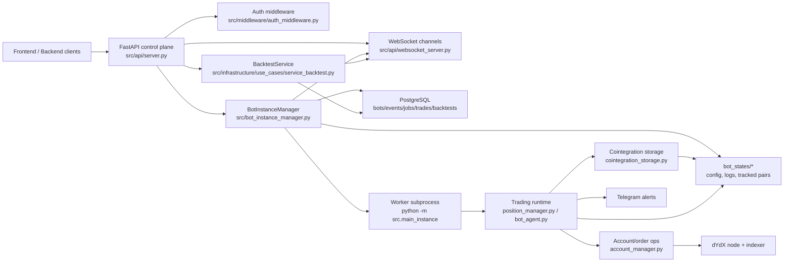
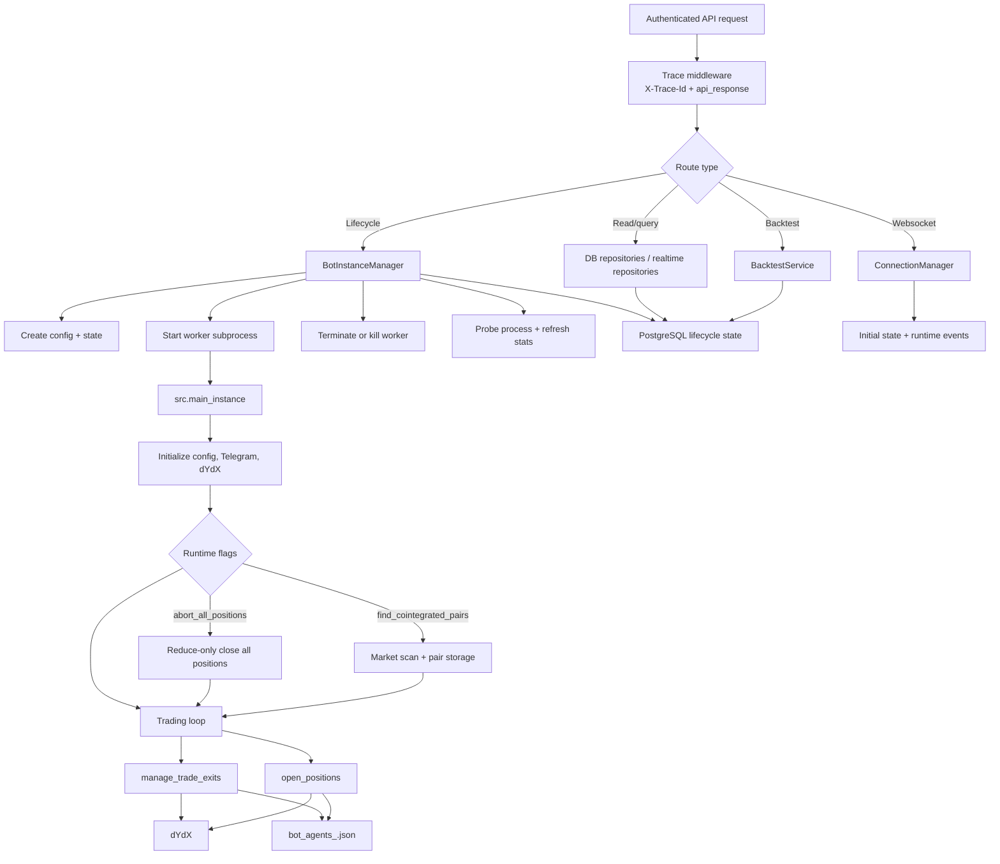
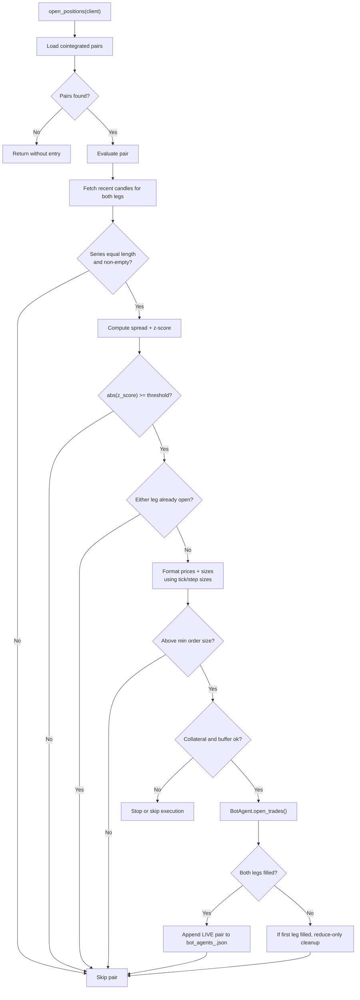
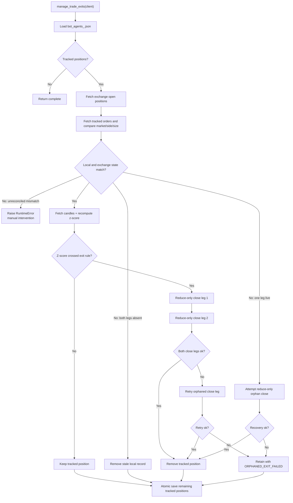
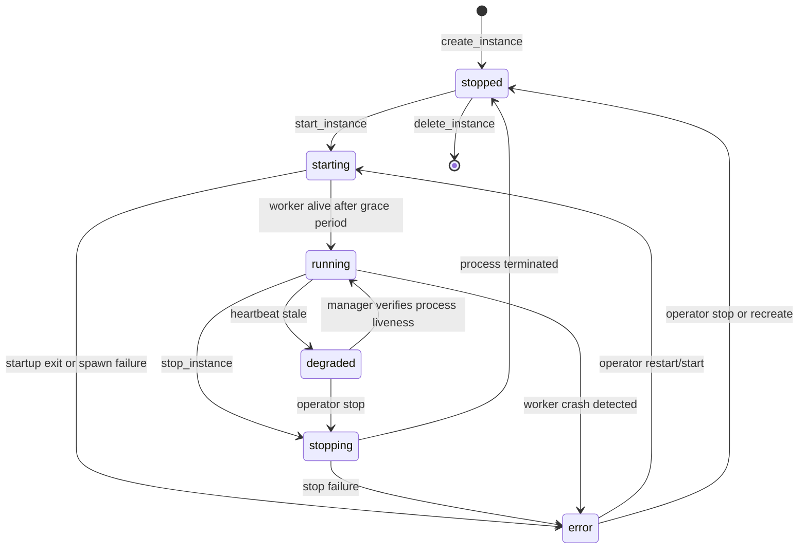
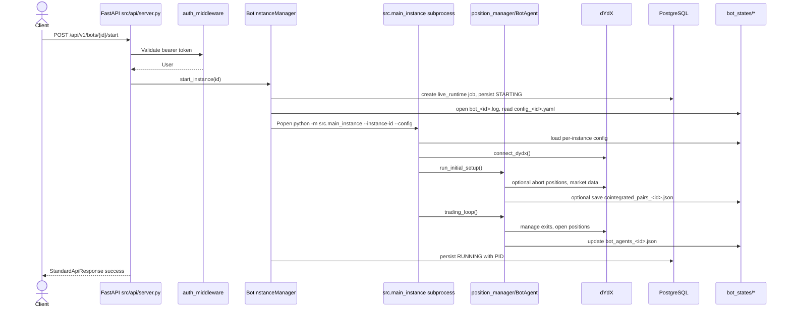
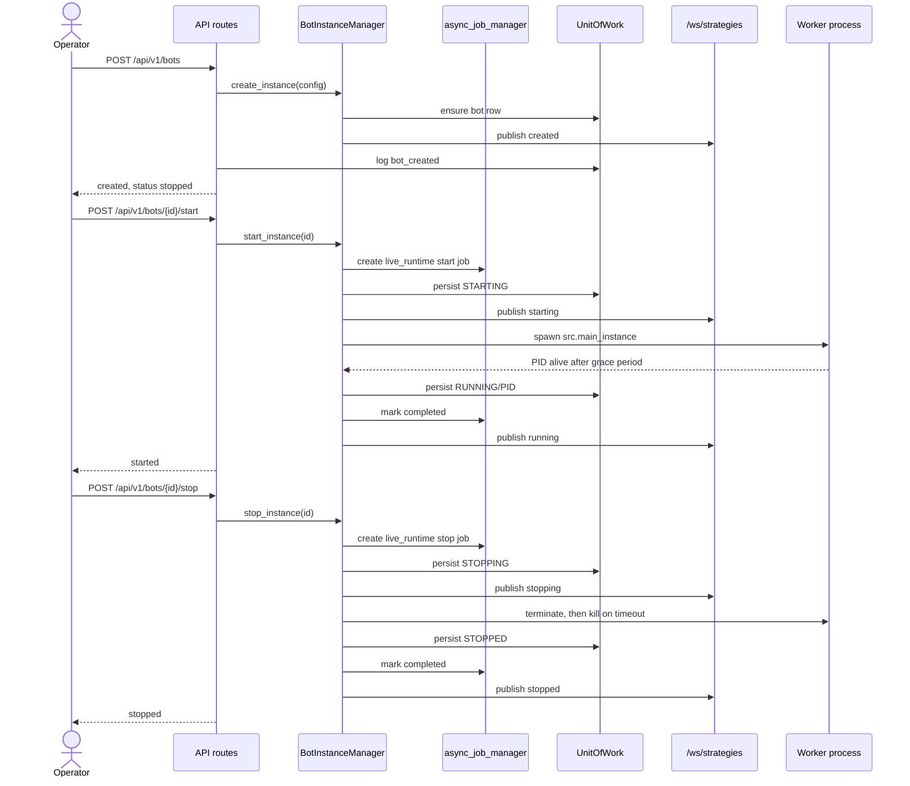
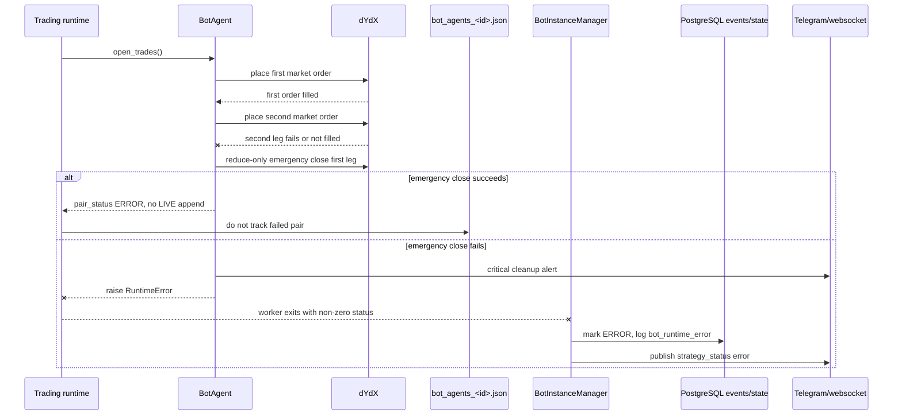
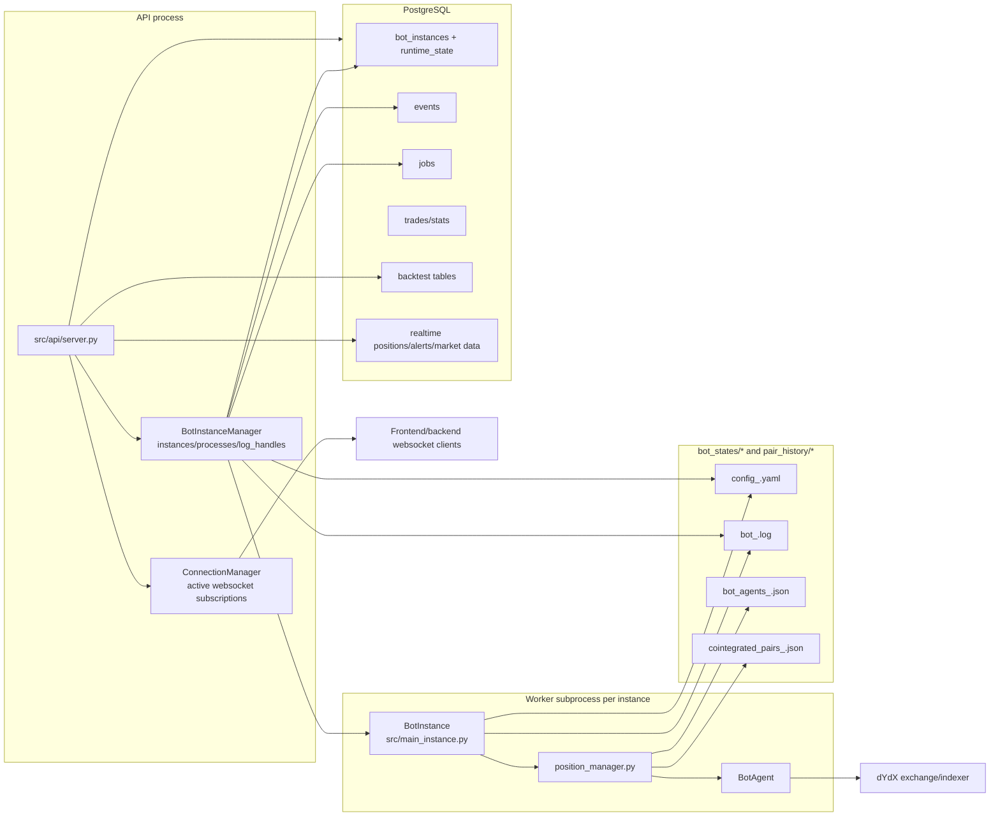

# Bot Flow Documentation

Scope: full bot system, including API lifecycle, strategy runtime, worker process behavior, dYdX execution, persistence, and recovery surfaces.

Last code-traced: 2026-04-28.

## Developer Workspace Notes

The repository includes a `.vscode/` workspace setup for day-to-day bot development:

- `settings.json` points Python tooling at the project `.venv` and enables pytest + analysis defaults.
- `extensions.json` recommends the core Python, formatter, linting, and Docker extensions.
- `launch.json` includes debug profiles for the FastAPI API, the local API wrapper, the bot runtime, and compound
  API/bot launches.
- `tasks.json` provides Makefile-backed run/test/preflight tasks plus stop tasks for the long-running local services.

For the smoothest experience, open the repo in VS Code, install the recommended extensions, and use **Run Task** or
**Run and Debug** for the workflows above.

## Architecture Snapshot

### Core Components

| Component | Responsibility | Canonical files |
| --- | --- | --- |
| FastAPI control plane | Authenticated HTTP and websocket API, request tracing, readiness, lifecycle orchestration, backtest orchestration | `src/api/server.py`, `src/api/start_api.py`, `app.py`, `start_api.py` |
| Bot instance manager | Creates instance config files, starts/stops/deletes worker subprocesses, tracks status, persists lifecycle state, monitors dead workers | `src/bot_instance_manager.py` |
| Worker runtime | Loads per-instance config, connects to dYdX, optionally aborts all positions, optionally scans cointegration pairs, runs the trading loop | `src/main_instance.py`, `worker_entrypoint.py`, `main.py` |
| Trading runtime | Finds entries, manages exits, tracks open pairs, executes two-leg orders, performs emergency cleanup | `src/trading/position_manager.py`, `src/trading/bot_agent.py`, `src/trading/account_manager.py` |
| Exchange adapter | dYdX wallet/client creation, market data, account/order/position calls | `src/trading/dydx_client.py`, `src/trading/market_data.py`, `src/trading/account_manager.py` |
| Persistence | PostgreSQL bot metadata/events/jobs/trades/backtests/realtime state, plus per-instance state files under `bot_states/` | `src/infrastructure/database.py`, `src/infrastructure/persistence/*.py`, `src/infrastructure/domain/*.py` |
| Realtime channels | Websocket initial state, live bot/backtest/strategy lifecycle events | `src/api/websocket_server.py`, `src/api/server.py` |

### Runtime Boundaries

- The API process and each live trading instance are separate OS processes. `BotInstanceManager.start_instance()` starts workers with `subprocess.Popen(...)` using `python -m src.main_instance`.
- Worker state is isolated by environment variables and per-instance files:
  - `BOT_INSTANCE_ID`
  - `BOT_CONFIG_FILE`
  - `BOT_AGENTS_FILE`
  - `BOT_PAIRS_FILE`
- The manager owns worker lifecycle. API routes should call `bot_manager` methods rather than creating or killing processes directly.
- PostgreSQL is the authoritative instance metadata store when database persistence is enabled. Legacy disk snapshots are optional and disabled unless `BOT_ENABLE_LEGACY_STATE_FALLBACK` or `BOT_WRITE_LEGACY_STATE_SNAPSHOT` is enabled.

### Component Diagram

## Flow Map

### Happy Path: Request To Execution To Persistence

1. A client calls a protected HTTP route in `src/api/server.py`, for example `POST /api/v1/bots`.
2. Auth dependencies from `src/middleware/auth_middleware.py` validate the bearer token unless `API_BYPASS_AUTH=true`.
3. The request trace middleware assigns or propagates `X-Trace-Id` and wraps responses with `api_response(...)`.
4. `create_bot_instance()` validates the payload as `BotInstanceConfig` and calls `bot_manager.create_instance(...)`.
5. `BotInstanceManager` writes `bot_states/config_<instance_id>.yaml`, stores in-memory state, ensures the database row exists, persists status, and publishes strategy websocket status if the instance id maps to a strategy.
6. `POST /api/v1/bots/{instance_id}/start` calls `bot_manager.start_instance(...)`.
7. The manager transitions `STOPPED -> STARTING`, creates an async job, opens `bot_states/bot_<instance_id>.log`, and starts `src.main_instance` as a subprocess.
8. The worker loads the structured config before runtime imports, connects to dYdX, optionally closes all positions, optionally performs cointegration discovery, then enters the trading loop.
9. Each loop can run `manage_trade_exits(...)` and `open_positions(...)` based on config flags.
10. Trades, lifecycle events, jobs, realtime state, logs, and local pair state are persisted through the DB and `bot_states/*` artifacts.

### Critical Alternate Paths

- API startup fails readiness if database health checks fail. The API lifespan runs DB health, table creation, schema compatibility, pending migrations, and required table verification before declaring ready.
- `/ready` is strict: it returns `200` only when `bot_manager` is available and `503` otherwise.
- If a worker exits during startup, `start_instance()` reads the recent log tail, marks the instance `ERROR`, records a runtime event, and publishes strategy status.
- If an attached worker dies after startup, `cleanup_dead_processes()` and `get_instance_status()` detect the exit code, mark `ERROR`, close log handles, persist state, and publish websocket status.
- If a persisted process PID exists but the API process lost the `Popen` handle, `_resolve_external_runtime_process()` validates the PID and command line before treating it as the recovered runtime.
- If local tracked pair state diverges from exchange positions, `manage_trade_exits()` either removes stale local state, tries reduce-only orphan recovery, or raises a runtime error requiring manual intervention.

### High-Level Flow Diagram

## Business Logic Flow

### Strategy Setup

Controlled by `TradingParameters` in `src/infrastructure/domain/bot_api_models.py` and worker config loading in `src/main_instance.py`.

- `abort_all_positions=true`: `BotInstance.run_initial_setup()` calls `abort_all_positions(client)` before entering the trading loop.
- `find_cointegrated_pairs=true`: the worker calls `construct_market_prices(...)`, then `store_cointegration_results(...)`.
- `manage_exits=true`: each loop calls `manage_trade_exits(client)`.
- `place_trades=true`: each loop calls `open_positions(client)`.

Cointegration selection in `src/trading/analysis/cointegration.py`:

- Rejects invalid statistical inputs with `SmartError`.
- Requires p-value `< 0.05`, test statistic below the critical value, positive half-life, and half-life `<= MAX_HALF_LIFE`.
- Stores pair metadata through `pair_storage.save_pairs(...)`.
- Adds a confidence score based on p-value, half-life, and zero crossings.

### Entry Decision Flow

Entry decisions live in `open_positions(client)` in `src/trading/position_manager.py`.

Preconditions:

- Pair storage has at least one saved cointegrated pair.
- Market metadata is available from dYdX for tick and step precision.
- Recent candle series for both legs are available and equal length.
- Neither leg is already open on the exchange.
- Candidate order sizes are above minimum order thresholds.
- Free collateral is at least `USD_MIN_COLLATERAL`.
- The trade would not leave collateral below the 1.25x minimum collateral buffer.

Decision points:

- Compute spread as `series_1 - hedge_ratio * series_2`.
- Compute rolling z-score with `calculate_zscore(...)`.
- Enter only when `abs(z_score) >= ZSCORE_THRESH`.
- Direction:
  - `z_score < 0`: buy base leg, sell quote leg.
  - `z_score > 0`: sell base leg, buy quote leg.
- Prices and sizes are formatted with `format_number(...)` using dYdX tick and step sizes.

Postconditions:

- If both legs fill, `BotAgent.open_trades()` returns an order dictionary with `pair_status="LIVE"`.
- Before returning `LIVE`, `BotAgent` reconciles both filled orders from dYdX and records weighted average fill prices when fill records are available.
- The worker appends the live pair to `BOT_AGENTS_FILE` using an atomic file write and lock.
- Telegram trade-opened notification is sent from the actual `BotAgent.open_trades()` order fields: base/quote side, size, z-score, hedge ratio, half-life, and both order ids.
- When PostgreSQL persistence is enabled and a `BOT_INSTANCE_ID` maps to a bot row, the worker best-effort persists the opened pair to the existing core `trades` table and realtime `positions_realtime` table.
- If entry fails before the first leg fills, the pair is marked `ERROR` or `FAILED` and no tracked position is appended.
- If the first leg fills and the second leg fails, the runtime attempts reduce-only emergency cleanup of the first leg.

### Entry Decision Diagram

### Exit Decision Flow

Exit decisions live in `manage_trade_exits(client)` in `src/trading/position_manager.py`.

Preconditions:

- `BOT_AGENTS_FILE` exists and contains tracked live pair records.
- Exchange open positions can be fetched.
- Both tracked orders can be fetched by order id.
- Local tracked state matches exchange order market, side, and size.

Decision points:

- If both tracked legs are no longer live on exchange, remove the stale local record.
- If exactly one leg remains live and tracked order data matches, attempt reduce-only orphan recovery for the live leg.
- If state mismatches cannot be reconciled, raise `RuntimeError` and require manual intervention.
- If `CLOSE_AT_ZSCORE_CROSS=true`, recompute current z-score and close when:
  - current absolute z-score is at least the entry absolute z-score, and
  - z-score crossed through zero relative to entry.

Postconditions:

- On successful close of both legs, the position is omitted from the saved tracked-position list.
- On successful close of both legs, the worker best-effort marks the existing core trade and realtime position closed when PostgreSQL persistence is enabled.
- If the first close leg succeeds but the second fails, the runtime retries the orphaned close leg.
- If orphan close retry fails, the tracked position is retained with `pair_status="ORPHANED_EXIT_FAILED"` and error metadata.
- Remaining positions are written with `_save_processed_positions(...)`, preserving concurrent appends.

### Exit Decision Diagram

### Execution Safety Controls

- Pair entry is sequential but guarded:
  - first order is placed and confirmed before second order placement.
  - second-leg failure triggers `_emergency_close_first_leg()`.
  - emergency close is reduce-only.
- Pair exit is reduce-only and retry-backed through `_place_reduce_only_close_with_retries(...)`.
- Orphan exposure recovery uses exchange position side and size where available.
- `abort_all_positions(client)` cancels open orders, then submits reduce-only close orders for all open positions, and clears the per-instance tracked-position file through the same locked atomic state helper used by normal entry/exit state writes.
- API runtime preflight checks wallet derivation, subaccount availability, free collateral, minimum collateral, configured capital allocation, and trade-size-to-collateral ratio.
- The manager uses per-instance lifecycle locks to avoid concurrent start/stop races.

## Application/API Flow

### Route To Module Mapping

| Route or channel | Handler | Main downstream modules |
| --- | --- | --- |
| `GET /health` | `health_check()` | backtest service health, manager recovery diagnostics |
| `GET /ready` | `readiness_check()` | strict bot manager readiness |
| `GET /api/v1/capabilities` | `api_capabilities()` | route introspection |
| `GET /api/v1/runtime/db-config` | `runtime_db_config()` | `DatabaseConfig.to_diagnostics()` |
| `POST /api/v1/runtime/preflight` | `runtime_preflight()` | `connect_dydx_runtime(...)`, dYdX subaccount lookup |
| `POST /api/v1/bots` | `create_bot_instance()` | `bot_manager.create_instance(...)`, `UnitOfWork.bots`, `UnitOfWork.events` |
| `GET /api/v1/bots` | `list_bot_instances()` | `bot_manager.list_instances()` |
| `GET /api/v1/bots/{instance_id}` | `get_bot_instance()` | `bot_manager.get_instance_status(...)` |
| `POST /api/v1/bots/{instance_id}/start` | `start_bot_instance()` | `bot_manager.start_instance(...)`, DB status/event persistence |
| `POST /api/v1/bots/{instance_id}/stop` | `stop_bot_instance()` | `bot_manager.stop_instance(...)`, DB status/event persistence |
| `POST /api/v1/bots/{instance_id}/restart` | `restart_bot_instance()` | stop then start through manager |
| `DELETE /api/v1/bots/{instance_id}` | `delete_bot_instance()` | manager delete, DB delete, state-file cleanup |
| `GET /api/v1/bots/{instance_id}/history` | `get_bot_history()` | `UnitOfWork.events` |
| `GET /api/v1/bots/{instance_id}/jobs` | `get_bot_jobs()` | `UnitOfWork.jobs` |
| `GET /api/v1/bots/{instance_id}/trades` | `get_bot_trades()` | `UnitOfWork.trades` |
| `GET /api/v1/bots/{instance_id}/stats` | `get_bot_stats()` | `UnitOfWork.bots`, `UnitOfWork.trades` |
| `GET /api/v1/bots/{id}/positions/current` | `get_current_positions()` | `UnitOfWorkRealtime.positions` |
| `GET /api/v1/bots/{id}/market-data` | `get_market_data()` | `UnitOfWorkRealtime.market_data` |
| `GET /api/v1/bots/{id}/realtime-stats` | `get_realtime_stats()` | `UnitOfWorkRealtime.stats` |
| `GET /api/v1/bots/{id}/alerts` | `get_alerts()` | `UnitOfWorkRealtime.alerts` |
| `WS /ws/strategies` | `websocket_strategies()` | strategy status snapshot and lifecycle updates |
| `WS /ws/bots/{id}` and `/api/v1/bots/{id}/*/live` | websocket handlers | `WebSocketServer.handle_connection(...)` |
| `POST /api/v1/backtests*` | backtest handlers | `BacktestService`, `BacktestRepository`, websocket progress |

### Instance Lifecycle

States are defined by `BotStatus`:

- `created`
- `starting`
- `running`
- `stopping`
- `stopped`
- `error`
- `recovering`
- `degraded`
- `safeguarded`

Create:

1. API validates `BotInstanceConfig`.
2. Manager rejects duplicates and max-instance overflow.
3. Manager writes `bot_states/config_<instance_id>.yaml`.
4. Manager stores `BotInstanceState(status=STOPPED)`.
5. Manager ensures/persists DB metadata.
6. API logs `bot_created` and sends lifecycle notification.

Start:

1. Manager acquires the per-instance lock.
2. Manager rejects missing instances and active runtime states, including `running`, `starting`, `stopping`, `degraded`, `recovering`, and `safeguarded`, to avoid duplicate workers.
3. Manager creates a `live_runtime` async job.
4. Manager writes `STARTING`.
5. Manager starts the worker subprocess with per-instance environment and log file.
6. Manager checks for immediate startup exit after `BOT_STARTUP_GRACE_SECONDS`.
7. On success, manager writes `RUNNING`, stores PID/cmd/log path, completes job, and publishes websocket status.

Status/list:

1. Manager checks attached process handles.
2. If the process exited, manager marks `ERROR`.
3. If no local handle exists but status is active, manager probes persisted PID and validates command line.
4. Manager refreshes DB-backed trading stats when database persistence is enabled.
5. If a degraded worker is still alive, manager-owned liveness verification moves it back to `running`.

Stop:

1. Manager acquires the per-instance lock.
2. Manager writes `STOPPING`.
3. If attached, it sends terminate or kill based on `force`.
4. If detached but a valid PID exists, it terminates or kills the recovered process.
5. Manager writes `STOPPED`, clears PID and last error, closes log handle, completes job, and publishes websocket status.

Delete:

1. Manager force-stops any active runtime instance, including degraded/recovering/safeguarded states.
2. Manager removes in-memory state.
3. Manager closes logs and deletes `bot_states/*_<instance_id>*` files known to `_get_instance_state_files(...)`.
4. API logs deletion and deletes the DB bot row.

### Lifecycle State Diagram

### Auth, Trace, And Readiness

- HTTP auth is dependency-based through `get_current_active_user` or `get_admin_user`.
- Websocket auth uses `_authorize_websocket_connection(...)`, accepting bearer token in the `Authorization` header or `access_token` query parameter.
- `API_BYPASS_AUTH=true` bypasses websocket auth and standard HTTP dependencies where those dependencies implement bypass support.
- `api_response(...)` standardizes non-auth HTTP responses as `{success, message, data, timestamp, trace_id}`.
- The request middleware propagates `X-Trace-Id` to response headers.
- 5xx responses intentionally hide raw exception details and return `Internal server error`.
- `lifespan(...)` performs DB startup checks before the API is ready.

## Sequence Diagrams

### System-Level Runtime Sequence

### Lifecycle Sequence

### Failure And Recovery Sequence

## Data And State Flow

### Persistent Stores

PostgreSQL:

- Bot metadata and runtime config: managed through `UnitOfWork.bots`.
- Lifecycle and runtime events: managed through `UnitOfWork.events`.
- Async jobs: managed through `async_job_manager` and `UnitOfWork.jobs`.
- Historical trades and stats: exposed through `UnitOfWork.trades` and bot statistics methods.
- Backtest runs, trades, snapshots, analytics: managed by `BacktestRepository` and `BacktestService`.
- Realtime tables: exposed by `UnitOfWorkRealtime` for positions, market data, stats, alerts, and snapshots.
- Live entry/exit persistence: `position_manager.py` calls `trade_persistence.py` after successful paired opens and closes. This uses existing repository APIs only; it does not introduce schema changes. Entry prices come from `BotAgent`'s post-fill reconciliation: weighted average fill prices when dYdX fills are available, otherwise the exchange order record price.

Local files:

- `bot_states/config_<instance_id>.yaml`: runtime config generated by the manager and consumed by the worker.
- `bot_states/bot_<instance_id>.log`: stdout/stderr from the worker subprocess.
- `bot_states/bot_agents_<instance_id>.json`: live tracked pair state for entry/exit management.
- `bot_states/cointegrated_pairs_<instance_id>.json`: pair storage when `BOT_PAIRS_FILE` points to this path.
- `bot_states/instances.json`: optional legacy manager snapshot only when enabled.
- `pair_history/cointegration_results.json`: default pair storage outside multi-instance `BOT_PAIRS_FILE`.

In-memory state:

- `BotInstanceManager.instances`: current known instance config, status, process info, stats, and recovery metadata.
- `BotInstanceManager.processes`: attached `subprocess.Popen` handles for workers spawned by the current API process.
- `BotInstanceManager.log_handles`: open log file handles for worker output.
- `ConnectionManager.active_connections`: websocket subscriptions grouped by channel.

### Data And State Diagram

### Consistency Safeguards

- Manager DB recovery loads persisted bot rows first. Disk fallback requires explicit opt-in.
- Persisted credentials must include address and mnemonic; otherwise the manager skips the instance during DB recovery and records diagnostics.
- Per-instance lifecycle locks reject overlapping start/stop operations.
- Status persistence stores `runtime_state` inside the DB config payload, including PID, last error, exit code, timestamps, and trading stats.
- `get_instance_status()` and `cleanup_dead_processes()` reconcile dead processes into `ERROR`.
- `cleanup_dead_processes()` and status probes refresh manager-owned heartbeats from attached or recovered worker process liveness, so long-running healthy workers are not marked `DEGRADED` merely because no lifecycle websocket event was published.
- API startup reconciles stale orphaned backtest runs. By default it marks persisted `pending`/`running` runs with no in-memory worker as `failed` after `BACKTEST_AUTO_RECOVERY_MIN_AGE_SECONDS` (default: the stale heartbeat threshold); set `BACKTEST_AUTO_RECOVERY_MODE=restart` or `BACKTEST_AUTO_RECOVER=true` to requeue restartable persisted runs.
- API startup asks `BotInstanceManager` to reconcile active live bot rows. It verifies attached/recovered PIDs first, marks missing workers `ERROR` by default, and only restarts missing testnet workers when `BOT_AUTO_RECOVER_LIVE_RUNTIMES=true`. Mainnet live auto-restart also requires `BOT_AUTO_RECOVER_LIVE_MAINNET=true`.
- The tracked-position file uses an async lock, thread lock, optional `fcntl` file lock, temp-file write, `fsync`, and atomic replace.
- `_save_processed_positions(...)` preserves positions appended concurrently while exits were being processed.

## Failure Modes And Rollback Notes

### Top Operational Risks

- **Exchange/local state divergence**: Local `bot_agents_<id>.json` does not match dYdX orders or positions. The runtime raises for unreconciled mismatches. Operator must verify dYdX first before editing local state.
- **One-sided exposure**: One leg remains open after entry or exit failure. The runtime attempts reduce-only cleanup and sends critical alerts. If cleanup fails, manual exchange intervention is required.
- **Worker crash**: The manager marks the instance `ERROR`, records exit code and last log tail, and publishes strategy error status.
- **Detached process after API restart**: The manager validates persisted PID and command line. If validation fails, active status is moved to `ERROR` unless live auto-restart is explicitly enabled and allowed for the environment.
- **Interrupted backtest after API restart**: Startup reconciliation fails stale in-progress rows by default so dashboards do not show phantom work. Fresh rows are skipped to avoid false positives in multi-worker API deployments. Opt-in restart mode requeues stale runs that still have a persisted request payload.
- **Database unavailable at startup**: API lifespan raises before ready. `/ready` should not return `200`.
- **Insufficient collateral**: Runtime preflight reports blockers. Entry loop skips or stops execution when collateral is below configured minimum or buffer.
- **Cancellation uncertainty**: `cancel_all_orders()` submits cancellation requests then raises to force dashboard verification.

### Rollback And Incident Steps

1. Freeze automation: call `POST /api/v1/bots/{instance_id}/stop?force=false`. If the process does not stop, retry with `force=true`.
2. Verify exchange truth directly in dYdX for the configured address and subaccount. Exchange state is the source of truth for exposure.
3. If exposure exists, prefer reduce-only closes through the exchange UI/API. Use local runtime cleanup only when the config and subaccount are confirmed correct.
4. Inspect `bot_states/bot_<instance_id>.log` for the last runtime error and compare with `/api/v1/bots/{instance_id}/history`.
5. If `bot_agents_<instance_id>.json` is stale but exchange has no open legs, remove or quarantine only the stale tracked records after taking a backup. Inferred operational note: the code removes fully stale tracked pairs automatically during `manage_trade_exits()`, but manual edits should still be audited.
6. If exactly one leg remains open and automatic orphan recovery failed, close that leg reduce-only on exchange, then update local tracked state or let the next loop remove fully closed stale state.
7. Restart only after `/api/v1/runtime/preflight` is ready, `/ready` returns `200`, and the manager status is `STOPPED` or a known safe state.

## Validation Checklist

### Static And Startup Checks

- Run API import/startup check with the project interpreter:
  - `.venv/bin/python -m uvicorn src.api.server:app --host 0.0.0.0 --port 8889`
- Confirm `/ready` returns `200` only when the bot manager imports and database startup checks pass.
- Confirm `/health` includes `bot_recovery` diagnostics.
- Confirm `GET /api/v1/capabilities` lists bot, backtest, and websocket routes.
- Confirm startup logs include backtest auto-recovery and live runtime auto-recovery summaries.

### Auth And Readiness

- Verify HTTP routes reject missing/invalid bearer tokens when auth bypass is disabled.
- Verify websocket routes close with code `4401` for missing or invalid auth.
- Verify service-token overlap behavior when touching auth:
  - `tests/test_auth_middleware_service_token.py`
- Verify request tracing:
  - send `X-Trace-Id`
  - confirm response header and API response body contain the same trace id.

### Instance Lifecycle

Use a testnet config and small `usd_per_trade`.

1. `POST /api/v1/runtime/preflight`: confirm `ready=true` or inspect blockers.
2. `POST /api/v1/bots`: create an instance.
3. Confirm `bot_states/config_<instance_id>.yaml` exists.
4. `POST /api/v1/bots/{instance_id}/start`: confirm status becomes `running` and `bot_states/bot_<instance_id>.log` receives output.
5. `GET /api/v1/bots/{instance_id}`: confirm PID, status, and last update.
6. Connect to `/ws/strategies`: confirm initial `strategy_status_snapshot` and lifecycle updates for strategy-scoped ids.
7. `POST /api/v1/bots/{instance_id}/stop`: confirm status becomes `stopped` and PID clears.
8. `DELETE /api/v1/bots/{instance_id}`: confirm state files and DB row are removed.

### Strategy Runtime

- With `find_cointegrated_pairs=true`, confirm pair storage is written and contains expected metadata.
- With `place_trades=false`, confirm the loop manages exits only and does not place entries.
- With `manage_exits=false`, confirm entries can still be evaluated but exits are skipped.
- With `abort_all_positions=true`, run only on testnet and confirm reduce-only close behavior before enabling other runtime actions.
- Verify order parameters use tick/step precision in `open_positions(...)`.
- Verify per-instance `BOT_AGENTS_FILE` is used and no default shared `bot_agents.json` is written by managed workers.

### Failure And Recovery

- Simulate worker crash after start and confirm:
  - `cleanup_dead_processes()` or `GET /api/v1/bots/{id}` marks `ERROR`.
  - DB event `bot_runtime_error` is recorded when DB persistence is enabled.
  - `/ws/strategies` receives an error status for strategy-scoped ids.
- Simulate immediate startup failure and confirm the start response contains the startup exit message and recent log tail.
- Simulate stale heartbeat by reducing heartbeat timeout in test and confirm `DEGRADED` status.
- Simulate a stale orphaned persisted backtest and confirm startup/default auto-recovery marks it `failed`; enable `BACKTEST_AUTO_RECOVERY_MODE=restart` only when requeueing is desired.
- Simulate a persisted active live testnet bot with a dead PID and confirm it is marked `ERROR` by default; set `BOT_AUTO_RECOVER_LIVE_RUNTIMES=true` and confirm restart occurs through `BotInstanceManager`.
- Test orphan handling with mocked exchange positions:
  - one leg live, one leg absent: reduce-only recovery attempted.
  - both legs absent: tracked local state removed.
  - mismatch in order identity: runtime raises and preserves state.

### Production/Testnet Gates

- For execution-safety changes, run:
  - `make test-execution-safety`
- For runtime or safety-impacting edits, run:
  - `make preflight-testnet`
- For release-oriented runtime changes, run:
  - `make preflight-testnet-strict`
- For database runtime selection/cutover changes, run:
  - `tests/test_database_config_runtime.py`
- For API readiness changes, verify `/ready` strict `200`/`503` behavior.
- For websocket strategy runtime changes, verify `/ws/strategies` sends `strategy_status_snapshot` on connect and lifecycle updates after runtime state changes.

## Assumptions, Unknowns, And Documentation Gaps

- Inferred: PostgreSQL is intended to be authoritative for bot instance recovery in deployed environments because disk fallback is disabled unless explicitly enabled.
- Inferred: `recovering`, `safeguarded`, and parts of heartbeat-based `degraded` state are operational vocabulary for incident handling. Startup auto-recovery now covers orphaned backtests and missing live worker processes, but it intentionally defaults to fail-safe marking rather than unattended live restart.
- Gap: Live DB persistence records accepted order prices and best-effort fill averages when the exchange exposes fills; operators should still reconcile against exchange-reported fills for settlement-grade accounting.
- Gap: The worker signal handler calls `sys.exit(0)` directly. This is acceptable at the process entrypoint boundary, but library/service code should continue raising typed errors instead.
- Gap: The validation commands above depend on local DB, config, and testnet credentials. Record blockers explicitly if they cannot run in a given environment.
