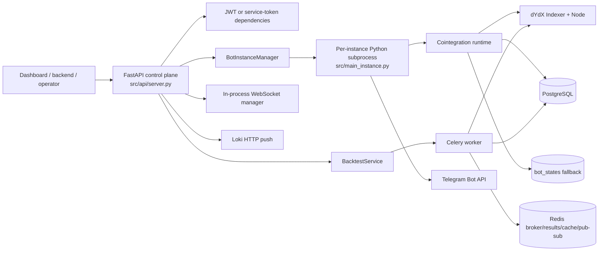

# Current Bot Flows and Service Architecture

This package documents the implementation found in the repository on 2026-06-21. It is a source-code map, not a target architecture. Claims link to concrete code; behavior that cannot be established statically is marked **UNKNOWN / NEEDS VALIDATION**.

## Document map

| Document                                               | Scope                                                                       |
| ------------------------------------------------------ | --------------------------------------------------------------------------- |
| [project-structure.md](project-structure.md)           | Physical tree, entrypoints, process boundaries, generated/runtime artifacts |
| [services-inventory.md](services-inventory.md)         | Service/module responsibilities and dependencies                            |
| [current-business-flows.md](current-business-flows.md) | End-to-end business and runtime flows                                       |
| [api-flows.md](api-flows.md)                           | HTTP/WebSocket surface, auth, response and route-to-service mapping         |
| [background-tasks.md](background-tasks.md)             | Celery, Celery Beat, supervised asyncio work and recovery                   |
| [data-flows.md](data-flows.md)                         | Entities, repositories, migrations, caches and files                        |
| [integrations.md](integrations.md)                     | dYdX, PostgreSQL, Redis, Telegram, Loki and callers                         |
| [risks-and-gaps.md](risks-and-gaps.md)                 | Critical architectural and operational findings                             |

## Architecture snapshot

Confirmed process boundaries are the Uvicorn API process ([`src/api/start_api.py`](../src/api/start_api.py), [`src/api/server.py`](../src/api/server.py)), one subprocess per managed bot ([`BotInstanceManager._start_instance_locked`](../src/bot_instance_manager.py), [`BotInstance.main`](../src/main_instance.py)), and optional Celery workers ([`worker_entrypoint.py`](../worker_entrypoint.py), [`celery_app`](../src/infrastructure/workers/celery_app.py)). Redis and PostgreSQL are external infrastructure, not embedded services.

## Confirmed headline flows

1. API startup validates PostgreSQL, creates/checks schema, runs migrations, reconciles stale backtests and live runtimes, and starts a supervised manager monitor ([`lifespan`](../src/api/server.py)).
2. Auth supports username/password JWTs and rotating backend service tokens; route enforcement is dependency-by-dependency, not global ([`src/api/v1/auth/__init__.py`](../src/api/v1/auth/__init__.py), [`authenticate_bearer_token`](../src/middleware/auth_middleware.py)).
3. Bot create/start/stop/restart/delete is routed through `BotInstanceManager`; workers load their runtime config from `bot_instances.config` ([`src/api/server.py`](../src/api/server.py), [`src/bot_instance_manager.py`](../src/bot_instance_manager.py), [`BotInstance.load_config`](../src/main_instance.py)).
4. Live trading analyzes cointegrated pairs, opens two sequential dYdX legs with first-leg emergency cleanup, tracks positions in DB plus a file, and closes on Z-score reversion ([`open_positions`](../src/trading/position_manager.py), [`BotAgent.open_trades`](../src/trading/bot_agent.py), [`manage_trade_exits`](../src/trading/position_manager.py)).
5. Backtests persist a run before dispatch, default to Celery, fetch dYdX historical candles, simulate pairs, and persist progress/results ([`BacktestService.create_and_run_backtest`](../src/infrastructure/use_cases/service_backtest.py), [`run_backtest_task`](../src/infrastructure/workers/backtest_tasks.py)).
6. Realtime HTTP/WebSocket reads come from realtime tables. A monitoring service exists but is not wired into an entrypoint ([`src/trading/realtime_data_service.py`](../src/trading/realtime_data_service.py), [`src/api/websocket_server.py`](../src/api/websocket_server.py)).

## Validation Notes

- **Confirmed statically:** module wiring, all 81 main-app HTTP decorators, five mounted auth operations under two prefixes, all five authenticated WebSocket handlers, task registration, model/repository code, environment selection and explicit failure branches.
- **Partly confirmed:** external dYdX payload assumptions and PostgreSQL schema compatibility; these require a live service and migrated database.
- **UNKNOWN / NEEDS VALIDATION:** deployed topology, whether an external component starts Celery Beat or `RealTimeDataService`, current database revision/data shape, WebSocket behavior with multiple API workers, and whether the Go backend supplies auth for every delegated endpoint.

## Investigation method and limits

The full physical tree was enumerated. Source-relevant files were then inspected separately from `.venv`, `.mypy_cache`, `.pytest_cache`, `__pycache__`, IDE metadata and runtime logs. Python entrypoints, decorators, classes/functions, ORM models, repositories, Alembic revisions, Make targets and tests were traced. No service was started and no external system was contacted, so this package does not claim runtime validation.
