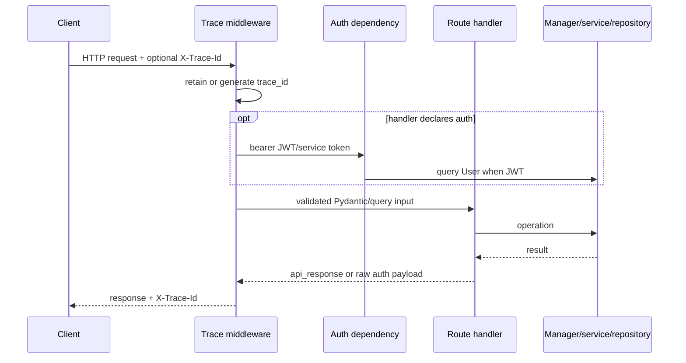

# API Flows

## Common request path

The canonical app defines 81 HTTP operations and five WebSocket operations in [
`src/api/server.py`](../src/api/server.py). The five auth operations are mounted under two prefixes, producing ten
additional HTTP paths. The 2FA router is mounted at `/api/v1/auth/2fa` (`/setup`, `/verify`, `/backup-codes/regenerate`, `/disable`), adding four auth-gated operations (2026-08-11; recovery endpoints + login enforcement 2026-08-12).

[`request_trace_logging_middleware`](../src/api/server.py) supplies `X-Trace-Id`. Most main API handlers explicitly
call [`api_response`](../src/api/server.py); auth routes return their own shapes. FastAPI validation and raised
`HTTPException` responses do not use the standard envelope.

## Authentication reality

There is no global authentication middleware. Authentication is enforced only when a handler declares
`Depends(get_current_active_user)` or `Depends(get_admin_user)` ([
`src/middleware/auth_middleware.py`](../src/middleware/auth_middleware.py)). [`custom_openapi`](../src/api/server.py)
nevertheless marks almost every non-auth HTTP operation as Bearer-protected. The tables below reflect executable
dependencies, not the generated documentation.

Principals:

- User JWT: signature/expiry verification followed by `users.username` lookup.
- Service token: any value in `BOT_API_TOKEN`, `BOT_API_TOKEN_PREVIOUS`, or `BOT_API_TOKENS`; treated as active
  superuser.
- Development bypass: synthetic superuser when `API_BYPASS_AUTH=true`; startup rejects it only when `ENVIRONMENT` equals
  `production` exactly.

## Auth routes

The router is mounted twice, so every row exists under both `/auth` and `/api/v1/auth` ([
`app.include_router`](../src/api/server.py)).

| Method + suffix    | Handler       | Auth   | Flow/data                                      |
|--------------------|---------------|--------|------------------------------------------------|
| POST `/token`      | `token_login` | Public | OAuth form → `users` read → access/refresh JWT |
| POST `/login`      | `login`       | Public | JSON credentials → `users` read → JWTs         |
| POST `/register`   | `register`    | Public | validate/hash → insert `users` → JWTs          |
| POST `/logout`     | `logout`      | Public | Returns message only; no revocation            |
| POST `/logout-all` | `logout_all`  | Public | Compatibility response only; no revocation     |

2FA `/setup` and `/verify` are defined in [`password_2fa.py`](../src/api/v1/auth/password_2fa.py) and mounted at
`/api/v1/auth/2fa` via `app.include_router` in [`server.py`](../src/api/server.py): **reachable, auth-gated** (2026-08-11).
Login enforces 2FA state: a user with 2FA enabled must send `totp_code` (a TOTP code **or** a single-use backup code) at `/auth/login` and `/token`. Recovery: `/2fa/verify` issues backup codes on enable, `/2fa/backup-codes/regenerate` reissues them, and `/2fa/disable` turns 2FA off (requires a TOTP code or a backup code — never password-only). (2026-08-12.)

## Bot lifecycle and business history routes

| Method/path                               | Handler                | Auth                | Primary implementation/result        |
|-------------------------------------------|------------------------|---------------------|--------------------------------------|
| POST `/api/v1/runtime/preflight`          | `runtime_preflight`    | Active              | dYdX/runtime configuration probe     |
| POST `/api/v1/bots`                       | `create_bot_instance`  | Active + rate limit | manager create; persist config/event |
| GET `/api/v1/bots`                        | `list_bot_instances`   | Active              | manager memory/status                |
| GET `/api/v1/bots/{instance_id}`          | `get_bot_instance`     | Active              | liveness-refreshed status            |
| DELETE `/api/v1/bots/{instance_id}`       | `delete_bot_instance`  | Active              | manager stop/delete; DB delete       |
| POST `/api/v1/bots/{instance_id}/start`   | `start_bot_instance`   | Active              | manager spawns worker                |
| POST `/api/v1/bots/{instance_id}/stop`    | `stop_bot_instance`    | Active              | terminate/kill and persist           |
| POST `/api/v1/bots/{instance_id}/restart` | `restart_bot_instance` | Active              | stop then start                      |
| GET `/api/v1/bots/{instance_id}/history`  | `get_bot_history`      | Active              | `event_logs` query                   |
| GET `/api/v1/bots/{instance_id}/jobs`     | `get_bot_jobs`         | Active              | `jobs` query                         |
| GET `/api/v1/bots/{instance_id}/trades`   | `get_bot_trades`       | Active              | `trades` query, newest first, `limit`/`offset` |
| GET `/api/v1/bots/{instance_id}/cointegrated-pairs` | `get_bot_cointegrated_pairs` | Active  | `cointegrated_pairs` row of the last pair scan |
| GET `/api/v1/bots/{instance_id}/stats`    | `get_bot_stats`        | Active              | manager/DB aggregation               |
| POST `/api/v1/bots/quick-deploy`          | `quick_deploy_bot`     | Active              | create then optional start           |

All handlers are in [`src/api/server.py`](../src/api/server.py); lifecycle operations delegate to [
`BotInstanceManager`](../src/bot_instance_manager.py).

## Health, capabilities, market and runtime routes

| Method/path                      | Handler                    | Auth   | Notes                                          |
|----------------------------------|----------------------------|--------|------------------------------------------------|
| GET `/health`                    | `health_check`             | Public | Basic status plus DB and manager diagnostics   |
| GET `/ready`                     | `readiness_check`          | Public | 200 only when manager available; otherwise 503 |
| GET `/metrics`                   | `metrics`                  | Public | Process/runtime metrics response               |
| GET `/api/v1/capabilities`       | `api_capabilities`         | Public | Enumerates routes/commands/queries             |
| GET `/api/v1/markets/perpetuals` | `list_perpetual_markets`   | Public | dYdX with fresh/stale in-process cache         |
| GET `/api/v1/users/me`           | `get_current_user_profile` | Active | Current principal projection                   |
| GET `/api/v1/system/status`      | `system_status`            | Active | manager, host resources, backtest health       |
| GET `/api/v1/runtime/db-config`  | `runtime_db_config`        | Admin  | Sanitized DB cutover/pool settings             |

## Arbitrage diagnostics/configuration routes

| Method/path                                                  | Auth   | Implementation                                                                                       |
|--------------------------------------------------------------|--------|------------------------------------------------------------------------------------------------------|
| GET `/api/v1/arbitrage/improvement-metrics`                  | Active | In-process [`arbitrage_observability.snapshot_metrics`](../src/trading/arbitrage_observability.py)   |
| GET `/api/v1/arbitrage/runtime-settings`                     | Active | In-process settings from [`arbitrage_runtime_config.py`](../src/trading/arbitrage_runtime_config.py) |
| PUT `/api/v1/arbitrage/runtime-settings`                     | Active | Mutates API-process runtime settings only                                                            |
| GET `/api/v1/arbitrage/pair-priority`                        | Active | DB/file pair load and score                                                                          |
| GET `/api/v1/arbitrage/opportunity/{opportunity_id}/explain` | Active | Current aggregate diagnostics; per-opportunity history explicitly not persisted                      |

**Risk:** live trading happens in subprocesses, so API-process settings/counters are not a demonstrated control or
aggregate view of worker processes.

## Strategy-resolution diagnostics routes

| Method/path                                                    | Auth   | Operation                               |
|----------------------------------------------------------------|--------|-----------------------------------------|
| GET `/api/v1/runtime/strategy-resolution-metrics`              | Active | Resolution source counters/recent paths |
| GET `/api/v1/runtime/strategy-resolution-metrics/prom`         | Active | Prometheus text projection              |
| GET `/api/v1/admin/runtime/strategy-resolution-metrics`        | Admin  | Admin JSON projection                   |
| POST `/api/v1/admin/runtime/strategy-resolution-metrics/reset` | Admin  | Reset process-local counters            |

These metrics are stored in API-process memory by helpers in [`src/api/server.py`](../src/api/server.py).

## Realtime REST routes

| Method/path                                            | Auth   | Read path                                   |
|--------------------------------------------------------|--------|---------------------------------------------|
| GET `/api/v1/bots/{id}/positions/current`              | Active | `PositionRepository.get_open_positions`     |
| GET `/api/v1/bots/{id}/positions/{position_id}`        | Active | realtime position by ID                     |
| GET `/api/v1/bots/{id}/market-data`                    | Active | realtime market rows                        |
| GET `/api/v1/bots/{id}/realtime-stats`                 | Active | realtime stats row                          |
| GET `/api/v1/bots/{id}/alerts`                         | Active | alerts repository                           |
| GET `/api/v1/bots/{id}/position-history/{position_id}` | Active | snapshot repository; currently always empty |

Handlers are in [`src/api/server.py`](../src/api/server.py), using [
`UnitOfWorkRealtime`](../src/infrastructure/persistence/repository_realtime.py).

## Celery administration routes

| Method/path                                  | Auth  | Operation                                                    |
|----------------------------------------------|-------|--------------------------------------------------------------|
| GET `/api/v1/celery/tasks`                   | Admin | Merge inspect/results and persisted backtests; filter/redact |
| GET `/api/v1/celery/tasks/{task_id}`         | Admin | Task detail/failure context                                  |
| POST `/api/v1/celery/tasks/{task_id}/revoke` | Admin | Revoke, optional terminate                                   |
| POST `/api/v1/celery/tasks/{task_id}/retry`  | Admin | Retry supported failed task                                  |
| GET `/api/v1/celery/workers`                 | Admin | Inspect workers                                              |
| GET `/api/v1/celery/queues`                  | Admin | Inspect active queues                                        |
| GET `/api/v1/celery/health`                  | Admin | Broker/backend/worker health                                 |

Implementation: [`src/infrastructure/workers/celery_monitor.py`](../src/infrastructure/workers/celery_monitor.py).

## Backtest routes

None of the non-admin routes below declares an auth dependency in the current source. OpenAPI says they are protected,
but FastAPI execution does not enforce that.

| Method/path                                          | Handler purpose             | Main read/write                                         |
|------------------------------------------------------|-----------------------------|---------------------------------------------------------|
| POST `/api/v1/backtests`                             | Create canonical run        | persist then dispatch                                   |
| POST `/api/v1/backtests/run`                         | Compatibility create        | persist then dispatch                                   |
| GET `/api/v1/backtests`                              | List/filter runs            | backtest tables                                         |
| GET `/api/v1/backtests/interrupted`                  | List interrupted            | run lifecycle scan                                      |
| POST `/api/v1/backtests/interrupted/reconcile`       | Reconcile interrupted       | mutate run state                                        |
| GET `/api/v1/admin/backtests/interrupted`            | Admin alias                 | same, **Admin** dependency                              |
| POST `/api/v1/admin/backtests/interrupted/reconcile` | Admin reconcile             | same, **Admin** dependency                              |
| POST `/api/v1/admin/backtests/{id}/repair-request`   | Repair request relation     | **Admin** mutation                                      |
| GET `/api/v1/backtests/{id}`                         | Run details                 | run + request/results                                   |
| GET `/api/v1/backtests/{id}/status`                  | Normalized status           | run/control/task metadata                               |
| POST `/api/v1/backtests/{id}/metadata`               | Update metadata             | request JSON write                                      |
| GET `/api/v1/backtests/{id}/websocket-metrics`       | Socket delivery diagnostics | process-local metrics                                   |
| POST `/api/v1/backtests/{id}/create-strategy`        | Create volatile strategy    | in-memory strategy write                                |
| GET `/api/v1/backtests/{id}/trades`                  | Paginated trades            | run JSON                                                |
| GET `/api/v1/backtests/{id}/logs`                    | Tail run log                | `bot_states/backtest_<id>.log`                          |
| POST `/api/v1/backtests/{id}/cancel`                 | Request cancellation        | run control + task revoke                               |
| POST `/api/v1/backtests/{id}/pause`                  | Request pause               | run control                                             |
| POST `/api/v1/backtests/{id}/resume`                 | Request resume              | run control                                             |
| POST `/api/v1/backtests/{id}/restart`                | Reconstruct/requeue         | run/request + Celery                                    |
| POST `/api/v1/backtests/{id}/retry`                  | Retry failed run            | restart path                                            |
| DELETE `/api/v1/backtests/{id}`                      | Delete run                  | run/request cascade                                     |
| GET `/api/v1/backtests/stats/summary`                | Aggregate summary           | runs                                                    |
| GET `/api/v1/backtests/{id}/analytics`               | Analytics                   | stored run results                                      |
| GET `/api/v1/backtests/{id}/analytics/summary`       | Compact analytics           | stored run results                                      |
| GET `/api/v1/backtests/{id}/position-snapshots`      | Snapshots                   | run JSON                                                |
| POST `/api/v1/backtests/compare`                     | Multi-run compare           | runs                                                    |
| GET `/api/v1/backtests/sync-health`                  | Persistence/runtime health  | runs + job metrics                                      |
| GET `/api/v1/backtests/{id}/dydx-validation`         | Validation summary          | stored results; inspect handler before relying on depth |
| GET `/api/v1/backtests/{id}/performance-metrics`     | Advanced metrics            | stored results                                          |
| GET `/api/v1/backtests/{id}/live-progress`           | Progress projection         | run state                                               |

Implementation is split between handlers in [`src/api/server.py`](../src/api/server.py), [
`BacktestService`](../src/infrastructure/use_cases/service_backtest.py), and [
`BacktestRepository`](../src/infrastructure/persistence/repository_backtest.py).

## Strategy routes

| Method/path                                              | Auth   | Store                    |
|----------------------------------------------------------|--------|--------------------------|
| GET `/api/v1/strategies`                                 | Active | in-memory list           |
| GET `/api/v1/strategies/public`                          | Public | in-memory public list    |
| POST `/api/v1/strategies`                                | Active | in-memory create         |
| GET `/api/v1/strategies/{id}`                            | Active | in-memory read           |
| PUT `/api/v1/strategies/{id}`                            | Active | in-memory update/version |
| DELETE `/api/v1/strategies/{id}`                         | Active | in-memory delete         |
| GET `/api/v1/strategies/{id}/versions`                   | Active | in-memory versions       |
| POST `/api/v1/strategies/{id}/versions/{version}/revert` | Active | in-memory revert         |

Despite ORM models for `backtest_strategies` and `strategy_version_history` in [
`internal/domain/models.py`](../internal/domain/models.py), these CRUD handlers use [
`InMemoryStrategyStore`](../src/api/server.py).

## WebSocket routes

| Path                            | Auth path                         | Initial/ongoing flow                               |
|---------------------------------|-----------------------------------|----------------------------------------------------|
| `/api/v1/bots/{id}/alerts/live` | `_authorize_websocket_connection` | Initial realtime state; client request messages    |
| `/api/v1/backtests/{id}/live`   | `_authorize_websocket_connection` | Backtest status/log snapshots and updates          |
| `/ws/bots/{id}`                 | `_authorize_websocket_connection` | Alias for bot realtime channel                     |
| `/ws/backtests/{id}`            | `_authorize_websocket_connection` | Alias for backtest channel                         |
| `/ws/strategies`                | `_authorize_websocket_connection` | Strategy snapshot on connect; lifecycle broadcasts |

All five routes call [`_authorize_websocket_connection`](../src/api/server.py), which accepts a bearer token from the
`Authorization` header or `access_token` query parameter, validates it through [
`authenticate_bearer_token`](../src/middleware/auth_middleware.py), and closes with code `4401` when missing or invalid.
`API_BYPASS_AUTH=true` bypasses this check outside the exact `ENVIRONMENT=production` startup guard.

## Request, response, persistence and error contracts

The route tables above identify every reachable operation. This matrix records the concrete schemas and storage/error
behavior by route family; handlers returning `api_response(...)` use `{success, data, message, timestamp, trace_id}`
plus `X-Trace-Id`. FastAPI validation errors and auth router responses are exceptions to that envelope.

| Route family                   | Input model/schema                                                                                                           | Output model/schema                                                                             | Tables/files touched                                                                                   | Confirmed errors                                                                                                          |
|--------------------------------|------------------------------------------------------------------------------------------------------------------------------|-------------------------------------------------------------------------------------------------|--------------------------------------------------------------------------------------------------------|---------------------------------------------------------------------------------------------------------------------------|
| `/auth/*`, `/api/v1/auth/*`    | `OAuth2PasswordRequestForm`, `LoginRequest`, or `RegisterRequest`; logout has no body                                        | Token dict (`access_token`, `refresh_token`, `token_type`, expiry) or message dict              | `users`; no login/logout token row                                                                     | 400 duplicate/invalid registration, 401 bad credentials, 422 validation; logout does not revoke                           |
| `/api/v1/runtime/preflight`    | Manually parsed JSON matching `RuntimePreflightRequest`                                                                      | `api_response` with configuration/exchange probe                                                | dYdX reads; no application table intended                                                              | 400 invalid request/config, 500 probe failure                                                                             |
| `/api/v1/bots*`                | `BotInstanceConfig`; lifecycle path/query args; quick deploy uses query/body fields `BotCredentials` and `TradingParameters` | Declared `BotOperationResult`, `BotInstanceList`, `BotInstanceStatus`, otherwise `api_response` | `bot_instances`, `jobs`, `event_logs`, `trades`, `bot_states/*`                                        | 400 invalid/duplicate/cap, 404 bot missing, 409 lifecycle conflict, 429 rate limit, 500 manager/DB/process failure        |
| Health/capabilities/markets    | Query `limit` where present; otherwise none                                                                                  | Dynamic `api_response` health/readiness/metrics/capability/market projections                   | DB health reads; dYdX market reads; process cache                                                      | `/ready` 503 when manager unavailable; market integration failure may use stale cache or 500                              |
| Arbitrage diagnostics/settings | `limit`, opportunity path ID, or free-form settings JSON                                                                     | Dynamic settings, scores, explanations, counters                                                | Pair DB/file reads; API-process memory writes                                                          | 400 unsupported setting/value, 404 opportunity/pair context where applicable, 500 read failures                           |
| Celery administration          | Filter query fields; revoke body `{terminate?, signal?}`                                                                     | Dynamic task/worker/queue/health projections                                                    | Celery broker/backend and backtest tables                                                              | 400 invalid action, 404 task, 409 unsupported retry/state, 502/503 inspect/broker failure                                 |
| Realtime bot data              | Bot/position path IDs; `limit`/`hours` query fields                                                                          | Serialized position, market, stats, alert, snapshot envelopes                                   | `bot_instances`, `positions_realtime`, `market_data_realtime`, `bot_stats_realtime`, `alerts_realtime` | 404 bot/position, 500 DB/serialization; history is empty with current snapshot repository                                 |
| Backtest create                | Manually parsed JSON normalized to `BacktestConfigRequest` or `BacktestRunRequestCompat`                                     | Declared `BacktestResponse` or compatibility `api_response`                                     | `backtest_runtime_runs`, `backtest_run_requests`, optional `jobs`, run log                             | 400 invalid/missing pairs or strategy, 404 strategy, 409 admission/state, 429 limit, 500 persistence, 503 enqueue/backend |
| Backtest reads/analytics       | Run path ID plus documented pagination/filter query fields; compare parses run IDs from JSON                                 | `BacktestListResponse`, `BacktestDetailResponse`, or dynamic normalized envelope                | Backtest run/request JSON, `bot_states/backtest_<run_id>.log`                                          | 400 invalid filters/compare, 404 run/log, 500 repository/analytics                                                        |
| Backtest controls/admin repair | Path ID, optional `dry_run`, metadata free-form JSON                                                                         | Dynamic lifecycle/repair envelope                                                               | backtest run/request, Celery control/backend, optional `jobs`                                          | 400 invalid metadata/request, 404 run, 409 invalid lifecycle, 500 persistence/control                                     |
| Strategy CRUD                  | Manually parsed `StrategyRequest`; path IDs; `StrategyVersionRevertRequest` is defined but revert uses path IDs              | Dynamic strategy/version dictionaries                                                           | API-process dictionaries; DB strategy tables are read only during backtest resolution                  | 400 invalid strategy, 404 strategy/version, 500 handler failure                                                           |
| WebSockets                     | Path ID; bearer header or `access_token`; JSON commands handled by `WebSocketServer`                                         | Initial snapshot plus typed JSON updates/errors                                                 | Realtime/backtest DB reads; process-local connection state                                             | close 4401 auth; error frames/send disconnects; no durable socket state                                                   |

`RuntimePreflightRequest`, `BacktestConfigRequest`, `BacktestRunRequestCompat`, and `StrategyRequest` are sometimes
populated after direct `request.json()` rather than appearing as typed function parameters. Therefore the checked-in
OpenAPI schema may omit or weaken those bodies even though runtime validation occurs in handler code.

## API failure and validation notes

- Inputs using Pydantic/query constraints are confirmed; many handlers catch broad exceptions and convert them to
  generic 500 envelopes.
- `api_response` hides messages for 5xx, but direct `HTTPException` and auth route shapes differ.
- CORS is `allow_origins=["*"]` with credentials enabled ([`server.py`](../src/api/server.py)); browser/framework
  behavior and production intent need validation.
- Route count and schemas can be checked dynamically with `/api/v1/capabilities` and `/openapi.json`, but the
  checked-in [`openapi.json`](../openapi.json) was not treated as authoritative over decorators.
