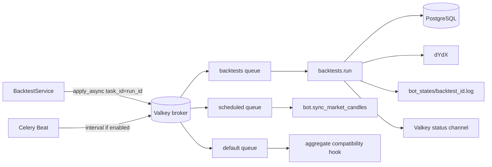

# Background Tasks

## Inventory

| Task/job                      | Trigger                                | Queue/executor                                          | Durable state                                     | Result/side effects                                         | Evidence                                                                                                                               |
|-------------------------------|----------------------------------------|---------------------------------------------------------|---------------------------------------------------|-------------------------------------------------------------|----------------------------------------------------------------------------------------------------------------------------------------|
| `backtests.run`               | Backtest create/restart/retry/recovery | Celery `backtests`                                      | backtest tables + Celery backend; optional `jobs` | historical fetch/simulation/results, Valkey status, run log | [`run_backtest_task`](../src/infrastructure/workers/backtest_tasks.py)                                                                 |
| `backtests.aggregate_candles` | Successful Celery backtest             | Celery `default`                                        | Celery result only                                | Returns `skipped`; no aggregation                           | [`aggregate_backtest_candles`](../src/infrastructure/workers/candle_aggregate_tasks.py)                                                |
| `bot.sync_market_candles`     | Beat interval or manual dispatch       | Celery `scheduled`                                      | Valkey cache/task result                          | dYdX candles cached in Valkey                               | [`sync_market_candles`](../src/infrastructure/workers/market_sync_tasks.py)                                                            |
| `bot-manager-monitor`         | API lifespan                           | API asyncio loop                                        | best-effort `jobs` row                            | dead-process cleanup/readiness monitoring                   | [`_bot_manager_monitor_loop`](../src/api/server.py), [`lifespan`](../src/api/server.py)                                                |
| asyncio backtest              | `BACKTEST_WORKER_BACKEND=asyncio`      | API asyncio loop                                        | backtest tables + `jobs`                          | same simulation in API process                              | [`create_and_run_backtest`](../src/infrastructure/use_cases/service_backtest.py)                                                       |
| lifecycle jobs                | bot start/stop/restart paths           | synchronous manager + AsyncJobManager persistence calls | `jobs`                                            | operator-visible lifecycle status                           | [`src/bot_instance_manager.py`](../src/bot_instance_manager.py)                                                                        |
| backtest heartbeat            | active execution                       | async task or worker thread                             | backtest row timestamp/control                    | prevents stale classification                               | [`_run_backtest_heartbeat_keepalive`, `_run_backtest_heartbeat_keepalive_thread`](../src/infrastructure/use_cases/service_backtest.py) |
| WebSocket connection loops    | WebSocket connect                      | API asyncio loop                                        | none                                              | sends DB-backed snapshots/updates                           | [`WebSocketServer.handle_connection`](../src/api/websocket_server.py)                                                                  |

## Detailed task contracts

| Task/job name                 | Trigger                                | Queue/broker or executor                                  | Worker file                                            | Business purpose                                           | Input payload                                                   | Output/result                                                            | Retry behavior                                                                                 | Failure handling                                                                                          | Tables/files touched                                                                                                      | Related flow |
|-------------------------------|----------------------------------------|-----------------------------------------------------------|--------------------------------------------------------|------------------------------------------------------------|-----------------------------------------------------------------|--------------------------------------------------------------------------|------------------------------------------------------------------------------------------------|-----------------------------------------------------------------------------------------------------------|---------------------------------------------------------------------------------------------------------------------------|--------------|
| `backtests.run`               | Create/restart/retry/recovery dispatch | Valkey/Celery queue `BACKTEST_CELERY_QUEUE` (`backtests`) | `src/infrastructure/workers/backtest_tasks.py`         | Execute one persisted historical simulation                | `run_id`; task context resolves stored request/strategy/pairs   | Celery result with run/result context; persisted metrics/trades/progress | Only classified transient network/HTTP failures; configurable max 3, exponential bounded delay | Valkey ownership lock, terminal error classification, run failure persistence, soft/hard timeout handling | `backtest_runtime_runs`, `backtest_run_requests`, optional `jobs`, `bot_states/backtest_<run_id>.log`, Valkey lock/status | BF-07, BF-08 |
| `backtests.aggregate_candles` | Successful `backtests.run`             | Valkey/Celery `default`                                   | ~~`src/infrastructure/workers/candle_aggregate_tasks.py`~~ **REMOVED (2026-08-11)** | ~~Compatibility post-processing hook~~ **stub deleted**     | ~~`run_id`~~                                                    | ~~`{status: "skipped", reason: ...}`~~ **n/a**                          | n/a                                                                                          | Stub + call site + Celery registration removed; chart reads use the DB fallback                                                            | No application table write found                                                                                          | BF-07        |
| `bot.sync_market_candles`     | Beat interval/manual dispatch          | Valkey/Celery `scheduled`                                 | `src/infrastructure/workers/market_sync_tasks.py`      | Prewarm recent candle cache                                | No required payload; markets/resolution/limits from environment | Per-market success/failure summary and last-run cache                    | No explicit automatic retry                                                                    | Disabled/missing dependency returns skipped; per-market failures collected                                | Valkey candle keys and last-run summary                                                                                   | BF-11        |
| `bot-manager-monitor`         | API lifespan                           | API `AsyncJobManager`/asyncio                             | `src/api/server.py`                                    | Reap dead workers and keep manager/readiness state current | Manager object; interval from environment                       | Long-running task, no normal business result                             | Loop continues after logged cycle errors; no cross-process retry                               | Job callback persists exception where enabled; API shutdown cancels                                       | `bot_instances`, `jobs`, `event_logs`, worker/log state indirectly                                                        | BF-01, BF-03 |
| Asyncio backtest              | `BACKTEST_WORKER_BACKEND=asyncio`      | API `AsyncJobManager`                                     | `src/infrastructure/use_cases/service_backtest.py`     | Fallback in-process backtest execution                     | Persisted `run_id` and normalized request                       | Same persisted run result as Celery path                                 | No durable executor retry; service lifecycle/restart endpoints can redispatch                  | Done callback records traceback/job failure; startup recovery handles stale DB state                      | backtest tables, `jobs`, run log as implemented                                                                           | BF-07, BF-08 |
| Backtest heartbeat            | Active simulation                      | asyncio task or worker thread                             | `src/infrastructure/use_cases/service_backtest.py`     | Keep long-running run from stale recovery                  | `run_id`, interval                                              | Timestamp/control refresh                                                | Repeated loop; write failures logged                                                           | Main execution remains authoritative; stale detection may trigger after failures                          | `backtest_runtime_runs` and request/control state                                                                         | BF-07, BF-08 |
| Lifecycle job records         | Bot start/stop/restart                 | Manager operation plus job persistence                    | `src/bot_instance_manager.py`                          | Make process lifecycle visible                             | instance/action/config metadata                                 | Completed/failed `jobs` row and lifecycle response                       | No automatic retry; restart route composes operations                                          | Typed/structured result, event/log, status correction                                                     | `jobs`, `bot_instances`, `event_logs`, bot log                                                                            | BF-03        |
| WebSocket connection loop     | Client connection                      | API event loop                                            | `src/api/websocket_server.py`                          | Stream/request current bot/backtest state                  | Authenticated socket, channel identifier, client JSON messages  | JSON snapshot/update/error frames                                        | Send failure metrics; client reconnect required                                                | Disconnect cleanup removes process-local connection                                                       | DB reads only; no durable socket writes                                                                                   | BF-09        |

## Celery topology

[`celery_app`](../src/infrastructure/workers/celery_app.py) uses Valkey/Redis-compatible infrastructure as broker by
default and a separate DB offset as result backend. Configured queues default to
`backtests,default,high_priority,scheduled`; no task is routed to `high_priority` in current source.

Safety/reliability settings include late acknowledgements, reject-on-worker-loss, prefetch 1, sent/started events,
extended results, UTC, broker startup retries, and configurable seven-day hard/soft task limits ([
`celery_app.conf.update`](../src/infrastructure/workers/celery_app.py)). Worker startup is available through
`make local-worker` and `WORKER_MODE=celery` ([`Makefile`](../Makefile), [
`worker_entrypoint.py`](../worker_entrypoint.py)). A Beat start command is not present in this repository: **UNKNOWN /
NEEDS VALIDATION**.

## Backtest job lifecycle

1. [`BacktestService.create_and_run_backtest`](../src/infrastructure/use_cases/service_backtest.py) persists `pending`
   before dispatch.
2. `_enqueue_celery_backtest` uses `run_id` as Celery task ID and routes to `BACKTEST_CELERY_QUEUE`.
3. [`run_backtest_task`](../src/infrastructure/workers/backtest_tasks.py) takes a Valkey/Redis ownership lock. A second
   task returns `duplicate_skipped`.
4. It validates selected pairs and strategy snapshot invariants, writes task context, marks `started`, and reports
   Celery `STARTED`/`PROGRESS` metadata.
5. `execute_existing_backtest` runs the simulation and heartbeat. Lightweight progress checkpoints update only scalar
   columns; trade/snapshot/daily-PnL JSON is persisted on the heavier pair/time cadence.
6. ~~Status is published on `backtest:{run_id}:status`.~~ The dead Redis pub-sub producer was removed 2026-08-23
   (no consumer existed); status reaches consumers via durable NATS JetStream events, and WebSockets query/poll
   persisted state (snapshot on connect, `request_status` refresh).
7. Transient HTTP/network failures are retried with bounded exponential delay; validation, timeout and cancellation are
   terminal.
8. ~~Success enqueues the candle aggregation hook, which currently returns `skipped` and relies on DB fallback.~~ **REMOVED (2026-08-11):** the no-op `backtests.aggregate_candles` stub, its post-backtest call site, and its Celery registration were deleted; chart reads fall back to the DB.

## Supervised asyncio jobs

[`AsyncJobManager`](../src/infrastructure/use_cases/async_job_manager.py) owns an in-memory map of tasks and best-effort
`jobs` persistence. It creates a row, marks running, captures exceptions/tracebacks in a done callback, and handles
cancellation. Progress writes are throttled by minimum time/delta. Repeated SQLAlchemy pool overload activates a
persistence cooldown.

Important semantics:

- Job persistence is disabled unless an explicit DB target environment variable is present, even if the global DB has
  defaults.
- Persistence failures are logged and swallowed; task execution continues.
- Tasks are local to one API process. A restart loses the in-memory task object; backtest startup recovery uses DB state
  to compensate.
- `bot-manager-monitor` uses `auto_complete=False`, so normal long-running completion is not expected until
  shutdown/cancellation.

## Controls and recovery

Backtest control is persisted in request/run data through [
`BacktestService._set_runtime_control`](../src/infrastructure/use_cases/service_backtest.py). The executor calls
`_honor_runtime_control` before pair work and after history fetches, before simulation; pause waits, resume clears
pause, and cancel raises cancellation. Celery revoke is also used where a task ID exists.

Startup recovery ([`auto_recover_interrupted_runs`](../src/infrastructure/use_cases/service_backtest.py)) supports:

- default/fail-safe: mark interrupted candidates failed;
- `restart`: requeue eligible candidates after `BACKTEST_AUTO_RECOVERY_MIN_AGE_SECONDS`;
- stale detection based on heartbeat age and terminal/control fields.

Live runtime recovery is separate in [`BotInstanceManager.auto_recover_live_runtimes`](../src/bot_instance_manager.py);
testnet auto-restart requires `BOT_AUTO_RECOVER_LIVE_RUNTIMES`, and mainnet additionally requires its mainnet flag.

## Failure and observability matrix

| Failure                     | Persisted effect                                           | Operator surface                     |
|-----------------------------|------------------------------------------------------------|--------------------------------------|
| Broker/enqueue unavailable  | run marked failed with enqueue context                     | create error, status, logs           |
| Duplicate backtest owner    | Celery result `duplicate_skipped`; existing run continues  | Celery admin detail                  |
| Worker lost                 | late ack/reject permits redelivery; Valkey lock arbitrates | Celery events/health, stale recovery |
| Soft limit                  | run failed with `BACKTEST_TIMEOUT`                         | run status/log/task failure          |
| Transient dYdX error        | retry count and retry-after stored                         | Celery task + run status             |
| API asyncio task exception  | `jobs.error_*` and run failure path                        | jobs/backtest endpoints              |
| Job DB pool overload        | best-effort writes paused                                  | system/sync health metrics and logs  |
| Market sync dependency down | task returns `skipped` or error summary                    | Celery result/log only               |

## Validation notes

- Confirmed by task decorators, routes, manager and service code.
- **NEEDS VALIDATION:** Valkey lock TTL versus maximum backtest duration; actual worker/Beat replica counts; redelivery
  behavior with the configured broker visibility timeout (not set here); whether an external cache-to-WebSocket bridge
  exists outside this repository.
