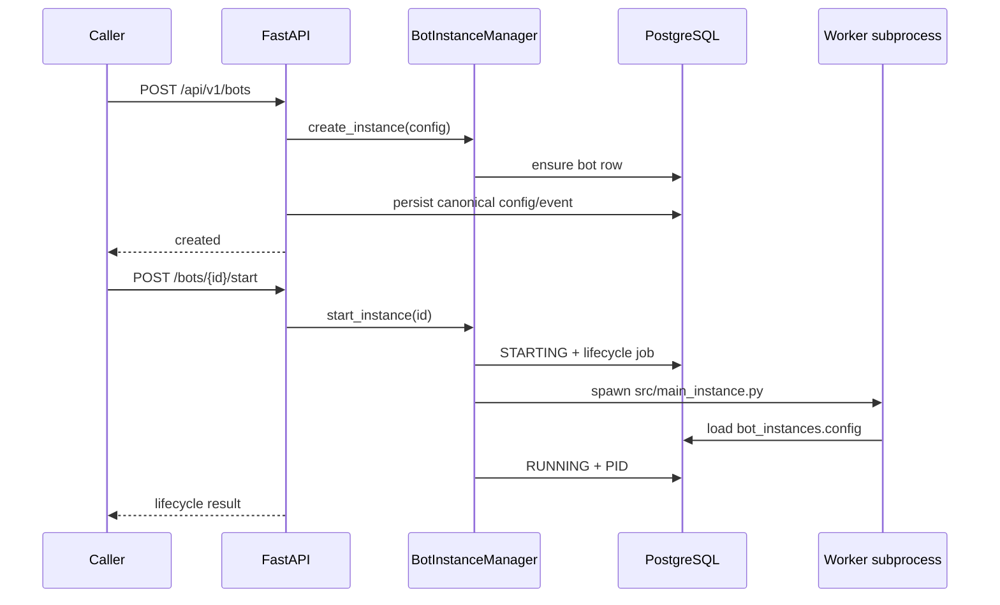
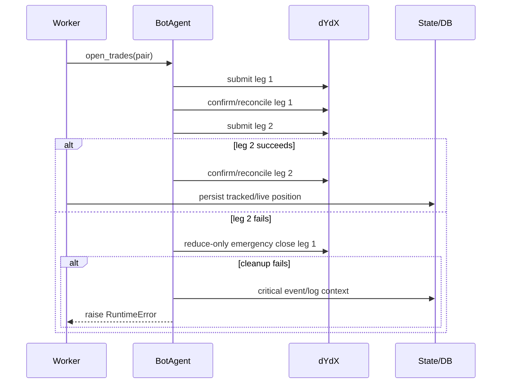

# Current Business Flows

Each flow below covers purpose, trigger, implementation, modules, data, integrations, background work,
failure/observability, and open questions. “Final write” means the last durable write or caller response visible in
source.

## BF-01 — API startup and recovery

| Item                  | Current implementation                                                                                                                                                                                                                                                                                                                                                                                                                                                                      |
|-----------------------|---------------------------------------------------------------------------------------------------------------------------------------------------------------------------------------------------------------------------------------------------------------------------------------------------------------------------------------------------------------------------------------------------------------------------------------------------------------------------------------------|
| Business purpose      | Refuse an unhealthy DB startup, reconcile interrupted work and expose a usable control plane.                                                                                                                                                                                                                                                                                                                                                                                               |
| Trigger               | Uvicorn starts the FastAPI lifespan.                                                                                                                                                                                                                                                                                                                                                                                                                                                        |
| Steps                 | 1. Default `BACKTEST_WORKER_BACKEND` to Celery and ping workers. 2. Reject auth bypass in production. 3. construct `DatabaseConfig`; health-check, `create_all`, compatibility-fix, Alembic-upgrade and required-table verification. 4. Auto-recover/mark stale backtests. 5. Reap dead bot processes and conditionally auto-restart live runtimes. 6. Register strategy status publisher and start supervised manager monitoring. 7. On shutdown cancel jobs and optionally stop runtimes. |
| Files/functions       | [`lifespan`](../src/api/server.py), [`DatabaseManager`](../src/infrastructure/database.py), [`BacktestService.auto_recover_interrupted_runs`](../src/infrastructure/use_cases/service_backtest.py), [`BotInstanceManager.auto_recover_live_runtimes`](../src/bot_instance_manager.py), [`_bot_manager_monitor_loop`](../src/api/server.py).                                                                                                                                                 |
| Services/modules      | API, DatabaseManager, BacktestService, manager, AsyncJobManager.                                                                                                                                                                                                                                                                                                                                                                                                                            |
| Data read             | Environment; migration state; `backtest_runtime_runs`; `bot_instances`; OS PIDs.                                                                                                                                                                                                                                                                                                                                                                                                            |
| Data written          | Schema/migration changes; recovered run/bot states; optional `jobs` monitor row.                                                                                                                                                                                                                                                                                                                                                                                                            |
| External integrations | PostgreSQL, Redis/Celery control.                                                                                                                                                                                                                                                                                                                                                                                                                                                           |
| Background tasks      | `bot-manager-monitor`; recovered Celery or asyncio backtests; optional restarted bot subprocesses.                                                                                                                                                                                                                                                                                                                                                                                          |
| Failure points        | DB health/migration/table verification is fatal. Backtest recovery failure is logged and startup continues. Manager import failure degrades `/ready`.                                                                                                                                                                                                                                                                                                                                       |
| Observability         | Structured startup logs, DB diagnostics, `/health`, strict `/ready`, `/api/v1/system/status`, job state.                                                                                                                                                                                                                                                                                                                                                                                    |
| Open questions        | **UNKNOWN / NEEDS VALIDATION:** migration duration/locking on production data; whether multiple API replicas concurrently perform recovery and migrations.                                                                                                                                                                                                                                                                                                                                  |

## BF-02 — User registration, login and delegated service authentication

| Item                  | Current implementation                                                                                                                                                                                                                                                                                                                                                                  |
|-----------------------|-----------------------------------------------------------------------------------------------------------------------------------------------------------------------------------------------------------------------------------------------------------------------------------------------------------------------------------------------------------------------------------------|
| Business purpose      | Issue user JWTs and authenticate backend-to-bot calls during service-token rotation.                                                                                                                                                                                                                                                                                                    |
| Trigger               | `/auth/register`, `/auth/login`, `/auth/token` or their `/api/v1/auth/*` aliases; a protected handler dependency.                                                                                                                                                                                                                                                                       |
| Steps                 | Registration sanitizes/validates input, checks uniqueness, hashes the password, inserts `users`, and returns access/refresh JWTs. Login reads `users`, verifies bcrypt and returns JWTs. Protected dependencies first accept constant-time-matched `BOT_API_TOKEN`, previous token, or token list; otherwise verify JWT and query the user. Active/admin dependencies add flags checks. |
| Files/functions       | [`register`, `_authenticate_user`](../src/api/v1/auth/__init__.py), [`JWTUtils`, `PasswordUtils`](../src/api/auth_utils.py), [`authenticate_bearer_token`, `get_admin_user`](../src/middleware/auth_middleware.py).                                                                                                                                                                     |
| Services/modules      | Auth router, security helpers, auth middleware, database.                                                                                                                                                                                                                                                                                                                               |
| Data read             | `users`; token environment variables; JWT claims.                                                                                                                                                                                                                                                                                                                                       |
| Data written          | `users`; no server-side session row is written on login.                                                                                                                                                                                                                                                                                                                                |
| External integrations | Caller/backend; PostgreSQL. Redis blacklist helper exists but is not used by login/logout.                                                                                                                                                                                                                                                                                              |
| Background tasks      | None.                                                                                                                                                                                                                                                                                                                                                                                   |
| Failure points        | Duplicate user, weak password, bad credentials/token, inactive/non-admin user. Logout endpoints do not revoke tokens.                                                                                                                                                                                                                                                                   |
| Observability         | HTTP errors; request trace middleware. No auth audit-event flow was found.                                                                                                                                                                                                                                                                                                              |
| Open questions        | **NEEDS VALIDATION:** expected refresh-token flow; required registration exposure in production; service-token owner/rotation procedure.                                                                                                                                                                                                                                                |

## BF-03 — Bot instance create/start/status/stop/restart/delete

| Item                  | Current implementation                                                                                                                                                                                                                                                                                                                                                                                                                                                                                                                                                                                 |
|-----------------------|--------------------------------------------------------------------------------------------------------------------------------------------------------------------------------------------------------------------------------------------------------------------------------------------------------------------------------------------------------------------------------------------------------------------------------------------------------------------------------------------------------------------------------------------------------------------------------------------------------|
| Business purpose      | Operate isolated trading runtimes through a central lifecycle owner.                                                                                                                                                                                                                                                                                                                                                                                                                                                                                                                                   |
| Trigger               | Authenticated `/api/v1/bots*` routes.                                                                                                                                                                                                                                                                                                                                                                                                                                                                                                                                                                  |
| Steps                 | Create rate-limits, validates Pydantic config, calls manager create, persists full DB config plus hash metadata, logs event and notifies Telegram. Start locks the instance, creates a lifecycle job, persists `STARTING`, opens `bot_states/bot_<id>.log`, sets per-instance environment, spawns `.venv`/configured Python `src/main_instance.py --instance-id`, then records PID/status. Status refreshes process liveness and trading stats. Stop sends terminate then kill escalation and persists result. Restart composes stop/start. Delete stops first, removes manager/file state and DB row. |
| Files/functions       | Route handlers [`create_bot_instance` through `restart_bot_instance`](../src/api/server.py); [`create_instance`, `_start_instance_locked`, `_stop_instance_locked`, `_delete_instance_locked`](../src/bot_instance_manager.py).                                                                                                                                                                                                                                                                                                                                                                        |
| Services/modules      | API, manager, AsyncJobManager, core UoW, subprocess worker, Telegram.                                                                                                                                                                                                                                                                                                                                                                                                                                                                                                                                  |
| Data read             | `bot_instances`, in-memory instances/process handles, OS process status.                                                                                                                                                                                                                                                                                                                                                                                                                                                                                                                               |
| Data written          | `bot_instances`, `jobs`, `event_logs`, `bot_states/instances.json` compatibility snapshot, bot log file.                                                                                                                                                                                                                                                                                                                                                                                                                                                                                               |
| External integrations | OS subprocess/process signals, PostgreSQL, Telegram.                                                                                                                                                                                                                                                                                                                                                                                                                                                                                                                                                   |
| Background tasks      | Lifecycle jobs are persisted by AsyncJobManager; the worker itself is a long-running subprocess.                                                                                                                                                                                                                                                                                                                                                                                                                                                                                                       |
| Failure points        | Instance cap/duplicate, DB config persistence rollback, missing interpreter, startup grace failure, stale/external PID ambiguity, stop timeout.                                                                                                                                                                                                                                                                                                                                                                                                                                                        |
| Observability         | Lifecycle response envelope, DB events/jobs, strategy WebSocket updates, per-instance log tail, Telegram, recovery diagnostics.                                                                                                                                                                                                                                                                                                                                                                                                                                                                        |
| Open questions        | **NEEDS VALIDATION:** cross-replica ownership of a worker; whether `instances.json` remains operationally required although startup is DB-only.                                                                                                                                                                                                                                                                                                                                                                                                                                                        |

## BF-04 — Managed worker initialization and pair discovery

| Item                  | Current implementation                                                                                                                                                                                                                                                                                                                                              |
|-----------------------|---------------------------------------------------------------------------------------------------------------------------------------------------------------------------------------------------------------------------------------------------------------------------------------------------------------------------------------------------------------------|
| Business purpose      | Establish a configured dYdX session and prepare statistically eligible pairs before trading.                                                                                                                                                                                                                                                                        |
| Trigger               | Manager-created `src/main_instance.py` process.                                                                                                                                                                                                                                                                                                                     |
| Steps                 | Load structured repo env; read and normalize `bot_instances.config`; initialize instance logger/Telegram; connect dYdX using per-instance address/mnemonic/network; optionally abort all exchange positions; optionally fetch selected/active market histories, compute cointegration, and save results DB-first with file fallback; enter loop.                    |
| Files/functions       | [`BotInstance.initialize`, `run_initial_setup`, `run`](../src/main_instance.py), [`connect_dydx_runtime`](../src/trading/dydx_client.py), [`construct_market_prices`](../src/trading/market_data.py), [`store_cointegration_results`](../src/trading/analysis/cointegration.py), [`PairStorage.save_pairs`](../src/infrastructure/domain/cointegration_storage.py). |
| Services/modules      | Worker, config, dYdX adapter, market data, cointegration, storage, notifications.                                                                                                                                                                                                                                                                                   |
| Data read             | DB bot config; dYdX markets/candles/account; runtime environment.                                                                                                                                                                                                                                                                                                   |
| Data written          | `cointegrated_pairs` or `bot_states/cointegrated_pairs_<id>.json`; logs; exchange closes if abort flag is set.                                                                                                                                                                                                                                                      |
| External integrations | dYdX Indexer/Node, PostgreSQL, Telegram.                                                                                                                                                                                                                                                                                                                            |
| Background tasks      | None inside worker; initialization is sequential.                                                                                                                                                                                                                                                                                                                   |
| Failure points        | Missing/incomplete DB config, credential/network/jurisdiction failure, history/statistical failure, pair-save failure. Initialization/setup errors are fatal to the process.                                                                                                                                                                                        |
| Observability         | Instance log, Telegram startup/error, manager detects exit and records error/log tail.                                                                                                                                                                                                                                                                              |
| Open questions        | **NEEDS VALIDATION:** pair refresh cadence—source shows discovery at startup, not periodic refresh; exact dYdX jurisdiction behavior in deployed networks.                                                                                                                                                                                                          |

## BF-05 — Live pair entry

| Item                  | Current implementation                                                                                                                                                                                                                                                                                                                                                                                                                                                                                                                                     |
|-----------------------|------------------------------------------------------------------------------------------------------------------------------------------------------------------------------------------------------------------------------------------------------------------------------------------------------------------------------------------------------------------------------------------------------------------------------------------------------------------------------------------------------------------------------------------------------------|
| Business purpose      | Open a market-neutral cointegration pair only when signal and safety gates pass.                                                                                                                                                                                                                                                                                                                                                                                                                                                                           |
| Trigger               | Every worker loop iteration when `placeTrades` is enabled (five-second outer cadence).                                                                                                                                                                                                                                                                                                                                                                                                                                                                     |
| Steps                 | Load stored pairs; optionally priority-rank; fetch markets and recent candles; skip ignored/cooldown/invalid pairs; compute current spread Z-score; require threshold; reject if either leg already open; calculate opposing sides, slippage prices and step-sized quantities; require minimum sizes; fetch free collateral; require minimum plus 1.25× buffer; `BotAgent` submits leg 1, confirms/reconciles fill, submits leg 2 and confirms/reconciles. On success append tracked state, persist live trade/realtime position/event, and send Telegram. |
| Files/functions       | [`open_positions`](../src/trading/position_manager.py), [`BotAgent.open_trades`](../src/trading/bot_agent.py), [`place_market_order`](../src/trading/account_manager.py), [`append_tracked_position`](../src/trading/bot_agents_state.py), [`persist_live_trade_opened`](../src/trading/trade_persistence.py).                                                                                                                                                                                                                                             |
| Services/modules      | Position manager, pair priority, market/account data, BotAgent, state/persistence, Telegram.                                                                                                                                                                                                                                                                                                                                                                                                                                                               |
| Data read             | Cointegrated pairs; dYdX markets/candles/account/orders/positions; import-time risk constants.                                                                                                                                                                                                                                                                                                                                                                                                                                                             |
| Data written          | Two exchange orders; `tracked_positions` and fallback JSON; `trades`; `positions_realtime`; `event_logs`; metrics memory.                                                                                                                                                                                                                                                                                                                                                                                                                                  |
| External integrations | dYdX, PostgreSQL, Telegram. Redis may serve recent candles.                                                                                                                                                                                                                                                                                                                                                                                                                                                                                                |
| Background tasks      | None; order sequence runs in the worker event loop.                                                                                                                                                                                                                                                                                                                                                                                                                                                                                                        |
| Failure points        | Stale/invalid candles, collateral, formatting/minimum size, order/fill lookup, second leg failure, persistence failure. If leg 2 fails, `_emergency_close_first_leg` attempts reduce-only cleanup; cleanup failure raises a critical error and alerts.                                                                                                                                                                                                                                                                                                     |
| Observability         | Scan-cycle logs/counters/rejection reasons, events, Telegram, stored order IDs. Metrics are API-process memory while trading workers have separate memory, so API metrics may not reflect worker counters.                                                                                                                                                                                                                                                                                                                                                 |
| Open questions        | **NEEDS VALIDATION:** max-position, drawdown, stop-loss, take-profit and trailing-stop fields exist in config/models but are not evident as enforced entry/exit gates in this flow.                                                                                                                                                                                                                                                                                                                                                                        |

## BF-06 — Live exit and reconciliation

| Item                  | Current implementation                                                                                                                                                                                                                                                                                                                                                                                                                                                                                                                                                                                                                    |
|-----------------------|-------------------------------------------------------------------------------------------------------------------------------------------------------------------------------------------------------------------------------------------------------------------------------------------------------------------------------------------------------------------------------------------------------------------------------------------------------------------------------------------------------------------------------------------------------------------------------------------------------------------------------------------|
| Business purpose      | Close tracked pairs on mean reversion and fail safely when exchange/local state diverges.                                                                                                                                                                                                                                                                                                                                                                                                                                                                                                                                                 |
| Trigger               | Every worker loop iteration when `manageExits` is enabled.                                                                                                                                                                                                                                                                                                                                                                                                                                                                                                                                                                                |
| Steps                 | Load tracked positions; fetch exchange positions and both original orders; reconcile market/size/side and live legs. If one exchange leg remains, attempt a reduce-only orphan close. If neither remains, remove local record. Unexplained mismatch raises for manual intervention. Otherwise fetch candles, recompute Z-score and close only when it crosses zero with magnitude at least the entry magnitude. Submit reduce-only close leg 1 then leg 2 with retries. Persist close and remove processed tracked state. If close leg 2 fails after leg 1, retry; retain an `ORPHANED_EXIT_FAILED` record and critical alert on failure. |
| Files/functions       | [`manage_trade_exits`, `_close_orphan_exchange_leg`, `_place_reduce_only_close_with_retries`](../src/trading/position_manager.py), [`save_processed_positions`](../src/trading/bot_agents_state.py), [`persist_live_trade_closed`](../src/trading/trade_persistence.py).                                                                                                                                                                                                                                                                                                                                                                  |
| Services/modules      | Position/account manager, market data, state storage, repositories, Telegram.                                                                                                                                                                                                                                                                                                                                                                                                                                                                                                                                                             |
| Data read             | `tracked_positions`/file, exchange orders/positions/markets/candles.                                                                                                                                                                                                                                                                                                                                                                                                                                                                                                                                                                      |
| Data written          | Reduce-only exchange orders; updated/deleted tracked state; closed `trades`/`positions_realtime`; events.                                                                                                                                                                                                                                                                                                                                                                                                                                                                                                                                 |
| External integrations | dYdX, PostgreSQL, Telegram.                                                                                                                                                                                                                                                                                                                                                                                                                                                                                                                                                                                                               |
| Background tasks      | None.                                                                                                                                                                                                                                                                                                                                                                                                                                                                                                                                                                                                                                     |
| Failure points        | Exchange/local mismatch, missing orders, candle/format error, partial close. DB writes are best-effort, but tracked-state save is the recovery record.                                                                                                                                                                                                                                                                                                                                                                                                                                                                                    |
| Observability         | Critical logs, Telegram categories, event types and orphan metadata in tracked state.                                                                                                                                                                                                                                                                                                                                                                                                                                                                                                                                                     |
| Open questions        | **NEEDS VALIDATION:** exchange fill confirmation after exit submission; current code marks closed after both close orders submit, not after confirmed fills.                                                                                                                                                                                                                                                                                                                                                                                                                                                                              |

## BF-07 — Create and execute a backtest

| Item                  | Current implementation                                                                                                                                                                                                                                                                                                                                                                                                                                                                                                                                                                 |
|-----------------------|----------------------------------------------------------------------------------------------------------------------------------------------------------------------------------------------------------------------------------------------------------------------------------------------------------------------------------------------------------------------------------------------------------------------------------------------------------------------------------------------------------------------------------------------------------------------------------------|
| Business purpose      | Evaluate a configured pair strategy against historical dYdX candles and retain reproducible results.                                                                                                                                                                                                                                                                                                                                                                                                                                                                                   |
| Trigger               | `POST /api/v1/backtests` or compatibility `/run`.                                                                                                                                                                                                                                                                                                                                                                                                                                                                                                                                      |
| Steps                 | Rate-limit/admission-check; resolve a strategy snapshot or manual request; resolve explicit markets/pair labels; validate dates/capacity; create `backtest_runtime_runs` and related request payload; select worker backend (Celery default); enqueue `backtests.run` with `run_id` as task ID. Worker acquires a Redis lock, validates immutable strategy/pairs, records context, starts heartbeat, fetches historical candles, prioritizes/simulates pairs, incrementally persists progress/metrics/trades/snapshots/daily PnL, publishes Redis status, and completes/fails/retries. |
| Files/functions       | [`create_backtest`, `run_backtest_compat`](../src/api/server.py), [`BacktestService.create_and_run_backtest`, `_execute_backtest`, `_simulate_pair`](../src/infrastructure/use_cases/service_backtest.py), [`run_backtest_task`](../src/infrastructure/workers/backtest_tasks.py), [`BacktestRepository.save_run`](../src/infrastructure/persistence/repository_backtest.py).                                                                                                                                                                                                          |
| Services/modules      | API, strategy resolver, BacktestService/repository, Celery/Redis, dYdX.                                                                                                                                                                                                                                                                                                                                                                                                                                                                                                                |
| Data read             | strategy store/history/request; dYdX historical candles; backtest config; capacity counts.                                                                                                                                                                                                                                                                                                                                                                                                                                                                                             |
| Data written          | `backtest_runtime_runs`, `backtest_run_requests`, optional `jobs`, Celery result state, Redis pub-sub, `bot_states/backtest_<run_id>.log`.                                                                                                                                                                                                                                                                                                                                                                                                                                             |
| External integrations | PostgreSQL, Redis/Celery, dYdX Indexer.                                                                                                                                                                                                                                                                                                                                                                                                                                                                                                                                                |
| Background tasks      | `backtests.run`; follow-on `backtests.aggregate_candles` compatibility hook. Asyncio backend is optional.                                                                                                                                                                                                                                                                                                                                                                                                                                                                              |
| Failure points        | Missing explicit pairs/snapshot, capacity, broker enqueue, duplicate lock, history timeout/rate limits, simulation error, hard/soft task limits. Transient network failures retry with exponential delay.                                                                                                                                                                                                                                                                                                                                                                              |
| Observability         | Status/progress routes and WebSockets, logs endpoint, task admin routes, task context/failure metadata, heartbeat and sync-health routes.                                                                                                                                                                                                                                                                                                                                                                                                                                              |
| Open questions        | **NEEDS VALIDATION:** expected production backtest concurrency and whether Redis lock TTL can expire before a seven-day task.                                                                                                                                                                                                                                                                                                                                                                                                                                                          |

## BF-08 — Backtest pause/resume/cancel/restart/retry/recovery

| Item                  | Current implementation                                                                                                                                                                                                                                                                                                                                                                                                                      |
|-----------------------|---------------------------------------------------------------------------------------------------------------------------------------------------------------------------------------------------------------------------------------------------------------------------------------------------------------------------------------------------------------------------------------------------------------------------------------------|
| Business purpose      | Give operators durable control over long-running or interrupted simulations.                                                                                                                                                                                                                                                                                                                                                                |
| Trigger               | Backtest control routes or API startup recovery.                                                                                                                                                                                                                                                                                                                                                                                            |
| Steps                 | Pause/resume/cancel set runtime-control flags in persisted request/run state; execution polls `_honor_runtime_control`. Celery cancel also revokes task. Restart reconstructs the request, resets lifecycle fields and re-dispatches. Retry delegates to restart rules. Startup identifies orphaned in-progress runs; default fail-safe marks failed, while `BACKTEST_AUTO_RECOVERY_MODE=restart` requeues eligible runs after minimum age. |
| Files/functions       | Route handlers [`cancel_backtest` through `retry_backtest`](../src/api/server.py); [`pause_backtest`, `resume_backtest`, `restart_backtest`, `cancel_backtest`, `auto_recover_interrupted_runs`](../src/infrastructure/use_cases/service_backtest.py).                                                                                                                                                                                      |
| Services/modules      | API, BacktestService/repository, Celery revoke/dispatch, AsyncJobManager.                                                                                                                                                                                                                                                                                                                                                                   |
| Data read             | run/request/control state; in-process task registry; Celery task ID.                                                                                                                                                                                                                                                                                                                                                                        |
| Data written          | control/status/error timestamps; new task dispatch; job state.                                                                                                                                                                                                                                                                                                                                                                              |
| External integrations | PostgreSQL, Celery/Redis.                                                                                                                                                                                                                                                                                                                                                                                                                   |
| Background tasks      | restarted `backtests.run` or asyncio task.                                                                                                                                                                                                                                                                                                                                                                                                  |
| Failure points        | Missing request payload, stale task identity, revoke not terminating external work, control polling latency, recovery races across API replicas.                                                                                                                                                                                                                                                                                            |
| Observability         | Interrupted/admin endpoints, runtime health, task monitor, error codes, retry count.                                                                                                                                                                                                                                                                                                                                                        |
| Open questions        | Pause/cancel is checked before pair work and again after history fetches, before CPU-heavy simulation; a single long external fetch can still delay control observation. **NEEDS VALIDATION:** production fetch latency and single-owner coordination for startup recovery.                                                                                                                                                                 |

## BF-09 — Realtime query and WebSocket delivery

| Item                  | Current implementation                                                                                                                                                                                                                                                                                                                                                                                                          |
|-----------------------|---------------------------------------------------------------------------------------------------------------------------------------------------------------------------------------------------------------------------------------------------------------------------------------------------------------------------------------------------------------------------------------------------------------------------------|
| Business purpose      | Expose current bot positions, market data, statistics, alerts and backtest/runtime status.                                                                                                                                                                                                                                                                                                                                      |
| Trigger               | Realtime REST routes or WebSocket connection/message.                                                                                                                                                                                                                                                                                                                                                                           |
| Steps                 | REST resolves external instance ID to numeric bot ID and queries realtime repositories. WebSocket handlers authenticate bearer query/header, accept into a process-local connection set, send initial DB/backtest state, then respond to request messages. Strategy socket sends manager snapshot then receives lifecycle broadcasts. Backtest sockets poll/send persisted state; in-process progress callbacks also broadcast. |
| Files/functions       | Realtime handlers and [`_authorize_websocket_connection`](../src/api/server.py), [`WebSocketServer.handle_connection`, `send_initial_state`](../src/api/websocket_server.py), [`UnitOfWorkRealtime`](../src/infrastructure/persistence/repository_realtime.py).                                                                                                                                                                 |
| Services/modules      | API, WebSocket manager, realtime/backtest repositories, bot manager.                                                                                                                                                                                                                                                                                                                                                            |
| Data read             | `positions_realtime`, `market_data_realtime`, `bot_stats_realtime`, `alerts_realtime`, backtest runs, manager memory.                                                                                                                                                                                                                                                                                                           |
| Data written          | WebSocket frames and connection metrics only. A separate realtime monitor can write/broadcast, but no startup call was found.                                                                                                                                                                                                                                                                                                   |
| External integrations | PostgreSQL, WebSocket clients.                                                                                                                                                                                                                                                                                                                                                                                                  |
| Background tasks      | Connection loops; no durable fan-out consumer found for Redis backtest pub-sub.                                                                                                                                                                                                                                                                                                                                                 |
| Failure points        | Unauthorized socket, missing bot/run, send failures, stale DB, process-local connection isolation.                                                                                                                                                                                                                                                                                                                              |
| Observability         | send-failure metrics, connection logs, backtest websocket metrics route.                                                                                                                                                                                                                                                                                                                                                        |
| Open questions        | **UNKNOWN / NEEDS VALIDATION:** who starts `RealTimeDataService`; ~~who consumes `backtest:{run_id}:status` Redis messages~~ (producer removed 2026-08-23, no consumer existed); production socket affinity/fan-out.                                                                                                                                                                                                                                                                   |

## BF-10 — Strategy CRUD and backtest-derived strategy

| Item                  | Current implementation                                                                                                                                                                                                                                                                                                                        |
|-----------------------|-----------------------------------------------------------------------------------------------------------------------------------------------------------------------------------------------------------------------------------------------------------------------------------------------------------------------------------------------|
| Business purpose      | Let clients define strategy parameter sets, version them and derive one from a backtest.                                                                                                                                                                                                                                                      |
| Trigger               | `/api/v1/strategies*` and `/api/v1/backtests/{run_id}/create-strategy`.                                                                                                                                                                                                                                                                       |
| Steps                 | Strategy routes operate on class-level dictionaries; create assigns an integer ID, update snapshots versions, revert copies a stored version. Backtest-derived creation reads the run request and calls the same store. Backtest request resolution checks in-memory store, then DB version history, then optional request snapshot fallback. |
| Files/functions       | [`InMemoryStrategyStore`](../src/api/server.py), strategy handlers and [`create_strategy_from_backtest`](../src/api/server.py), [`_resolve_strategy_backtest_request`](../src/api/server.py).                                                                                                                                                 |
| Services/modules      | API module, optional DB strategy/history lookup, BacktestService.                                                                                                                                                                                                                                                                             |
| Data read             | process memory; `backtest_strategies`/`strategy_version_history` during resolution; backtest request.                                                                                                                                                                                                                                         |
| Data written          | process memory only for current CRUD routes.                                                                                                                                                                                                                                                                                                  |
| External integrations | PostgreSQL read path, caller.                                                                                                                                                                                                                                                                                                                 |
| Background tasks      | None.                                                                                                                                                                                                                                                                                                                                         |
| Failure points        | API restart loses CRUD data; multiple API workers diverge; ID collisions by process; request/DB/store precedence can be surprising.                                                                                                                                                                                                           |
| Observability         | HTTP response and strategy-resolution counters. No durable strategy mutation audit.                                                                                                                                                                                                                                                           |
| Open questions        | **NEEDS VALIDATION:** whether another service owns durable strategy CRUD and this is intentionally a compatibility facade.                                                                                                                                                                                                                    |

## BF-11 — Scheduled market candle cache refresh

| Item                  | Current implementation                                                                                                                                                                                                                         |
|-----------------------|------------------------------------------------------------------------------------------------------------------------------------------------------------------------------------------------------------------------------------------------|
| Business purpose      | Prewarm recent-candle data in Redis for active markets.                                                                                                                                                                                        |
| Trigger               | Celery Beat interval when `MARKET_SYNC_ENABLED=true`, or manual task dispatch.                                                                                                                                                                 |
| Steps                 | Resolve configured markets or fetch active dYdX perpetuals; fetch recent candles per market; write JSON under Redis keys with TTL; record a last-run summary; close client/Redis. Disabled/unavailable dependencies return `skipped`.          |
| Files/functions       | [`_beat_schedule`](../src/infrastructure/workers/celery_app.py), [`sync_market_candles`, `_sync_market_candles_async`](../src/infrastructure/workers/market_sync_tasks.py), [`_get_recent_candles_from_redis`](../src/trading/market_data.py). |
| Services/modules      | Beat, Celery worker, dYdX, Redis, market-data adapter.                                                                                                                                                                                         |
| Data read             | dYdX active markets/candles; market-sync environment.                                                                                                                                                                                          |
| Data written          | Redis recent-candle keys and summary.                                                                                                                                                                                                          |
| External integrations | Redis, dYdX Indexer.                                                                                                                                                                                                                           |
| Background tasks      | `bot.sync_market_candles` on `scheduled`.                                                                                                                                                                                                      |
| Failure points        | Beat absent, flag disabled, Redis/dYdX unavailable, per-market failures.                                                                                                                                                                       |
| Observability         | Task result and logs; no dedicated API for the last-run summary was found.                                                                                                                                                                     |
| Open questions        | **UNKNOWN / NEEDS VALIDATION:** whether Beat is deployed and whether cache key/resolution combinations cover live/backtest consumers.                                                                                                          |

## Flow validation summary

The trigger-to-write chains above are confirmed by static call tracing. Exchange semantics, migration state, deployed
scheduler topology and cross-process delivery require integration/testnet review.
See [risks-and-gaps.md](risks-and-gaps.md) for prioritized findings.
