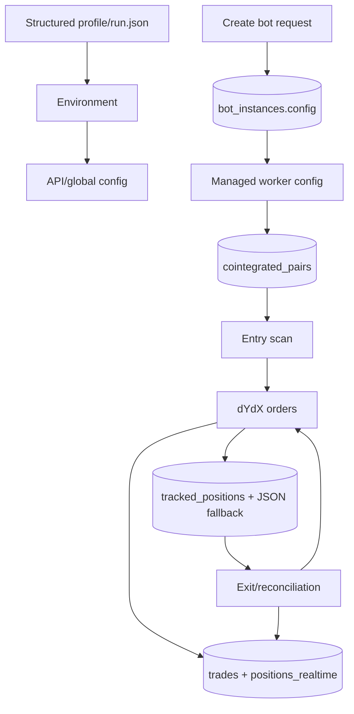
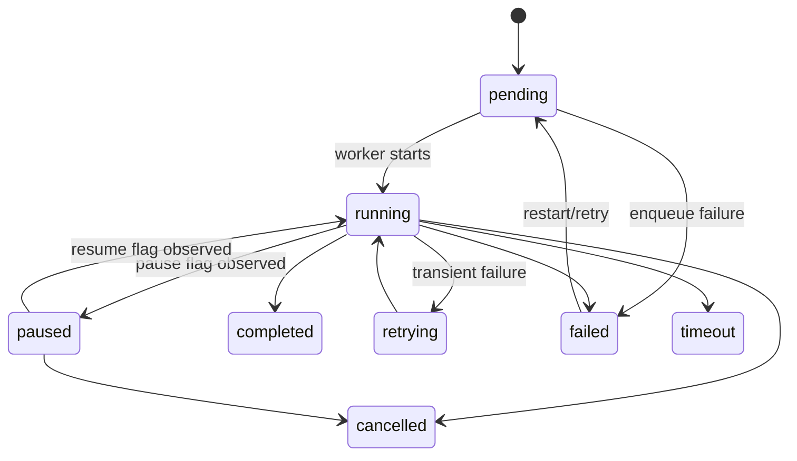

# Data Flows

## Data stores

| Store             | Role                                                                                                                                   | Access pattern                                  | Source evidence                                                                                                                                                                                  |
|-------------------|----------------------------------------------------------------------------------------------------------------------------------------|-------------------------------------------------|--------------------------------------------------------------------------------------------------------------------------------------------------------------------------------------------------|
| PostgreSQL        | Primary durable bot, jobs, trades, events, backtests, auth, realtime, tracked pair/position state                                      | synchronous SQLAlchemy plus some raw SQL        | [`database.py`](../src/infrastructure/database.py), [`internal/domain/models.py`](../internal/domain/models.py)                                                                                  |
| Valkey / Redis    | Celery broker/results, rate limits, recent-candle cache, market-sync cache, backtest lock and status pub-sub, optional token blacklist | sync Redis clients                              | [`celery_app.py`](../src/infrastructure/workers/celery_app.py), [`market_data.py`](../src/trading/market_data.py), [`backtest_tasks.py`](../src/infrastructure/workers/backtest_tasks.py)        |
| `bot_states/`     | Per-bot logs/state fallback and per-backtest logs                                                                                      | atomic JSON replace/file lock; append log sinks | [`bot_agents_state.py`](../src/trading/bot_agents_state.py), [`bot_instance_manager.py`](../src/bot_instance_manager.py), [`backtest_tasks.py`](../src/infrastructure/workers/backtest_tasks.py) |
| API memory        | manager state/process handles, strategy store, route caches/rate limits/metrics, WebSocket connections                                 | process-local dictionaries/locks                | [`server.py`](../src/api/server.py), [`websocket_server.py`](../src/api/websocket_server.py)                                                                                                     |
| Bot-worker memory | imported config constants, dYdX client, cooldown/cache state                                                                           | isolated per subprocess                         | [`main_instance.py`](../src/main_instance.py), [`position_manager.py`](../src/trading/position_manager.py)                                                                                       |

Celery task inventory uses a single joined backtest-overview query that includes request/task context while deferring
trade, position-snapshot and daily-PnL JSON. During simulation, frequent progress writes update scalar run fields only;
accumulated result JSON remains on the configured heavy-persistence cadence ([`BacktestRepository.list_run_overviews`,
`update_run_progress`](../src/infrastructure/persistence/repository_backtest.py)).

## Entity inventory

| Entity/table                                                                                  | Purpose and key fields                                                          | Writers/readers                                | Migration/model status                                                                                                |
|-----------------------------------------------------------------------------------------------|---------------------------------------------------------------------------------|------------------------------------------------|-----------------------------------------------------------------------------------------------------------------------|
| `bot_instances`                                                                               | instance identity, network, strategy, full credentials/config JSON, status, PID | API/manager/worker                             | [`Bot`](../internal/domain/models.py); initial migration                                                              |
| `jobs`                                                                                        | supervised/lifecycle job state, progress, errors, metadata, PID                 | AsyncJobManager/manager/API                    | [`Job`](../internal/domain/models.py); hardened by `c9f4...`                                                          |
| `trades`                                                                                      | live paired trade open/close and PnL                                            | trade persistence, bot history API             | [`Trade`](../internal/domain/models.py)                                                                               |
| `event_logs`                                                                                  | lifecycle/trade audit events                                                    | API/manager/trade persistence                  | [`Event`](../internal/domain/models.py)                                                                               |
| `backtest_strategies`                                                                         | durable strategy definition                                                     | resolution reads; current CRUD does not use it | [`Strategy`](../internal/domain/models.py)                                                                            |
| `strategy_version_history`                                                                    | strategy snapshots/versions                                                     | strategy resolution reads                      | [`StrategyVersion`](../internal/domain/models.py)                                                                     |
| `backtest_runtime_runs`                                                                       | lifecycle, metrics, request/result JSON, heartbeat/control                      | BacktestRepository/Service/Celery/API          | [`BacktestRun`](../internal/domain/models.py), `b7a2...`, `d4e5...`                                                   |
| `backtest_run_requests`                                                                       | one-to-one immutable-ish request JSON                                           | BacktestRepository/repair tools                | [`BacktestRunRequestPayload`](../internal/domain/models.py), `f2a9...`                                                |
| `tracked_positions`                                                                           | per-instance JSON array of live pair order state                                | bot worker state helper                        | raw SQL; migration `e1f2...`                                                                                          |
| `cointegrated_pairs`                                                                          | per-instance pair analysis JSON/counts                                          | PairStorage                                    | raw SQL; migration `e1f2...`                                                                                          |
| `positions_realtime`                                                                          | current live pair/reconciliation fields                                         | trade/realtime repositories and API            | [`Position`](../internal/domain/models_realtime.py); created by `create_all`, not the initial realtime migration name |
| `market_data_realtime`                                                                        | current symbol prices/indicators by bot                                         | RealTimeDataService/API                        | [`MarketData`](../internal/domain/models_realtime.py)                                                                 |
| `bot_stats_realtime`                                                                          | current aggregate live stats                                                    | RealTimeDataService/API                        | [`BotStats`](../internal/domain/models_realtime.py)                                                                   |
| `alerts_realtime`                                                                             | current alerts/ack state                                                        | RealTimeDataService/API                        | [`Alert`](../internal/domain/models_realtime.py)                                                                      |
| `users`                                                                                       | credentials/profile/admin state                                                 | auth routes/dependencies                       | [`User`](../src/infrastructure/domain/models/auth_models.py); created by metadata/startup or auth init                |
| `user_tokens`                                                                                 | TOTP and token records                                                          | currently-unmounted 2FA router                 | [`UserToken`](../src/infrastructure/domain/models/auth_models.py)                                                     |
| `live_position`, `live_market_data`, `bot_realtime_stats`, `position_snapshot`, `alert_event` | alternate realtime schema                                                       | no current ORM/API import identified           | migration `64bafb...`; likely legacy/parallel                                                                         |
| `system_metrics`, `daily_reports`                                                             | operational/reporting tables                                                    | no active repository flow identified           | initial migration only                                                                                                |

## Core data flow

### Bot configuration

The create route and manager both can ensure the bot row. Canonical runtime payload includes credentials, Telegram,
trading and backtest parameters plus `config_meta` SHA-256 metadata ([`_runtime_contract_payload`,
`_build_config_meta`](../src/bot_instance_manager.py)). The managed worker rejects missing DB configuration and ignores
deprecated config-file arguments ([`BotInstance.load_config`](../src/main_instance.py)). Credentials are stored inside
JSON; encryption at this layer was not found.

### Live trading state

Successful entry writes in this order conceptually: exchange orders → tracked state DB/file → best-effort core/realtime
DB rows/events. [`append_tracked_position`](../src/trading/bot_agents_state.py) writes both DB and file; a DB write
failure still permits the file write. [`persist_live_trade_opened`](../src/trading/trade_persistence.py) is explicitly
best-effort and may return `None` without failing exchange tracking.

On exit, tracked positions are reconciled against exchange truth. [
`save_processed_positions`](../src/trading/bot_agents_state.py) preserves concurrent additions, then writes DB and file.
Trade/realtime rows are marked closed after both reduce-only close orders submit, not after fill confirmation.

### Backtest state

`BacktestRepository` maps between normalized dictionaries and the run/request tables ([
`repository_backtest.py`](../src/infrastructure/persistence/repository_backtest.py)). Heavy arrays—trades, snapshots and
daily PnL—are JSON columns and periodically rewritten; progress/control/heartbeat fields are also embedded/normalized.
The service keeps compatibility aliases such as status/progress/current task for upstream clients.

## Migrations and startup schema behavior

Canonical revisions under [`migrations/versions`](../migrations/versions) form these functional phases:

1. `66f08...`: initial bots/jobs/trades/events plus metrics/reports.
2. `64baf...`: alternate `live_*` realtime tables.
3. `8c1f...`: strategy pair-selection mode.
4. `b7a2...`: backtest run table/compatibility additions.
5. `c9f4...`: job runtime/error/progress fields.
6. `d4e5...`: canonical backtest lifecycle/heartbeat indexes.
7. `e1f2...`: tracked positions and cointegrated pairs.
8. `a1b2...`, `b3c4...`, `c4d5...`: indexes/integrity/redundant-index cleanup.
9. `f2a9...`: separate backtest request relation/backfill.
10. `a8d1...`: metadata on `positions_realtime`.

At API startup, [`create_all_tables`](../src/infrastructure/database.py) runs before compatibility fixes and Alembic
migrations. This can create ORM-defined tables outside a migration revision, masking missing migration coverage and
producing schemas different from a migration-only deployment.

## Valkey key/data flows

| Purpose              | Key/channel shape                                      | Producer                   | Consumer                               |
|----------------------|--------------------------------------------------------|----------------------------|----------------------------------------|
| Rate limit           | `ratelimit:<endpoint>:<ip>` sorted set                 | API limiter                | API limiter                            |
| Recent candles       | key defined by market/resolution in market-data module | market sync / market fetch | live market fetch and realtime service |
| Backtest lock        | run-specific lock key                                  | Celery backtest task       | Celery backtest task                   |
| Backtest status      | `backtest:<run_id>:status` channel                     | Celery task                | **No consumer found in this repo**     |
| Celery broker/result | Celery-managed keys                                    | API/Beat/workers           | workers/API monitor                    |
| Token blacklist      | helper-managed keys                                    | `TokenBlacklist` helper    | helper only; logout does not call it   |

## Consistency and recovery notes

- DB-first plus file fallback is not a transactional dual write. DB and file can diverge; reads prefer DB when a row
  exists, even if file is newer.
- Manager startup is DB-only even though `_load_existing_instances_from_disk` still exists and `instances.json` is
  written.
- API memory has no replication. Restart loses strategies/caches/connection registries; manager reconstructs bots from
  DB.
- Backtest run/request split includes repair/reconciliation tooling ([
  `scripts/repair_backtest_requests.py`](../scripts/repair_backtest_requests.py)).
- **UNKNOWN / NEEDS VALIDATION:** actual production schema revision, duplicate realtime table usage, JSON payload
  sizes/locking behavior, and backup/retention for state/log files.
