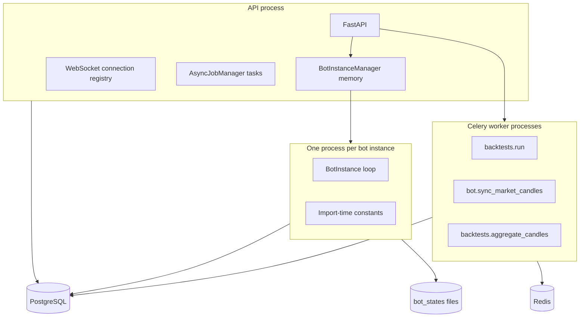

# Project Structure

## Logical tree

```text
bot/
├── main.py                         # legacy standalone trading loop
├── worker_entrypoint.py            # container selector: legacy bot or Celery worker
├── config/config.py                # environment-backed structured configuration objects
├── src/
│   ├── api/
│   │   ├── server.py               # canonical FastAPI app; most routes and startup
│   │   ├── start_api.py            # canonical Uvicorn launcher
│   │   ├── websocket_server.py     # in-process WebSocket connections/broadcasts
│   │   ├── auth_utils.py           # passwords, JWT, TOTP, Redis token blacklist helper
│   │   └── v1/auth/                # login/register plus 2FA router (mounted at /api/v1/auth/2fa)
│   ├── bot_instance_manager.py     # lifecycle owner and subprocess supervisor
│   ├── main_instance.py            # DB-configured per-instance trading worker
│   ├── trading/                    # dYdX adapter, analysis, entry/exit and persistence
│   ├── infrastructure/
│   │   ├── database.py             # PostgreSQL engine, startup schema/migration checks
│   │   ├── domain/                 # Pydantic/API models and pair storage
│   │   ├── persistence/            # core, backtest and realtime repositories
│   │   ├── use_cases/              # BacktestService and AsyncJobManager
│   │   └── workers/                # Celery app, jobs and monitoring
│   ├── middleware/                 # JWT/service-token dependencies
│   └── shared/                     # env loading, logging, notification, time helpers
├── internal/
│   ├── domain/                     # SQLAlchemy Base and core/realtime ORM models
│   └── repository/                 # older duplicate realtime repository
├── migrations/
│   ├── versions/                   # legacy Alembic revision set
│   └── postgres/                   # canonical PostgreSQL revision set
├── scripts/                        # preflight, backtest clients and repair utility
├── tests/                          # contract, safety, repository and runtime tests
├── bot_states/                     # runtime state locks and per-backtest logs
├── docs/BOT_FLOWS.md               # pre-existing flow document
├── openapi.json                    # checked-in API description
├── Makefile                        # local and Docker orchestration targets
└── requirements.txt                # Python dependencies
```

The tree also contains `.venv`, Python/mypy/pytest caches, `.idea`, `.vscode`, `.github`, `.agents`, `.codex`, and
runtime `bot_states/backtest_*.log` files. These are tooling/generated/runtime artifacts rather than application
services. The repository references `docker/` from [`Makefile`](../Makefile), but no `docker/` directory appeared in the
inspected tree: **UNKNOWN / NEEDS VALIDATION** whether it is generated, omitted, or stale.

## Entrypoints and ownership

| Entrypoint                    | Current role                                                                                | Evidence                                                                    |
|-------------------------------|---------------------------------------------------------------------------------------------|-----------------------------------------------------------------------------|
| `src/api/start_api.py`        | Canonical API launcher; loads repo env then starts Uvicorn on `BOT_API_PORT` (default 8889) | [`main`](../src/api/start_api.py)                                           |
| `src/api/server.py`           | Canonical app, lifespan, HTTP and WebSocket routes                                          | [`app`](../src/api/server.py), [`lifespan`](../src/api/server.py)           |
| `src/bot_instance_manager.py` | Sole intended owner of managed bot processes                                                | [`BotInstanceManager`](../src/bot_instance_manager.py)                      |
| `src/main_instance.py`        | Managed worker; requires `bot_instances.config`                                             | [`BotInstance`](../src/main_instance.py), [`main`](../src/main_instance.py) |
| `worker_entrypoint.py`        | Selects Celery mode from `WORKER_MODE`; otherwise shells to legacy `main.py`                | [`main`](../worker_entrypoint.py)                                           |
| `main.py`                     | Legacy standalone runtime using shared environment configuration                            | [`main`](../main.py)                                                        |
| `migrations/env.py`           | Alembic online/offline migration entrypoint                                                 | [`run_migrations_online`](../migrations/env.py)                             |
| `scripts/*.py`                | Operator clients/preflight/repair, not server-side services                                 | [`scripts`](../scripts)                                                     |

## Process and state boundaries



- API-process memory is not shared across Uvicorn workers: rate-limit fallback buckets, strategy store, market cache,
  WebSocket registry and manager subprocess handles are local to one process ([
  `src/api/server.py`](../src/api/server.py), [`ConnectionManager`](../src/api/websocket_server.py)).
- Bot workers receive `BOT_INSTANCE_ID`, `BOT_AGENTS_FILE` and `BOT_PAIRS_FILE` through the manager and use a dedicated
  log file ([`_start_instance_locked`](../src/bot_instance_manager.py), [
  `BotInstance.__init__`](../src/main_instance.py)).
- Durable primary stores are PostgreSQL for bot/runtime/backtest state and Redis for Celery/candle caches; tracked
  positions and cointegration pairs retain file fallbacks ([
  `src/trading/bot_agents_state.py`](../src/trading/bot_agents_state.py), [
  `src/infrastructure/domain/cointegration_storage.py`](../src/infrastructure/domain/cointegration_storage.py)).

## Configuration flow

`load_repo_env()` finds the repository root, selects `run.json` or an encrypted profile, flattens values into
environment variables, and is called before config imports by canonical entrypoints ([
`src/shared/env_loader.py`](../src/shared/env_loader.py), [`src/api/server.py`](../src/api/server.py), [
`src/main_instance.py`](../src/main_instance.py)). `ConfigurationManager` converts environment values into dataclasses
([`config/config.py`](../config/config.py)). Managed workers then override the business/runtime configuration from
`bot_instances.config`; missing DB configuration is fatal ([`BotInstance.load_config`](../src/main_instance.py)).

**Structural concern:** configuration is split between import-time constants ([
`src/constants.py`](../src/constants.py)), environment dataclasses, manager-injected environment variables, and DB JSON.
The worker builds a per-instance config, but trading modules import global constants. Correct isolation depends on each
worker being a separate process and environment being set before imports.

## Build, deployment and CI files

- `Makefile`
    - role: local API/bot/Celery/Flower/preflight commands plus older Docker setup/build/deploy commands
    - note: local `.venv` targets are usable from this directory. Docker targets point to `docker/docker-compose.yml`
      and scripts that are absent here.
- `run_api.sh`
    - role: shell wrapper for `.venv/bin/python src/api/start_api.py`
    - note: consistent with the canonical launcher.
- `worker_entrypoint.py`
    - role: container/background entrypoint selecting Celery or legacy bot mode
    - note: active code; no local Dockerfile references it because no Dockerfile is present in this directory.
- `.github/workflows/ci.yml`
    - role: lint, PostgreSQL-backed pytest, Docker build
    - note: workflow paths assume execution from the parent monorepo (`bot/**`). It references root
      `scripts/check_no_legacy_database.py` and `bot/Dockerfile`; neither target is present inside this bot directory.
      Parent-repository validation is required. Black failures are explicitly ignored with `|| true`; the build depends
      only on lint, not tests.
- `alembic.ini`, `migrations/env.py`
    - role: Alembic configuration and DB URL selection
    - note: canonical migration runtime uses `migrations/versions`.
- `openapi.json`
    - role: checked-in API description
    - note: may drift from decorators/manual JSON bodies; source decorators were treated as authoritative.
- `requirements.txt`
    - role: pinned/runtime and development Python dependencies
    - note: includes runtime, pytest, stubs, Flower and scientific libraries in one file; no separate lock file was
      found.
- `.pylintrc`, IDE files
    - role: static-analysis/editor configuration
    - note: tooling only; not runtime architecture.

## Tests and validation assets

`tests/` contains 41 `test*.py` modules covering auth contracts, API/database behavior, backtest service/repository
contracts, worker monitoring, bot lifecycle, dYdX adapter behavior, market caches, live persistence, WebSockets,
paired-entry cleanup and exit safety. Tests are concentrated around unit/contract behavior with mocked integrations; a
live exchange, Redis/Celery topology and production schema were not exercised during this documentation task.
`scripts/testnet_preflight.py` provides operator checks, while `scripts/parameter_sweep.py` and
`scripts/simulate_production_profile.py` are Bot API clients rather than test workers.

## Validation notes

- Confirmed from the enumerated tree and entrypoint source.
- `migrations/postgres` is the active migration path used by [
  `DatabaseManager.run_pending_migrations`](../src/infrastructure/database.py); any residual `migrations/versions` usage
  should be treated as legacy compatibility and validated before cleanup.
- Deployment manifests are not present in this directory, so replicas, API worker count, Beat deployment and volumes are
  **UNKNOWN / NEEDS VALIDATION**.
- The parent-monorepo paths assumed by CI and Docker commands were outside the requested write scope and must be
  validated from the repository root.
