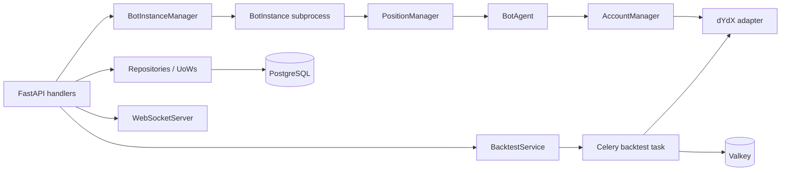

# Services Inventory

“Service” here includes deployable processes and cohesive in-process modules. This avoids inventing microservices that do not exist.

## Complete inventory

| Service / Module | Purpose | Main Files | APIs / Jobs | Database Models | External Dependencies | Risks / Notes |
|---|---|---|---|---|---|---|
| FastAPI control plane | Assemble routes, lifespan, recovery, tracing and response envelopes | `src/api/server.py`, `src/api/start_api.py` | All HTTP/WebSocket routes; `bot-manager-monitor` | All repositories indirectly | Uvicorn, PostgreSQL, Valkey, dYdX | Very large module; startup mutations and process-local globals |
| Authentication | Register/login, JWT/service-token validation and authorization | `src/api/v1/auth/__init__.py`, `src/api/auth_utils.py`, `src/middleware/auth_middleware.py` | `/auth/*`, `/api/v1/auth/*`, protected dependencies | `User`, `UserToken` | bcrypt/passlib, JWT, optional Redis | Logout is a stub; 2FA router is unmounted; registration is public |
| Bot instance manager | Own worker lifecycle, recovery, status and logs | `src/bot_instance_manager.py` | `/api/v1/bots*`; lifecycle jobs | `Bot`, `Job`, `Event` | OS processes, PostgreSQL, Telegram | One-process ownership; external PID/restart races need deployment validation |
| Managed bot runtime | Load DB config and run analysis/entry/exit loop | `src/main_instance.py` | Spawned `--instance-id` worker | `Bot`; pair/position state | dYdX, PostgreSQL, files, Telegram | Live exposure; global imports rely on process isolation |
| Legacy standalone runtime | Run one environment-configured bot | `main.py`, `worker_entrypoint.py` | `WORKER_MODE=bot` | Trading persistence models | dYdX, PostgreSQL, files | Parallel legacy path may drift from manager runtime |
| Trading execution | Place/cancel paired and reduce-only orders | `src/trading/bot_agent.py`, `account_manager.py`, `position_manager.py` | Called by bot loop | `Trade`, realtime `Position`, `Event` | dYdX Indexer/Node, Telegram | Sequential legs require compensation; exits lack demonstrated fill confirmation |
| Market data | Fetch/rate-limit/cache/circuit-break markets and candles | `src/trading/market_data.py` | Live scans; backtest/market jobs indirectly | None directly | dYdX, Redis, Telegram | Cache staleness and sync I/O boundaries |
| Cointegration and pair priority | Analyze, persist and rank eligible pairs | `src/trading/analysis/cointegration.py`, `pair_priority.py`, `src/infrastructure/domain/cointegration_storage.py` | Initial setup; diagnostics API | raw `cointegrated_pairs` | pandas, statsmodels, dYdX, files | DB/file divergence; startup-only refresh in traced worker |
| Tracked-state and trade persistence | Persist local recovery truth and best-effort trade/audit rows | `src/trading/bot_agents_state.py`, `trade_persistence.py` | Live entry/exit | raw `tracked_positions`, `Trade`, realtime `Position`, `Event` | PostgreSQL, file locks | Non-transactional dual writes; DB writes intentionally do not block trading |
| Backtest service | Normalize, dispatch, simulate, control, recover and analyze backtests | `src/infrastructure/use_cases/service_backtest.py`, `src/infrastructure/domain/models_backtest.py` | `/api/v1/backtests*`; asyncio jobs | `BacktestRun`, `BacktestRunRequestPayload`, `Job`, strategy reads | dYdX, Celery, Valkey, PostgreSQL, ClickHouse, MinIO | Very large module; unauthenticated non-admin routes; JSON-heavy writes |
| Celery backtest worker | Execute durable backtests with lock, heartbeat and retries | `src/infrastructure/workers/backtest_tasks.py` | `backtests.run` | Backtest run/request | Valkey/Celery, dYdX, PostgreSQL, ClickHouse, MinIO, files | Lock TTL/redelivery behavior needs load/failure validation |
| Scheduled market sync | Prewarm recent candles | `src/infrastructure/workers/market_sync_tasks.py`, `celery_app.py` | `bot.sync_market_candles` via Beat/manual | None | Redis, dYdX, Celery | Beat launcher not found; disabled by default |
| Candle aggregation hook | Compatibility post-backtest task | `src/infrastructure/workers/candle_aggregate_tasks.py` | `backtests.aggregate_candles` | None | Celery | Stub returns `skipped` |
| Celery monitoring | Inspect, redact, revoke and retry tasks | `src/infrastructure/workers/celery_monitor.py` | `/api/v1/celery/*` | Backtest reads | Celery broker/backend | Inspect is best effort and cache-backed |
| Async job manager | Supervise API-process tasks and persist progress/errors | `src/infrastructure/use_cases/async_job_manager.py` | Monitor/asyncio backtest/lifecycle job support | `Job` | asyncio, PostgreSQL | Persistence is best effort; tasks disappear on API restart |
| WebSocket delivery | Maintain connections, serialize snapshots and broadcast | `src/api/websocket_server.py`, `src/api/realtime_serializers.py`, `src/api/server.py` | Five authenticated sockets | Realtime and backtest reads | WebSocket clients, PostgreSQL | Registry is process-local; no Redis status subscriber found |
| Realtime monitoring | Poll and write current positions/market/stats/alerts | `src/trading/realtime_data_service.py` | `start_realtime_service` helper only | Realtime models | dYdX, Valkey, PostgreSQL | No production caller/entrypoint found |
| Core/realtime persistence | Unit-of-work and CRUD abstraction | `src/infrastructure/persistence/*`, `internal/domain/*` | Used by services/routes | Core, auth, backtest, realtime models | SQLAlchemy, PostgreSQL | Sync DB access in async paths; duplicate legacy realtime repository |
| Database/migrations | Select DB, pool sessions, create/check/migrate schema | `src/infrastructure/database.py`, `migrations/*`, `alembic.ini` | API startup; Alembic/operator commands | Shared `Base` metadata | PostgreSQL, Alembic | `create_all` plus migrations; duplicate revision trees/schema names |
| Strategy store/resolution | CRUD/version volatile strategies and resolve backtest snapshots | `src/api/server.py`, `src/infrastructure/persistence/repository.py` | `/api/v1/strategies*`; backtest creation | `Strategy`, `StrategyVersion` read path | PostgreSQL | CRUD writes only process memory |
| Notifications/logging/time helpers | Operator alerts, structured/local/Loki logging and UTC normalization | `src/shared/notifications.py`, `src/shared/logging_setup.py`, `src/shared/time_utils.py` | Called throughout | Event rows are separate | Telegram Bot API, Loki HTTP | Delivery is non-durable; blocking libraries are used |
| Configuration/environment | Load structured profiles and construct runtime settings/constants | `src/shared/env_loader.py`, `config/config.py`, `src/constants.py` | Every entrypoint | Bot config JSON at runtime | filesystem/environment | Multiple config layers and import-time values |
| Operator scripts | Preflight, backtest sweep/profile and request repair | `scripts/*.py` | CLI/manual | Backtest tables for repair | Bot API, PostgreSQL, dYdX | Operational only; credentials supplied by environment |

## Runtime/deployable services

| Service | Responsibility | Reads | Writes / side effects | Evidence |
|---|---|---|---|---|
| FastAPI control plane | Startup/recovery, auth, bot lifecycle, backtests, queries, WebSockets, operations | PostgreSQL, Valkey/Celery inspection, dYdX markets | PostgreSQL, manager calls, Celery dispatch, HTTP responses | [`src/api/server.py`](../src/api/server.py) |
| Bot instance manager | Hydrate instances, serialize lifecycle per instance, spawn/stop/reap workers, persist status | `bot_instances`, process table, log tails | subprocesses, `bot_instances`, `jobs`, `event_logs`, bot logs | [`BotInstanceManager`](../src/bot_instance_manager.py) |
| Managed bot worker | Load one DB config, connect dYdX, initial analysis, repeated entry/exit loop | `bot_instances.config`, dYdX, tracked pairs/positions | exchange orders, DB state, files, Telegram, logs | [`BotInstance`](../src/main_instance.py) |
| Celery worker | Execute durable backtests, optional market sync, aggregation hook | Valkey broker, PostgreSQL, dYdX | PostgreSQL, Valkey results/cache/pub-sub, ClickHouse/MinIO writes, logs | [`celery_app`](../src/infrastructure/workers/celery_app.py), [`worker_entrypoint.py`](../worker_entrypoint.py) |
| Celery Beat (optional) | Schedule market candle sync when `MARKET_SYNC_ENABLED=true` | Celery schedule | scheduled queue messages | [`_beat_schedule`](../src/infrastructure/workers/celery_app.py) |
| Legacy standalone bot | Single environment-configured bot loop | environment, dYdX | exchange, files/DB, Telegram | [`main.py`](../main.py) |

## Application modules

| Module/service | Detailed responsibility | Main collaborators | Status |
|---|---|---|---|
| Auth router | Login, registration, token issuing, logout stubs | `JWTUtils`, `PasswordUtils`, `User`, PostgreSQL | Active under `/auth` and `/api/v1/auth` ([`src/api/v1/auth/__init__.py`](../src/api/v1/auth/__init__.py)) |
| Auth dependencies | JWT/service-token validation, active/admin checks, dev bypass | `JWTUtils`, `User`, service-token env | Active only where declared with `Depends` ([`src/middleware/auth_middleware.py`](../src/middleware/auth_middleware.py)) |
| 2FA router | Create/verify TOTP secret records | `TwoFactorUtils`, `UserToken` | Implemented but not included by the app: **not reachable** ([`password_2fa.py`](../src/api/v1/auth/password_2fa.py), [`server.py` router includes](../src/api/server.py)) |
| BacktestService | Request normalization, dispatch, history fetch, simulation, lifecycle/control, analytics/recovery | BacktestRepository, dYdX, Celery, AsyncJobManager | Active; unusually large (4,320 lines) ([`service_backtest.py`](../src/infrastructure/use_cases/service_backtest.py)) |
| AsyncJobManager | Supervise in-process tasks and best-effort job persistence | `UnitOfWork.jobs`, asyncio | Active for API monitor and asyncio backtests ([`async_job_manager.py`](../src/infrastructure/use_cases/async_job_manager.py)) |
| WebSocket server | Connection registry, initial DB snapshots, request/response messages, broadcasts | realtime repositories, BacktestService | Active, process-local ([`websocket_server.py`](../src/api/websocket_server.py)) |
| RealTimeDataService | Poll realtime positions/markets/stats/alerts and broadcast updates | realtime repositories, Redis candle cache, WebSocket functions | Implemented but no production caller found: **UNKNOWN / NEEDS VALIDATION** ([`realtime_data_service.py`](../src/trading/realtime_data_service.py)) |
| dYdX client adapter | Network selection, Indexer/Node client construction, jurisdiction check | `dydx-v4-client`, config | Active ([`dydx_client.py`](../src/trading/dydx_client.py)) |
| Market data adapter | Rate limiting, circuit breaker, Redis recent-candle cache, Indexer calls | dYdX, Redis, Telegram | Active ([`market_data.py`](../src/trading/market_data.py)) |
| Cointegration analysis/storage | Compute statistical pairs and store DB-first/file fallback | pandas/statsmodels, `cointegrated_pairs` | Active ([`analysis/cointegration.py`](../src/trading/analysis/cointegration.py), [`cointegration_storage.py`](../src/infrastructure/domain/cointegration_storage.py)) |
| Position manager | Scan entries, collateral/order guards, exits, reconciliation/orphan handling | BotAgent, dYdX, tracked state, persistence, Telegram | Active ([`position_manager.py`](../src/trading/position_manager.py)) |
| BotAgent | Sequential paired order execution and first-leg emergency cleanup | account manager, dYdX, Telegram | Active ([`bot_agent.py`](../src/trading/bot_agent.py)) |
| Account manager | Account/order/position reads, order placement/cancel, emergency flatten | dYdX Indexer/Node | Active ([`account_manager.py`](../src/trading/account_manager.py)) |
| Trade persistence | Best-effort core/realtime trade and event writes | core and realtime UoWs | Active but deliberately non-blocking ([`trade_persistence.py`](../src/trading/trade_persistence.py)) |
| Repositories/UoWs | CRUD for bots, jobs, trades, events, backtests and realtime data | SQLAlchemy Session | Active ([`persistence`](../src/infrastructure/persistence)) |
| DatabaseManager | PostgreSQL URL/cutover guardrails, pool/session, schema startup, Alembic | SQLAlchemy/Alembic | Active global singleton ([`database.py`](../src/infrastructure/database.py)) |
| Celery monitor | Merge Celery inspect/results with persisted backtest metadata; redact secrets | Celery, BacktestRepository | Active via admin routes ([`celery_monitor.py`](../src/infrastructure/workers/celery_monitor.py)) |
| Notifications | Telegram lifecycle/trade/error messages with retry/dedupe | Telegram Bot API | Active when configured ([`notifications.py`](../src/shared/notifications.py)) |
| Logging | Loguru bridge and optional direct Loki HTTP sink | stdout, Loki | Active ([`logging_setup.py`](../src/shared/logging_setup.py)) |
| Strategy store | CRUD/version history in class-level dictionaries | API only | Active but volatile ([`InMemoryStrategyStore`](../src/api/server.py)) |

## Service interaction map

## Critical cohesion findings

- [`src/api/server.py`](../src/api/server.py) is 5,834 lines and mixes transport, auth documentation, recovery, caching, domain transformation, lifecycle orchestration, operations and an in-memory strategy repository.
- [`service_backtest.py`](../src/infrastructure/use_cases/service_backtest.py) is 4,320 lines and mixes dispatch, persistence transformation, external data fetching, simulation, recovery, controls and analytics.
- There are two realtime repository implementations: [`src/infrastructure/persistence/repository_realtime.py`](../src/infrastructure/persistence/repository_realtime.py) and [`internal/repository/repository_realtime.py`](../internal/repository/repository_realtime.py). Current API/runtime imports use the former; the latter appears legacy.
- Managed live workers and Celery are separate processes, but WebSocket fan-out and strategy storage are API-process-local. Horizontal API behavior is therefore not deterministic without an external affinity/fan-out layer.

## Validation notes

Counts above are logical modules, not deployment replicas. The repository alone cannot confirm which optional processes are deployed. `RealTimeDataService`, Celery Beat and legacy `main.py` require manual deployment review.
