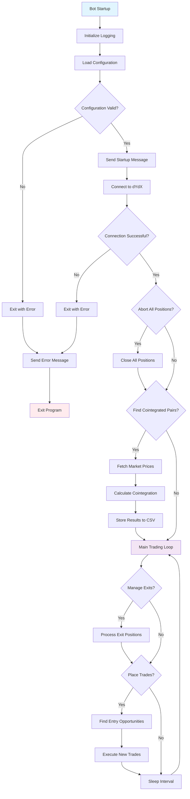
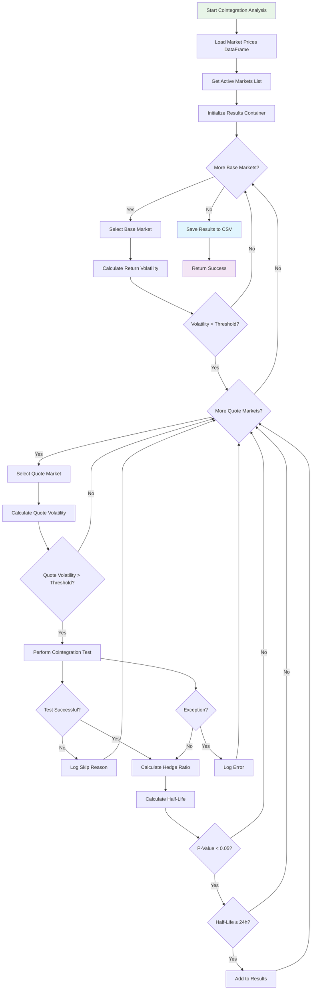
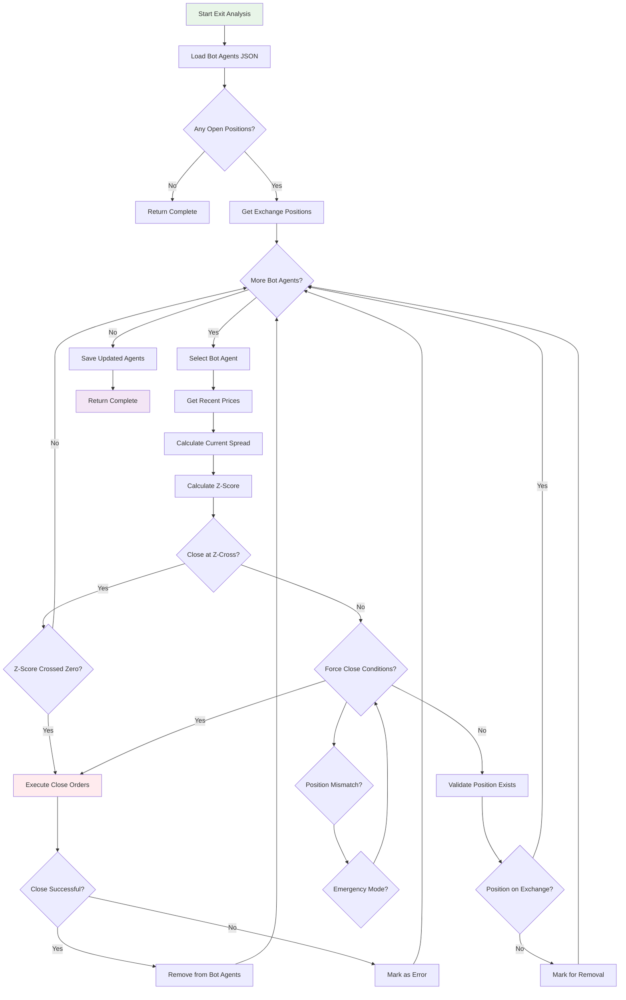
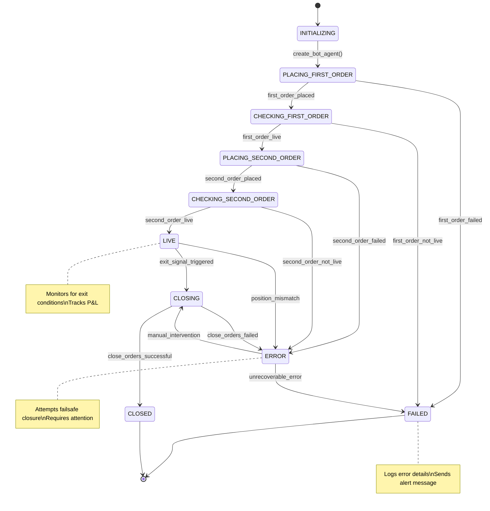
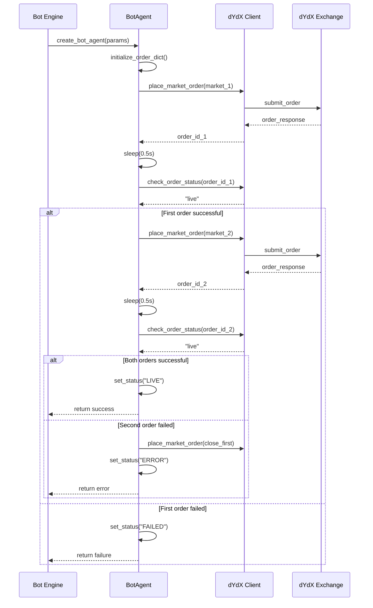
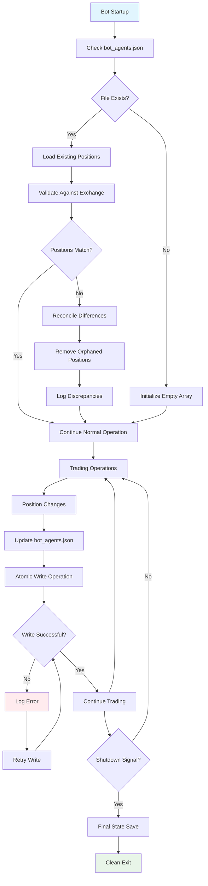
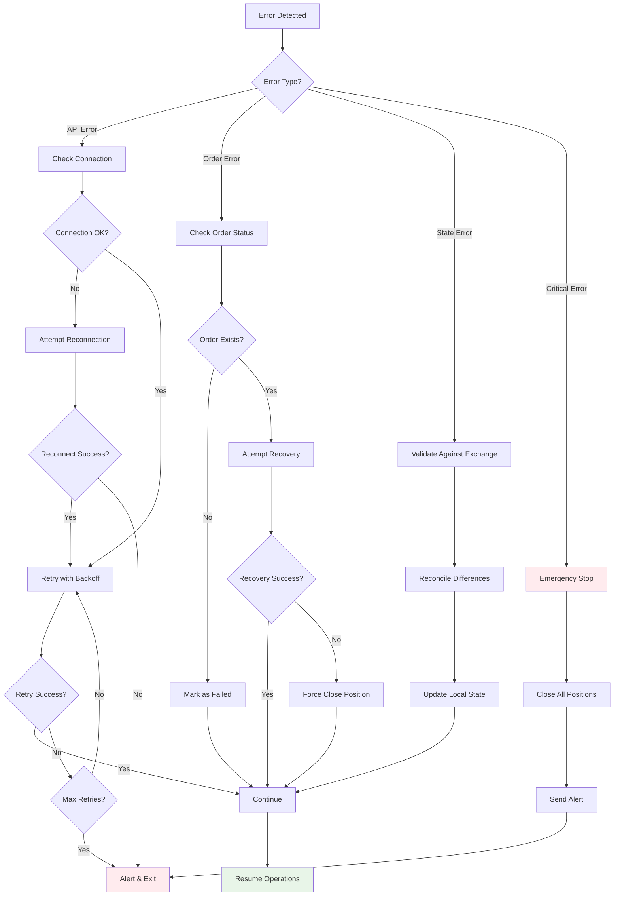

# Flow Diagrams

This document contains comprehensive flow diagrams for the dYdX Trading Bot system using Mermaid syntax. These diagrams illustrate the key processes and decision flows within the trading bot.

## 🚀 Main Execution Flow



## 📊 Cointegration Analysis Flow



## 📈 Entry Position Flow

```mermaid
flowchart TD
    A[Start Entry Analysis] --> B[Load Cointegrated Pairs CSV]
    B --> C[Get Market Information]
    C --> D[Load Existing Bot Agents]
    D --> E{More Pairs to Check?}
    E -->|No| Z[Save Bot Agents]
    E -->|Yes| F[Select Pair]
    F --> G[Check if Already Trading]
    G --> H{Already Trading Pair?}
    H -->|Yes| E
    H -->|No| I[Get Recent Candles]
    I --> J[Calculate Current Spread]
    J --> K[Calculate Z-Score]
    K --> L{|Z-Score| ≥ 1.5?}
    L -->|No| E
    L -->|Yes| M[Check Account Balance]
    M --> N{Sufficient Collateral?}
    N -->|No| E
    N -->|Yes| O[Calculate Position Sizes]
    O --> P[Determine Trade Sides]
    P --> Q[Create BotAgent]
    Q --> R[Execute Paired Trade]
    R --> S{Trade Successful?}
    S -->|No| T[Log Failed Trade]
    T --> E
    S -->|Yes| U[Add to Bot Agents]
    U --> V[Update State File]
    V --> E
    Z --> W[Log Completion]
    
    %% Sub-process for Z-Score calculation
    K --> K1[Calculate Rolling Mean]
    K1 --> K2[Calculate Rolling Std]
    K2 --> K3[Compute Z-Score]
    K3 --> L
    
    style A fill:#e8f5e8
    style R fill:#fff3e0
    style Z fill:#f3e5f5
```

## 📉 Exit Position Flow



## 🤖 BotAgent State Machine



## 🔄 Order Execution Subprocess



## 💾 State Management Flow



## 🔔 Error Handling & Recovery



These flow diagrams provide a comprehensive visual representation of the dYdX Trading Bot's operational logic, from high-level execution flow to detailed state management and error handling procedures. Each diagram can be rendered using Mermaid-compatible viewers or documentation platforms.