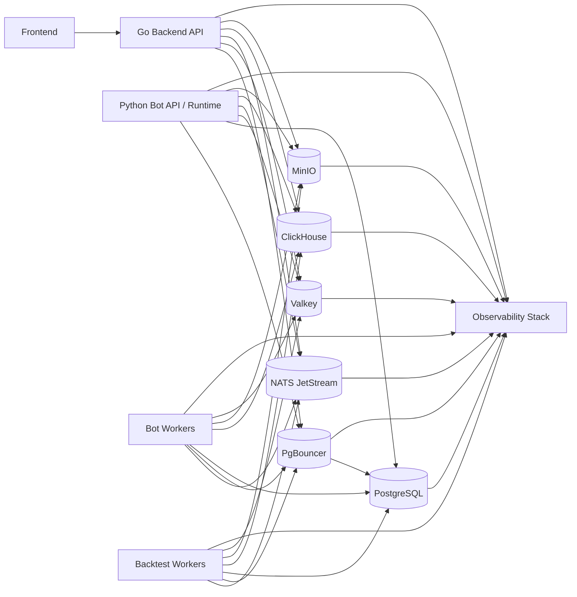

# Target Architecture

## Target Outcome

The target platform is a strict layered system:

- `frontend -> backend API -> runtime/workers/data services`
- PostgreSQL is the transactional source of truth only.
- Valkey is temporary coordination only.
- NATS JetStream is the durable async transport.
- ClickHouse is the analytical store.
- MinIO is the artifact store.

The backend must own API contracts and orchestration. Workers must become idempotent consumers of durable commands, not holders of authoritative state in local files or Redis-only structures.

## Mermaid Diagram

## Service Responsibility Map

### Frontend

- Calls backend API only.
- Displays task status, bot status, backtest status, summaries, metrics, dashboards, and artifact download links.
- Uses backend websocket or SSE feeds for live status.
- Does not connect directly to PostgreSQL, ClickHouse, MinIO, Valkey, or NATS.
- Downloads large artifacts only via backend-issued signed URLs.

### Go Backend API

- Owns HTTP and websocket contracts.
- Validates all bot/backtest requests.
- Creates command records and task metadata in PostgreSQL.
- Publishes durable commands to NATS JetStream.
- Reads transactional state and summaries from PostgreSQL.
- Reads analytical summaries from ClickHouse.
- Issues signed MinIO URLs for large artifacts.
- Uses Valkey for cache, rate limits, dedupe windows, and temporary locks only.
- Must not execute long-running backtests or live bot jobs inline.

### Python Bot API / Runtime

- Owns bot lifecycle logic and runtime control APIs.
- Subscribes to bot command subjects or coordinates command handling with worker services.
- Persists lifecycle state, heartbeat, retry, and summary data in PostgreSQL.
- Publishes lifecycle and execution events to NATS JetStream.
- Writes high-volume trading and runtime rows to ClickHouse.
- Uploads raw payloads and debug bundles to MinIO.
- Uses Valkey only for leases, locks, short-lived active state, and rate limiting.

### Bot Workers

- Consume durable bot work from JetStream durable consumers.
- Execute bot commands idempotently.
- Persist authoritative task state transitions in PostgreSQL.
- Write trade/order/fill/position/runtime metrics to ClickHouse in batches.
- Upload raw exchange payloads and debug artifacts to MinIO.
- Use Valkey for TTL-bound locks, leases, and dedupe windows only.

### Backtest Workers

- Consume backtest commands from JetStream durable consumers.
- Write run metadata, status, progress, heartbeat, retries, and summaries to PostgreSQL.
- Write backtest trades, position snapshots, daily PnL, equity curve, and strategy metrics to ClickHouse.
- Upload full result JSON, CSV exports, reports, charts, and debug bundles to MinIO.
- Batch analytical writes.
- Keep PostgreSQL rows small and query-friendly.

## Storage Responsibility Map

| Storage | Owns | Must Not Own |
| --- | --- | --- |
| PostgreSQL | users, bot config, strategy config, task/run metadata, retries, heartbeats, summaries, artifact references, low-volume audit | huge trade arrays, huge backtest JSON, raw exchange dumps, generated files, high-volume event history |
| Valkey | cache, rate limits, TTL locks, dedupe keys, worker leases, temporary active state | durable queueing, permanent task state, primary analytics, large result payloads |
| NATS JetStream | durable async commands, events, retries, dead-letter streams, fan-out | final transactional task state, long-term analytics, large artifact bodies |
| ClickHouse | high-volume trades, orders, fills, snapshots, backtest rows, metrics, request events, dashboard-heavy queries | transactional state, task ownership, large binary or document artifacts |
| MinIO | full result JSON, CSV, reports, charts, raw payloads, logs/debug bundles, replay files | transactional state, cross-run query store, durable queue semantics |

## Queue and Event Flow

### Command flow

1. Frontend calls backend API.
2. Backend validates request and creates a PostgreSQL command/task row.
3. Backend publishes a JetStream command with an idempotency key.
4. Durable consumer in bot-worker or backtest-worker receives the command.
5. Worker claims execution, writes `started` state and heartbeat to PostgreSQL.
6. Worker emits progress and lifecycle events to JetStream.
7. Backend or a notification projector consumes events and updates websocket/SSE clients.
8. Worker writes analytical rows to ClickHouse and artifacts to MinIO.
9. Worker writes final summary and artifact references to PostgreSQL.

### Event flow

- Use JetStream subjects for command intent and execution events.
- Use PostgreSQL for final state lookup.
- Use ClickHouse for dashboard reads that need high-cardinality aggregations.
- Use MinIO references for large downloadable outputs.

## PostgreSQL Responsibilities

- Transactional source of truth.
- Small rows.
- Indexed task state, heartbeat, retries, summaries, and artifact references.
- No unbounded growth from large JSON arrays.
- Accessed through PgBouncer in k3s and higher-concurrency environments.

## Valkey Responsibilities

- Distributed cache.
- Rate limit counters.
- TTL-bound locks.
- Deduplication windows.
- Worker leases and short-lived active state.
- No durable critical queue semantics.

## NATS JetStream Responsibilities

- Durable task queues for bot and backtest work.
- Durable event streams for lifecycle and execution events.
- Retry and dead-letter policy.
- Backpressure and consumer lag visibility.
- Fan-out to analytics/projector/notification consumers.

## ClickHouse Responsibilities

- Append-optimized analytical event store.
- Batch inserts from workers and API emitters.
- Fast dashboard and reporting reads.
- Materialized views for rollups where needed.
- Not used for transactional task state.

## MinIO Responsibilities

- Large raw JSON payloads.
- Full backtest result JSON.
- CSV exports.
- Reports and charts.
- Raw exchange request/response bodies.
- Debug bundles and replay packages.
- Backend returns signed URLs; frontend never receives bucket credentials.

## Scaling Strategy

### API scale

- Run multiple backend replicas behind ingress.
- Put PgBouncer in front of PostgreSQL.
- Move rate limiting and response cache to Valkey.
- Offload heavy analytical reads to ClickHouse.

### Worker scale

- Split `bot-worker` and `backtest-worker` deployments.
- Scale workers on JetStream consumer lag and throughput.
- Use durable consumers with explicit ack and redelivery control.
- Make task handlers idempotent with PostgreSQL task state and Valkey dedupe windows.

### Data scale

- Keep PostgreSQL rows narrow.
- Partition ClickHouse by time and logical workload.
- Store only object references in PostgreSQL for large artifacts.
- Use bucket/object retention policies in MinIO.

## Failure Handling Strategy

### Idempotency

- Every command and event gets a stable idempotency key.
- PostgreSQL stores command/task state transitions.
- Workers verify prior completion before re-executing destructive steps.

### Retries

- Retry via JetStream consumer delivery policy, not ad hoc process loops.
- Persist retry count and last failure in PostgreSQL.
- Move poison messages to dead-letter streams after `max_deliver`.

### Heartbeats and stuck-task recovery

- Workers write heartbeats to PostgreSQL and optionally leases in Valkey.
- Backend or control service marks runs stale when heartbeat age breaches SLA.
- Recovery commands are reissued via JetStream, not hidden in process memory.

### Artifact safety

- Workers upload artifacts to MinIO first, then persist PostgreSQL references.
- Temporary local files are deleted after upload verification.
- Partial uploads are marked failed and retried with checksum validation.

## Why This Architecture Fits This Repository

This target uses what the repo already prepared in infrastructure:

- PgBouncer manifests already exist in `deploy/k8s-next/pgbouncer.yaml`.
- NATS JetStream manifests already exist in `deploy/k8s-next/nats.yaml`.
- ClickHouse manifests already exist in `deploy/k8s-next/clickhouse.yaml`.
- MinIO manifests already exist in `deploy/k8s-next/minio.yaml`.
- Valkey manifests already exist in `deploy/k8s-next/valkey.yaml`.

The modernization work is mainly converting these from disabled optional integrations into the default runtime path, while removing the current large-payload and local-file anti-patterns.
