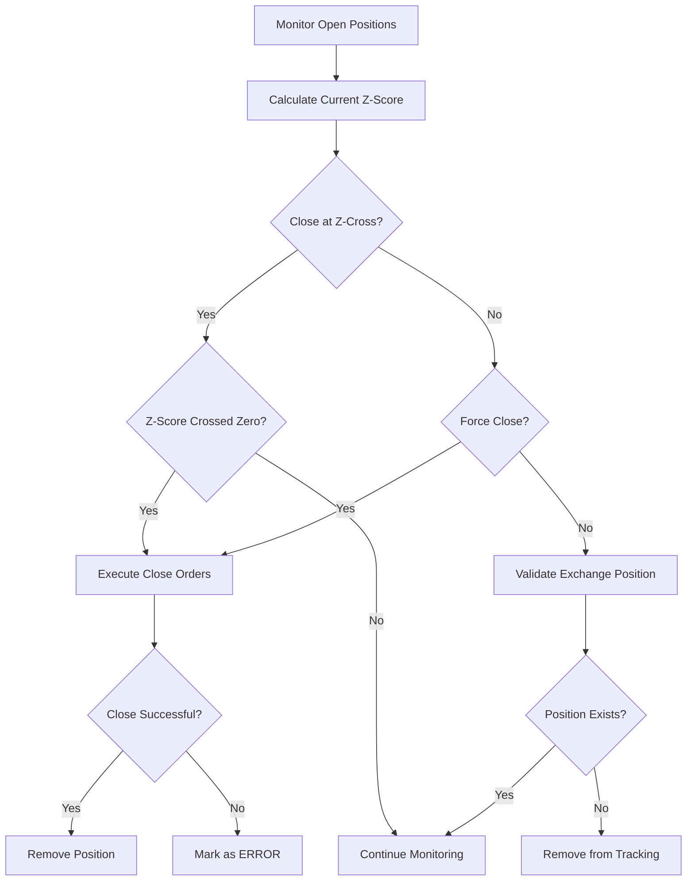

# Trading Strategy Documentation

This document provides comprehensive coverage of the cointegration-based trading strategy implemented in the dYdX Trading Bot.

## 🎯 Strategy Overview

The dYdX Trading Bot implements a **statistical arbitrage strategy** based on cointegration theory. This market-neutral approach identifies pairs of cryptocurrency assets with long-term statistical relationships and profits from temporary deviations that tend to revert to the mean.

### Key Principles
- **Market Neutral**: Profits from relative price movements, not absolute direction
- **Mean Reversion**: Exploits temporary deviations from long-term equilibrium
- **Statistical Foundation**: Uses rigorous statistical tests to identify tradeable relationships
- **Risk Management**: Built-in position limits and failsafe mechanisms

## 📊 Cointegration Theory

### What is Cointegration?

Cointegration is a statistical property where two or more time series have a long-term equilibrium relationship. Even though individual series may be non-stationary (trending), their linear combination (spread) is stationary (mean-reverting).

### Mathematical Foundation

Two time series X(t) and Y(t) are cointegrated if:
1. Both series are individually non-stationary (I(1))
2. There exists a coefficient β such that: **Spread = X(t) - β×Y(t)** is stationary

The coefficient β is called the **hedge ratio** and represents the optimal trading ratio between the assets.

### Engle-Granger Test

The bot uses the Engle-Granger two-step method:

1. **Step 1**: Estimate the cointegrating relationship via OLS regression:
   ```
   X(t) = α + β×Y(t) + ε(t)
   ```

2. **Step 2**: Test if residuals ε(t) are stationary using ADF test:
   ```
   H₀: ε(t) has unit root (not cointegrated)
   H₁: ε(t) is stationary (cointegrated)
   ```

### Implementation Details

```python
def calculate_cointegration(series_1, series_2):
    # Perform cointegration test
    coint_res = coint(series_1, series_2)
    coint_t = coint_res[0]      # Test statistic
    p_value = coint_res[1]      # P-value
    critical_value = coint_res[2][1]  # 5% critical value
    
    # Estimate hedge ratio via OLS
    model = sm.OLS(series_1, sm.add_constant(series_2)).fit()
    hedge_ratio = model.params[1]
    intercept = model.params[0]
    
    # Calculate spread
    spread = series_1 - (series_2 * hedge_ratio) - intercept
    
    # Determine cointegration
    t_check = coint_t < critical_value
    coint_flag = 1 if p_value < 0.05 and t_check else 0
    
    return coint_flag, hedge_ratio, half_life
```

## 📈 Z-Score Analysis

### Z-Score Calculation

The Z-score measures how many standard deviations the current spread is from its historical mean:

```
Z-Score = (Current Spread - Rolling Mean) / Rolling Standard Deviation
```

### Rolling Window Implementation

```python
def calculate_zscore(spread):
    spread_series = pd.Series(spread)
    mean = spread_series.rolling(center=False, window=WINDOW).mean()
    std = spread_series.rolling(center=False, window=WINDOW).std()
    x = spread_series.rolling(center=False, window=1).mean()
    zscore = (x - mean) / std
    return zscore
```

### Signal Generation

| Z-Score Range | Signal | Action |
|--------------|--------|---------|
| Z > +1.5 | Spread too high | SHORT asset 1, LONG asset 2 |
| -1.5 < Z < +1.5 | Normal range | No action |
| Z < -1.5 | Spread too low | LONG asset 1, SHORT asset 2 |
| Z crosses 0 | Mean reversion | Close positions |

### Statistical Parameters

- **Rolling Window**: 21 periods (configurable via `statsWindow`)
- **Entry Threshold**: ±1.5 standard deviations (configurable via `ZScoreThreshold`)
- **Exit Signal**: Z-score crosses zero (mean reversion)

## ⏱️ Mean Reversion Speed

### Half-Life Calculation

Half-life measures how quickly deviations revert to the mean. It's calculated using the Ornstein-Uhlenbeck process:

```
dX = θ(μ - X)dt + σdW
```

Where:
- θ = mean reversion rate
- μ = long-term mean
- σ = volatility
- Half-life = ln(2)/θ

### Implementation

```python
def half_life_mean_reversion(series):
    # Calculate first differences and lagged values
    difference = np.diff(series)
    lagged_series = series[:-1]
    
    # Linear regression: Δy = α + βy₍ₜ₋₁₎ + ε
    slope, _, _, _, _ = linregress(lagged_series, difference)
    
    # Calculate half-life
    half_life = -np.log(2) / slope
    return float(half_life)
```

### Half-Life Filtering

The bot only trades pairs with half-life ≤ 24 hours (configurable via `maxHalfLife`) to ensure:
- **Quick mean reversion**: Positions don't remain open indefinitely
- **Active trading opportunities**: Regular entry/exit cycles
- **Risk management**: Limits exposure time to market changes

## 💰 Position Sizing Strategy

### Fixed Dollar Amount

The bot uses a fixed USD amount per trade (configurable via `usdPerTrade`):

```python
# Calculate position sizes
base_quantity = usd_amount / base_price
quote_quantity = base_quantity * hedge_ratio

# Apply market constraints (tick size, step size)
base_size = format_number(base_quantity, base_precision)
quote_size = format_number(quote_quantity, quote_precision)
```

### Size Calculation Example

For BTC-USD/ETH-USD pair:
- **USD per trade**: $100
- **BTC price**: $45,000
- **ETH price**: $3,000
- **Hedge ratio**: 0.065 (1 BTC ≈ 0.065 ETH)

Calculations:
```
BTC size = $100 / $45,000 = 0.0022 BTC
ETH size = 0.0022 * 0.065 = 0.000143 ETH
```

### Position Constraints

| Parameter | Purpose | Default | Range |
|-----------|---------|---------|-------|
| `usdPerTrade` | Fixed trade size | $10 | $1-$1000 |
| `usdMinCollateral` | Minimum account balance | $100 | $50-$10000 |
| Tick size | Minimum price increment | Market-specific | Exchange defined |
| Step size | Minimum quantity increment | Market-specific | Exchange defined |

## 🎯 Entry Logic

### Entry Conditions Checklist

1. **✅ Pair is cointegrated** (p-value < 0.05)
2. **✅ Half-life ≤ 24 hours** (quick mean reversion)
3. **✅ |Z-score| ≥ 1.5** (sufficient deviation)
4. **✅ Sufficient account balance** (≥ minimum collateral)
5. **✅ Pair not already being traded** (avoid double exposure)
6. **✅ Markets are active** (exchange trading status)

### Entry Process Flow

```mermaid
flowchart TD
    A[Calculate Z-Score] --> B{|Z| ≥ 1.5?}
    B -->|No| C[Skip Entry]
    B -->|Yes| D[Check Account Balance]
    D --> E{Balance ≥ Min?}
    E -->|No| C
    E -->|Yes| F[Calculate Position Sizes]
    F --> G[Determine Trade Sides]
    G --> H[Create BotAgent]
    H --> I[Execute Paired Trade]
    I --> J{Both Orders Fill?}
    J -->|Yes| K[Mark Position LIVE]
    J -->|No| L[Emergency Close]
```

### Trade Side Determination

```python
def determine_trade_sides(zscore):
    if zscore > 0:
        # Spread too high: Short base, Long quote
        return "SELL", "BUY"
    else:
        # Spread too low: Long base, Short quote  
        return "BUY", "SELL"
```

### Entry Example

**Scenario**: BTC-USD/ETH-USD pair
- **Current Z-score**: +2.1 (spread too high)
- **Hedge ratio**: 0.065
- **Trade size**: $100

**Action**:
1. **SHORT BTC-USD**: Sell $100 worth of BTC
2. **LONG ETH-USD**: Buy equivalent ETH (hedge ratio adjusted)
3. **Expectation**: Spread will revert, BTC underperforms ETH

## 🚪 Exit Logic

### Exit Conditions

| Condition | Trigger | Action |
|-----------|---------|---------|
| **Mean Reversion** | Z-score crosses zero | Close both positions |
| **Force Close** | Position mismatch | Emergency closure |
| **Manual Override** | `abortAllPositions = true` | Close all positions |
| **Error Recovery** | BotAgent ERROR state | Failsafe closure |

### Exit Process Flow



### Mean Reversion Detection

The bot monitors Z-score for zero-crossing:

```python
# Previous Z-score: +1.8 (positive)
# Current Z-score: -0.2 (negative) 
# → Zero crossing detected → Close position

if (prev_zscore > 0 and current_zscore <= 0) or \
   (prev_zscore < 0 and current_zscore >= 0):
    # Mean reversion detected
    close_position()
```

### Exit Execution

1. **Calculate close sizes**: Equal and opposite to opening positions
2. **Place market orders**: Simultaneous closure of both legs
3. **Verify execution**: Confirm both orders fill successfully
4. **Update state**: Remove from `bot_agents.json`
5. **Log performance**: Record P&L and holding period

## 🛡️ Risk Management

### Position Limits

| Risk Control | Parameter | Purpose |
|--------------|-----------|---------|
| **Maximum positions** | Unlimited | Controlled by cointegration opportunities |
| **Position size** | `usdPerTrade` | Limits individual trade risk |
| **Account minimum** | `usdMinCollateral` | Prevents over-leveraging |
| **Market constraints** | Tick/step sizes | Exchange compliance |

### Failsafe Mechanisms

#### 1. Partial Fill Protection
```python
# If first order fills but second fails:
if order_1_status == "live" and order_2_status != "live":
    # Emergency: Close first position
    close_order = place_market_order(
        market=market_1,
        side=opposite_side,
        size=order_1_size,
        reduce_only=True
    )
```

#### 2. State Reconciliation
```python
# Compare local state vs exchange
local_positions = load_bot_agents()
exchange_positions = await get_open_positions(client)

for position in local_positions:
    if position['market'] not in exchange_positions:
        # Position exists locally but not on exchange
        remove_from_bot_agents(position)
```

#### 3. Emergency Abort
```python
# Close all positions immediately
if ABORT_ALL_POSITIONS:
    exchange_positions = await get_open_positions(client)
    for market, position in exchange_positions.items():
        await place_market_order(
            market=market,
            side="SELL" if position['side'] == "LONG" else "BUY",
            size=abs(position['size']),
            reduce_only=True
        )
```

### Market Order Protection

All orders use market orders with price bounds (±70%) to prevent extreme slippage:

```python
# Price protection
upper_bound = current_price * 1.70
lower_bound = current_price * 0.30
protected_price = min(max(order_price, lower_bound), upper_bound)
```

## 📊 Performance Metrics

### Key Performance Indicators

| Metric | Description | Calculation |
|--------|-------------|-------------|
| **Sharpe Ratio** | Risk-adjusted returns | (Return - RiskFree) / Volatility |
| **Win Rate** | Percentage profitable trades | Winning trades / Total trades |
| **Average Hold Time** | Position duration | Sum(hold times) / Number of trades |
| **Maximum Drawdown** | Largest peak-to-trough loss | Max(Peak - Trough) / Peak |
| **Profit Factor** | Gross profit / Gross loss | Sum(wins) / Sum(losses) |

### Trade Attribution

Each closed position records:
- **Entry Z-score**: Signal strength at entry
- **Exit Z-score**: Signal strength at exit  
- **Holding period**: Time from entry to exit
- **Realized P&L**: Actual profit/loss in USD
- **Hedge ratio accuracy**: How well the ratio predicted price movements

### Performance Analysis Example

```python
# Sample trade analysis
trade_record = {
    "entry_time": "2024-01-01T10:00:00Z",
    "exit_time": "2024-01-01T16:30:00Z", 
    "holding_period_hours": 6.5,
    "entry_zscore": 1.87,
    "exit_zscore": -0.12,
    "realized_pnl_usd": 2.34,
    "market_1": "BTC-USD",
    "market_2": "ETH-USD",
    "hedge_ratio": 0.065,
    "trade_size_usd": 100.0,
    "return_percent": 2.34
}
```

## 🔬 Strategy Validation

### Backtesting Framework

The strategy can be validated using historical data:

1. **Data Requirements**: 
   - Hourly price data for all trading pairs
   - Minimum 6 months of history for reliable statistics
   - High-quality data without gaps or errors

2. **Validation Process**:
   ```python
   # Pseudo-code for backtesting
   for date in historical_dates:
       cointegrated_pairs = find_cointegrated_pairs(price_data[date])
       for pair in cointegrated_pairs:
           zscore = calculate_zscore(pair, date)
           if abs(zscore) >= threshold:
               entry_signal = True
           if zscore_crossed_zero(pair, date):
               exit_signal = True
   ```

3. **Performance Metrics**:
   - Total return vs buy-and-hold
   - Maximum drawdown periods
   - Trade frequency and duration
   - Success rate by market conditions

### Statistical Significance

The strategy requires statistically significant cointegration:
- **P-value threshold**: < 0.05 (95% confidence)
- **Minimum observations**: 100+ price points
- **Half-life validation**: ≤ 24 hours for tradeable pairs
- **Stability testing**: Rolling window cointegration tests

## 🎛️ Strategy Parameters

### Configurable Settings

| Parameter | Default | Range | Impact |
|-----------|---------|-------|--------|
| `ZScoreThreshold` | 1.5 | 0.5-3.0 | Higher = fewer but stronger signals |
| `statsWindow` | 21 | 5-100 | Longer = smoother but slower signals |
| `maxHalfLife` | 24h | 1-168h | Shorter = faster mean reversion |
| `usdPerTrade` | $10 | $1-1000 | Position sizing |
| `closeAtZscoreCross` | true | bool | Exit on mean reversion vs manual |

### Parameter Optimization

```python
# Example parameter sweep
for threshold in [1.0, 1.5, 2.0, 2.5]:
    for window in [14, 21, 28, 35]:
        for half_life in [12, 24, 48, 72]:
            # Backtest with parameters
            results = backtest_strategy(threshold, window, half_life)
            # Evaluate performance metrics
            sharpe = calculate_sharpe(results)
            max_dd = calculate_max_drawdown(results)
```

### Market Regime Adaptation

The strategy may need adjustment for different market conditions:

- **Bull Markets**: May favor momentum over mean reversion
- **Bear Markets**: Increased correlation may reduce opportunities  
- **High Volatility**: Wider Z-score thresholds may be needed
- **Low Volatility**: Tighter thresholds for sufficient opportunities

## 🔮 Future Enhancements

### Advanced Features

1. **Dynamic Hedge Ratios**:
   - Recalculate ratios periodically
   - Adjust for changing market relationships
   - Time-varying coefficient models

2. **Multi-Asset Cointegration**:
   - Extend to 3+ asset combinations
   - Portfolio-based approaches
   - Diversification benefits

3. **Regime Detection**:
   - Identify market regime changes
   - Adaptive parameter adjustment
   - Strategy switching mechanisms

4. **Machine Learning Integration**:
   - Feature engineering from price data
   - Predictive models for entry timing
   - Risk assessment algorithms

### Risk Improvements

1. **Portfolio Risk Management**:
   - Correlation limits between active pairs
   - Sector/asset class diversification
   - Maximum aggregate exposure limits

2. **Dynamic Position Sizing**:
   - Volatility-adjusted position sizes
   - Kelly criterion optimization
   - Drawdown-based scaling

3. **Advanced Exit Strategies**:
   - Trailing stops on profitable positions
   - Time-based exits for stale positions
   - Volatility-adjusted exit thresholds

This comprehensive trading strategy documentation provides the theoretical foundation and practical implementation details for understanding and optimizing the dYdX Trading Bot's cointegration-based approach to cryptocurrency arbitrage.